[TOC]


# From 《大型网站技术架构》

高可用、高性能、高扩展、可伸缩、安全

# 资源

## 架构模式应用案例

- 服务端高并发分布式架构演进之路:  https://segmentfault.com/a/1190000018626163
- 天猫双十一 1小时破千亿，聊聊高并发系统:  https://baijiahao.baidu.com/s?id=1650158666898635488&wfr=spider&for=pc
-  淘宝架构演进：https://www.jianshu.com/p/f81ad699b431 
- 淘宝网技术架构介绍： https://blog.csdn.net/wp1603710463/article/details/50166797/ 


## 在线画图

- ProcessOn:  https://www.processon.com

本笔记中的架构演化图是使用 ProcessOn  在线画图工具绘制,  ProcessOn 是一个在线作图工具的聚合平台， 它可以在线画流程图、思维导图、UI原型图、UML、网络拓扑图、组织结构图等等， 无需担心下载和更新的问题，不管Mac还是Windows，一个浏览器就可以随时随地的发挥创意，规划工作.

可在线生成 png、jpg、pdf、svg矢量图形、pos图形结构定义文件（可导入）等。

# 第 1 篇 概述

# 一 . 大型网站架构演化

## 1.大型网站优点

```
高并发、大流量
高可用			# 不间断服务， 不宕机
海量数据
用户分布广泛、网络情况复杂
安全环境恶劣
需求快速变更、发布频繁
渐进式发展
```


高可用

海量数据

## 2.架构演化发展历程

大型网站架构主要解决的问题：

- 处理数以 P 计的数据和数以亿计的用户

### 初始阶段架构

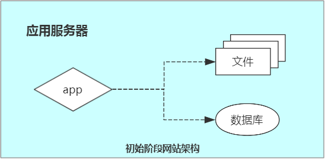

```
1 台服务器 (Linux)
	1.应用程序  =>  PHP + Apache
	2.文件	 =>  本地读写
	3.数据库    =>  MySQL
```

### 应用和数据服务分离

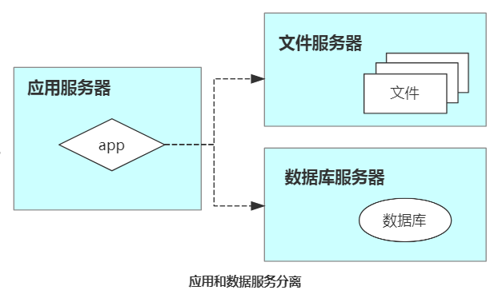

```
3 台服务器, 对硬件资源要求各不相同
	1.应用程序服务器: 需要更快更强大的 CPU
	2.文件服务器: 需要更大的硬盘
	3.数据库服务器: 需要更大的磁盘和内存
```

### 缓存改善性能

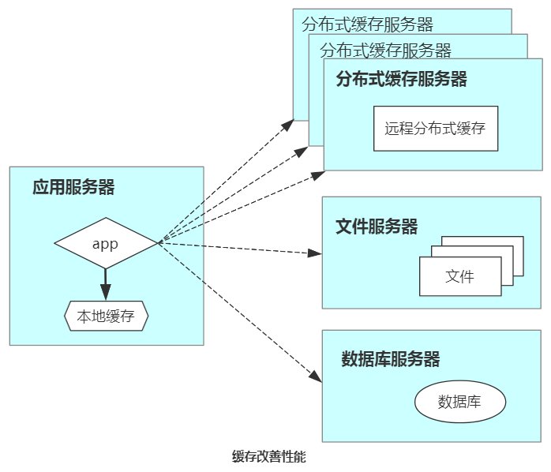

- 应用服务器本地缓存.  访问速度更快, 但缓存数据量有限

- 远程分布式缓存.  专门的缓存服务器,  理论上不受内存容量限制

```
4+n 台服务器
	1.应用程序服务器: 运行应用程序 + 提供本地缓存
	2.远程分布式缓存服务器: n 台
	2.文件服务器
	3.数据库服务器
```

### 应用服务集群改善并发处理能力

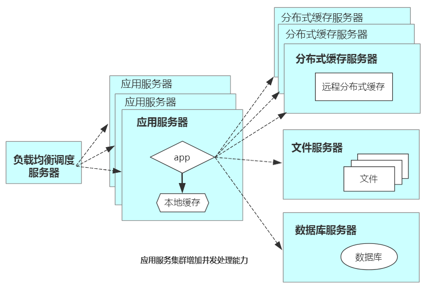

使用集群是网站解决高并发、海量数据问题的常用手段。当一台服务器的处理能力、存储空间不足时，最好不要企图去换更强大的服务器，对大型网站而言，不管多么强大的服务器，都满足不了网站持续增长的业务需求。更恰当的做法是增加一台服务器，分担原有服务器的访问及存储压力。

**应用服务器集群**：应用服务器实现集群，是网站可伸缩集群架构设计中较为简单成熟的一种。

**负载均衡调度服务器**：通过负载均衡调度服务器，可将来自用户浏览器的访问分发到应用服务器集群中的任何一台服务器上。

```
5+n 台服务器
	1.负载均衡调度服务器
	2.应用程序服务器: n 台. 运行应用程序 + 提供本地缓存 + 数据访问模块(读/写)
	3.分布式缓存服务器: n 台
	4.文件服务器: n 台
	5.数据库服务器
```

### 数据库读写分离

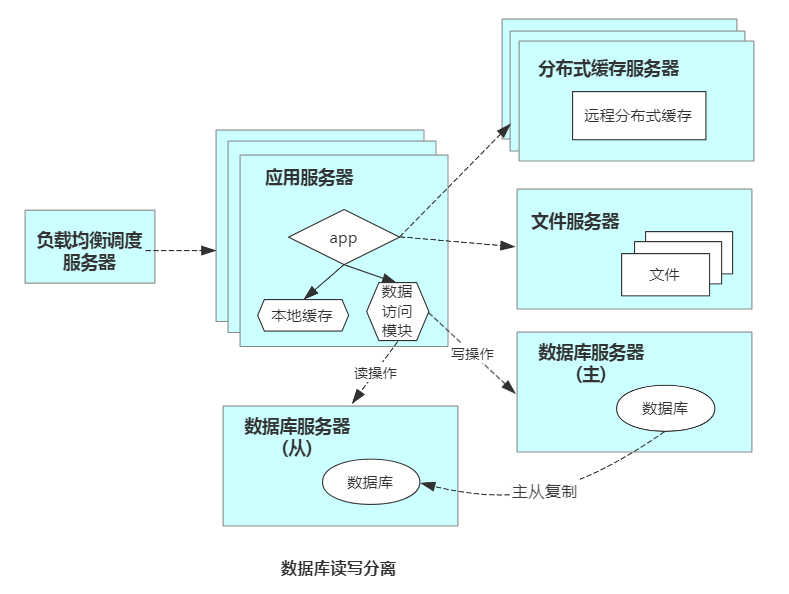

网站使用缓存后, 绝大部分数据读操作访问都可以不通过数据库,  但是仍有一部分读操作 (缓存访问不命中、缓存过期) 和全部的写操作需要访问数据库.

目前大部分主流数据库都提供 **主从热备** 功能,  通过配置两台数据库主从关系,  可以将一台数据库服务器的数据更新同步到另一台服务器上.  网站利用数据库这一功能,  实现数据库 **读写分离** , 改善数据库负载.

应用服务器在写数据时,  访问主数据库,  主数据库通过 **主从复制** 机制将数据更新到从数据库, 当应用服务器读数据时,  就可以通过从数据库获得数据.  为了便于应用程序访问读写分离后的数据库,  通常在应用服务器端使用专门的数据访问模块.

```
6+n 台服务器
	1.负载均衡调度服务器
	2.应用程序服务器: n 台
	3.分布式缓存服务器: n 台
	4.文件服务器
	5.数据库服务器(主, 写操作)
	6.数据库服务器(从, 读操作, 主从复制)
```

### 反向代理、CDN 加速网站响应

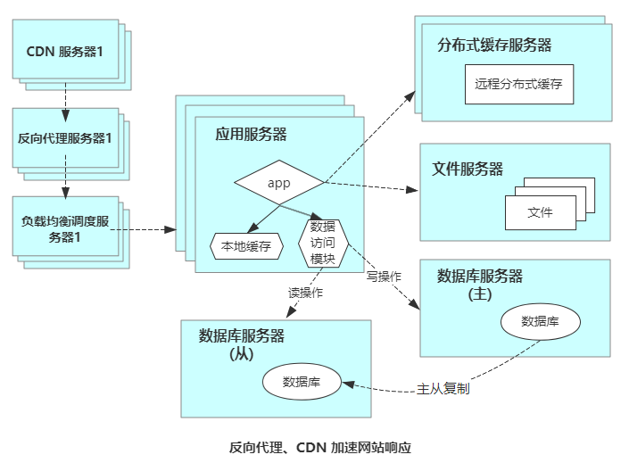

在中国复杂的网络环境下，不同地区的用户访问网站时，速度差别也极大。网站访问延迟和用户流失率正相关。

加速网站访问速度的主要手段有使用 CDN、使用 反向代理。CDN 和反向代理也减轻了后端服务器的负载压力。

CDN 和反向代理的基本原理都是缓存，CDN 与 反向代理有什么区别？

- CDN 部署在网络提供商的机房，使用户在请求网站服务时，可以从距离自己最近的网络提供商机房获取数据。
- 反向代理 部署在网站的中心机房，当用户请求到达中心机房后，首先访问的服务器是反向代理服务器，如果反向代理服务器中缓存着用户请求的资源，就将其直接返回给用户。

```
8+n 台服务器
	1.CDN 服务器: n台
	2.反向代理服务器: n台
	3.负载均衡调度服务器: n台
	4.应用程序服务器: n 台
	5.分布式缓存服务器: n 台
	6.文件服务器
	7.数据库服务器(主, 写操作)
	8.数据库服务器(从, 读操作, 主从复制)
```


### 分布式文件系统、分布式数据库系统

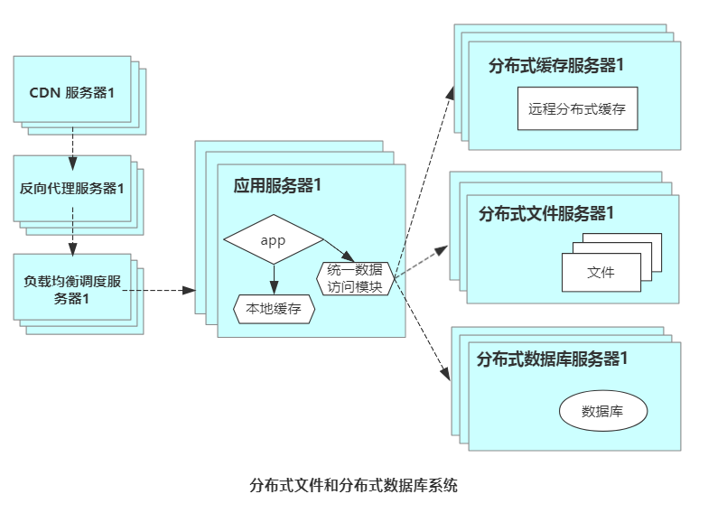

任何强大的单一服务器都满足不了大型网站持续增长的业务需求。随着网站业务的发展，需要使用分布式数据库、分布式文件系统。

分布式数据库是网站数据库拆分的最后手段，只有在单表数据规模非常庞大时才使用。不到万不得已时，网站更常用的数据库拆分手段是 **业务分库**，将不同业务的数据库部署在不同的物理服务器上。


### NoSQL 和 搜索引擎

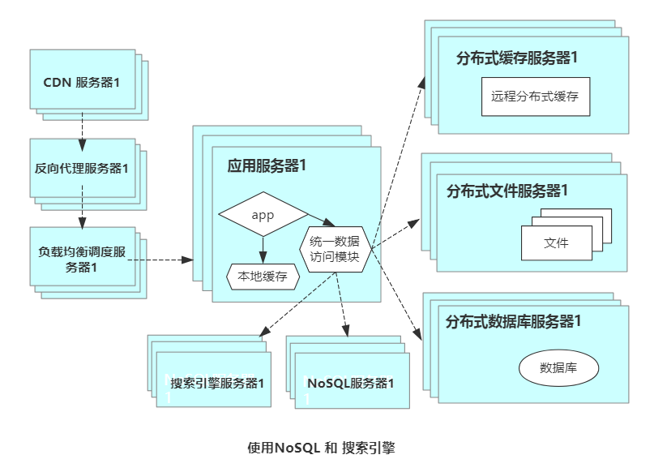

随着网站业务越来越复杂,对数据存储和检索的需求也越来越复杂,网站需要采用一些 **非关系型数据库** 技术如 NoSQL 和 **非数据库查询技术** 如搜索引擎。

应用服务器通过一个数据访问模块访问各种数据，减轻应用程序管理诸多数据源的麻烦。

### 业务拆分

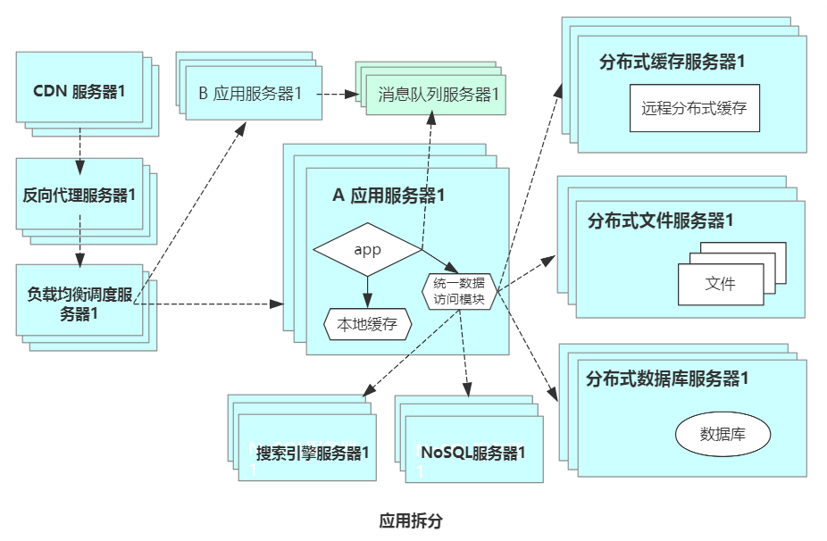

通过使用分而治之的手段将整个网站业务分成不同的产品线，如大型购物交易网站就会将首页、商铺、订单、

卖家、买家等分成不同的产品线，分归不同的团队负责。

具体到技术上，也会根据产品线划分，将一个网站分成不同的应用，每个应用独立部署维护。应用之间可以通过一个超链接建立关系，也可以通过消息队列进行数据分发，最多的是通过访问同一个数据存储系统来构成一个关联的完整系统。

### 分布式服务

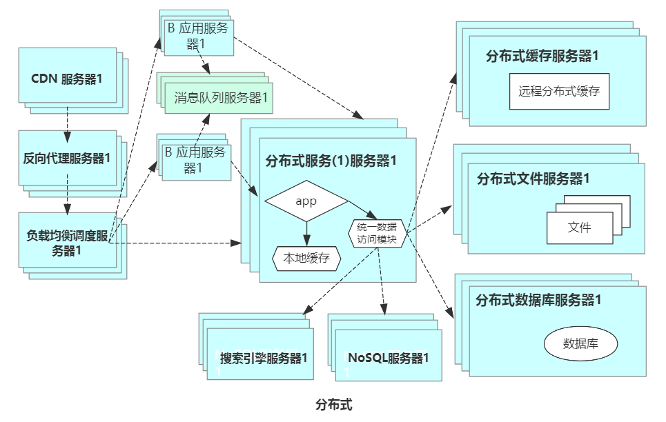

随着业务拆分越来越小，存储系统越来越大，应用系统的整体复杂度呈指数级增加，部署维护越来越困难。由于所有应用要和所有数据库系统连接，在数万台服务器规模的网站中，这些连接的数目是服务器规模的平方，导致数据库连接资源不足，拒绝服务。

既然每一个应用系统都需要执行许多相同的业务操作，比如用户管理、商品管理等，那么可以将这些共用的业务提取出来，独立部署。由这些可复用的业务连接数据库，提供共用业务服务，而应用系统只需要管理用户界面，通过分布式服务调用共用业务服务完成具体业务操作。


## 3.架构演化的价值观

核心价值：随网站所需，灵活应对。随需求来演化。

## 4.架构设计误区

- 一味追随大公司的解决方案
- 为了技术而技术，脱离业务发展的实际
- 企图用技术解决所有问题：
  - 技术是用来解决业务问题的，而业务的问题也可以用业务手段来解决。
  - 最典型的例子就是 2012 年年初 12306 故障事件。

# 二. 大型网站架构模式

模式的复用性： 一个模式描述了不断重复的问题及解决方案的核心


## 分层

将系统在横向维度上切分成几个部分，每个部分负责各自相对单一的职责，然后通过上层对下层的依赖和调用组成一个完整的系统。

分层架构最初的目的是规划软件清晰的逻辑结构，便于开发维护。在网站规模还小的时候就应该采用分层架构。

分层结构在计算机中的应用：

- 网络的 7 层通信协议
- 计算机硬件 -> 操作系统 -> 应用软件
- 大型网站架构分层:  应用层 -> 服务层 -> 数据层

网站分层架构:

| 分层   | 功能                                                       |
| ------ | ---------------------------------------------------------- |
| 应用层 | 负责具体业务和视图展示                                     |
| 服务层 | 为应用层提供服务支持                                       |
| 数据层 | 提供数据存储、访问服务，如数据库、缓存、文件、搜索引擎等。 |

思考：

- 分层的作用？

- 分层如何细化？


## 分割

如果说分层是将软件在横向方面就行拆分，那么分割就是在纵向方面对软件进行切分。

- 应用层不同业务可以如何分割？ 
- 减小分割粒度，又如何分割？
- 再减小？

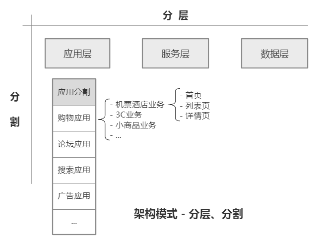


## 分布式

对于大型网站， 分层与分割的一个主要目的是为了切分后的模块便于分布式部署。

- 不同模块部署在不同服务器上

分布式的优点？

- 使用更多的计算机完成相同的功能
- 提高并发处理能力
- 提高大数据量存储能力

分布式的缺点？

- 网络交互影响性能
- 服务宕机可能性增加，网站可用性降低
- 难以保证分布式环境的数据一致性
- 网站依赖错综复杂，开发维护难
- ...

分布式的方案（网站哪些内容可以进行分布式？）：

- 分布式应用和服务： 将分层和分割后的应用和服务模块分布式部署
- 分布式静态资源：网站静态资源独立分布式部署，并采用独立域名
- 分布式数据和存储：如关系型数据库、非关系型数据库、非数据库查询服务
- 分布式计算：严格来说，应用、服务、实时数据处理都是计算，网站除了处理这些在线业务，还有很大部分用户不会直观感受的后台业务要处理，包括搜索引擎的索引构建、数据仓库的数据分析统计等，计算规模庞大。目前普遍用 Hadoop 和 MapReduce 分布式计算框架进行此类批处理计算。
- 分布式配置：支持网站线上服务器配置实时更新
- 分布式锁：分布式环境下实现并发和协同的锁
- 分布式文件系统： 支持云存储
- ...


## 集群

对于用户访问集中的模块（如网站首页），除了使用分布式部署， 还需要将独立部署的服务器集群化，即 **多台服务器部署相同的应用，构成一个集群，通过负载均衡设备共同对外提供服务**。

集群的优点有哪些?

- 提高并发性能:  服务器集群有更多服务器提供相同的服务。
- 提高系统可用性:  当集群中某台服务器啊发生故障时, 负载均衡设备 或 系统的失效转移机制会将请求转发到集群中其他服务器上。


## 缓存

什么是缓存？

- 缓存就是将数据存放在距离计算最近的位置加以快速处理。
- 缓存是改善软件性能的第一手段

**网站有哪些缓存？**

1. CND 服务器： 内容分发网络。部署在距离终端用户最近的网络服务提供商，主要缓存网站的一些静态资源。
2. 反向代理服务器：网站前端架构的一部分，当用户的请求到达网站的数据中心时，最先访问到的就是反向代理服务器， 反向代理服务器缓存网站的静态资源，无需将请求继续转发给应用服务器就能返回给用户。
3. 本地缓存： 在应用服务器本地缓存热点数据。
4. 分布式缓存服务器：将数据缓存在一个专门的分布式缓存集群中，应用程序通过网络通信访问缓存数据。

缓存的作用？

1. 加快数据访问速度
2. 减轻后端应用和数据存储的压力

什么情况下使用缓存？

1. 数据访问热点不均衡，某些数据会被更频繁地访问，这类数据应该在缓存中存储一份
2. 数据仅在某个时间段内存在有效性 （但不会很快过期）


## 异步

降低系统耦合性：系统解耦合的手段除了 **分层**、**分割**、**分布** 等，还有一个重要手段是 **异步**，

异步： 

- 业务之间的消息传递不是同步调用，而是将一个业务操作分成多个阶段，每个阶段之间通过共享数据的方式 异步执行 进行协作。

如何实现异步？

1. 单一服务内部通过多线程共享内存队列的方式实现异步。
2. 在分布式系统中，多个服务集群通过分布式消息队列实现异步。

异步优点？

1. 提高可扩展性

   ```
   异步架构是典型的生产者消费者模式，两者不存在直接调用，只要保持数据结构不变，对网站扩展新功能非常便利。
   ```

2. 提高系统可用性

   ```
   若消费者服务器发生故障，数据会在消息队列服务器中存储堆积，生产者服务器可以继续处理业务请求，系统整体表现无故障。消费者服务器恢复正常后，继续处理消息队列中的数据。
   ```

3. 加速网站响应速度

   ```
   处在业务处理前端的生产者服务器在处理完业务请求后，将数据写入消息队列，不需要等待消费者服务器处理就可以返回，响应延迟减少。
   ```

4. 消除并发访问高峰

   ```
   用户访问网站是随机的, 存在访问高峰、低峰。
   网站并发访问突然增大可能造成整个网站负载过重， 响应延迟， 严重时出现宕机情况。
   使用消息队列将突然增加的访问请求数据放入消息队列中， 等待消费者服务器依次处理， 就不会对整个网站负载造成太大压力。
   ```

异步缺点？

1. 异步处理业务可能影响用户体验、业务流程，需要网站产品设计方面的支持。


## 冗余

网站需要 7x24 小时连续运行，但是服务器随时可能出现故障。要保证服务器在宕机情况下网站依然尅继续服务，不丢失数据，就需要一定程度的服务器冗余运行，数据冗余备份，这样当某台服务器宕机时，可以将其上的数据访问转移到其他机器上。

冗余措施有哪些？

1. 部署至少两台服务器构成一个集群：数据库定期备份: **冷备份**、**热备份**
2. 为了面对不可抗力导致的网站完全瘫痪，在全球范围内部署 **灾备数据中心**，  网站程序和数据实时同步到多个灾备数据中心。


## 自动化

网站自动化涉及哪些方面？

1. 发布过程自动化

   ```
   1.1 自动化代码管理
   	开发提交代码 -> 代码版本控制 -> 代码分支创建合并
   1.2 自动化测试
   	-> 部署代码到测试环境 -> 启动自动化测试用例进行测试 -> 发送测试报告
   1.3 自动化安全检测
   	-> 安全检测工具对代码进行静态安全扫描 -> 部署到安全测试环境进行安全攻击测试 -> 评估安全性
   1.4 自动化部署
   	将工程代码自动部署到线上生产环境
   ```

2. 监控自动化

   ```
   2.1 自动化报警
   	对线上生产环境进行心跳检测, 监测各项性能指标、关键数据指标 -> 发现异常时自动报警
   2.2 自动化失效转移
   	-> 检测到故障后, 系统自动将失效服务器从集群中隔离出去
   2.3 自动化失效恢复
   	-> 故障消除后系统进行自动化失效恢复 -> 重启服务, 同时保证数据一致性
   2.4 自动化降级
   	-> 网站访问高峰时自动拒绝部分请求及关闭部分不重要的服务, 将系统负载降至一个安全的水平
   2.5 自动化分配资源
   	-> 必要时, 将重要资源分配给重要的服务
   ```


## 安全

网站安全控制手段有哪些？

1. 通过密码和手机校验码进行身份认证
2. 登录、交易等操作需要对网络通信进行加密
3. 对数据库存储的用户信息进行加密处理
4. 处理 XSS 攻击、SQL 注入等
5. 过滤垃圾、敏感星系
6. ...


# 三.核心架构要素

- **架构**：最高层的规划，难以改变的决定。

- **软件架构**： 有关软件整体结构和组件的抽象描述，用于指导大型软件系统各个方面的设计。

## 5 个核心架构要素

1. 性能
2. 可用性
3. 可伸缩性
4. 扩展性
5. 安全性

## 性能

### 性能优化手段

1. 浏览器端使用浏览器缓存、页面压缩、合理布局、减少 cookie 传输等。
2. 使用 CDN
3. 使用服务器本地缓存、远程分布式缓存
4. 异步操作 + 消息队列
5. 采用集群
6. 代码层面使用多线程、改善内存管理等手段
7. 数据库服务端采用索引、缓存、SQL优化等
8. NoSQL数据库通过优化数据模型、存储结构、伸缩特性等手段进行性能优化

### 性能指标

- 响应时间
- TPS
- 系统性能计数器
- ...

## 可用性

几乎所有网站都承诺 7 x 24 小时可用, 但事实上任何网站都不可能达到完全的 7 x 24 小时可用, 总有一些故障时间.

大型网站通常都会有上万台服务器, 每天必定有一些服务器宕机, 高可用设计的目标是当服务器宕机时, 服务或应用仍然可用

### 高可用的手段

高可用的主要手段是 **冗余**,  应用服务器冗余部署，数据库服务器冗余部署、实时备份

可用性的指标

```
网站总可用时间 = 7x24 - 故障时间
可用性： 一些知名网站可以做到可用性超过 99.99%
```

## 伸缩性

伸缩性就是指通过不断向集群中加入多台服务器的手段来缓解不断上升的用户并发访问压力和不断增长的数据存储需求。

架构伸缩性的主要衡量标准：

- 是否可以用多台服务器构建集群，是否容易向集群中添加新的服务器。

### 提高伸缩性的手段

1. 应用服务器集群提高伸缩性：只要应用服务器不保存数据，所有服务都是对等的，通过使用合适的负载均衡设备就可以向集群中不断加入服务器。
2. 缓存服务器集群提高伸缩性：加入新的服务器可能导致缓存路由失效，进而导致集群中大部分缓存数据无法访问。需要改进路由算法保证缓存数据的可访问性。
3. 关系型数据库提高伸缩性：关系型数据库虽然支持数据复制、主从热备等机制，但是很难做到大规模集群的可伸缩性，因此关系型数据库的集群伸缩性方案必须在数据库之外实现，通过路由分区等手段将部署有多个数据库的服务器组成一个集群。
4. NoSQL数据库提高伸缩性：NoSQL先天就是为海量数据而生，因此其对伸缩性的支持通常都非常好，可以做到在较少运维参与的情况下实现集群规模的线性伸缩。

## 扩展性

不同于其他架构要素关注非功能性需求， 扩展性直接关注网站的功能需求。网站快速发展，功能不断扩展，如何设计网站的架构使其能够快速响应需求变化，是网站可扩展性架构的主要目的。

衡量架构可扩展性的标准：

- 在网站增加新的业务产品时，是否可以实现对现有产品透明无影响，不需要任何改动或很少改动，既有业务功能就可以上线新产品

## 安全性

- 保护网站不受恶意访问和攻击
- 保护网站重要数据不被窃取

