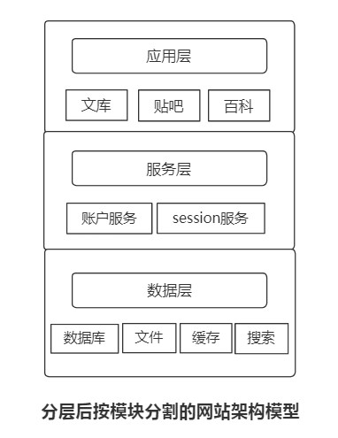

# From 《大型网站技术架构》

[TOC]

# 第 2 篇 架构


# 一.瞬时响应 - 高性能架构

性能优化的目的: 

1. 改善用户体验的响应时间
2. 提高系统吞吐量
3. 对大限度利用系统资源

## 网站性能测试

性能测试是性能优化的前提和基础,  也是性能优化结果的检查和度量标准.

### 不同视角下的网站性能

针对不同视角下的网站性能,  采取对应的解决方案.

a.用户视角的性能

- 用户在浏览器上的直观感受

b.开发人员视角的性能

- 应用程序本身及相关子系统的性能

c.运维人员视角的性能

- 基础设施性能和资源利用率: 网络质量、网络资源利用率、服务器质量、服务器资源利用率

### 性能测试指标

1. 响应时间

2. 并发数

3. 吞吐量：请求数/秒, 页面数/秒, 访问人数/天,  TPS (每秒事务数),  HPS (每秒http请求数),  QPS (每秒查询数)

   ```
   吞吐量的描述指标有:
   	请求数/秒, 页面数/秒, 访问人数/天,  TPS (每秒事务数),  HPS (每秒http请求数),  QPS (每秒查询数)
   并发数与吞吐量的变化关系:
   	在系统并发数增加过程中: 
   	1.系统资源消耗增大, 系统吞吐量逐渐增加, 达到一个极限后, 随着并发数增加而下降, 达到系统崩溃点后, 系统资源耗尽, 吞吐量为0.
   	2.响应时间先小幅上升, 到达吞吐量极限后, 快速上升, 到达系统崩溃点后, 系统失去响应.
   ```

4. 性能计数器

   ```
   性能计数器是指描述服务器或操作系统性能的一些性能指标:
   1.System load (系统负载)
   2.对象与线程数
   3.内存使用
   4.CPU使用
   5.磁盘与网络I/O
   
   这些指标也是系统监控的重要参数.
   ```


### 性能测试方法

性能测试是一个总称, 具体细分为:

> 性能测试是一个不断对系统增加访问压力，以获得系统性能指标、最大负载能力、最大承压能力的过程。

1. 性能测试

   ```
   以系统设计初期规划的性能指标为预期目标, 对系统不断施压, 验证系统在资源可接受范围内, 是否能达到预期.
   ```

2. 负载测试

   ```
   对系统不断施加并发请求, 以增加系统压力, 直到系统的某项或多项性能指标达到安全临界值, 此时继续施压, 系统的处理能力不但不能提高, 反而会下降.
   ```

3. 压力测试

   ```
   超过安全负载的情况下, 对系统继续施压, 直到系统崩溃或不能再处理任何请求, 以此获得系统最大承压能力.
   ```

4. 稳定性测试

   ```
   被测系统在特定硬件、软件和网络环境下，给系统增加一定业务压力，使系统运行较长一段时间，以此检测系统是否稳定。
   稳定性测试也应不均匀地对系统施压。
   ```


### 性能测试曲线


### 响应时间曲线


### 性能测试报告

简单示例

| 并发数 | 响应时间(ms) | TPS  | 错误率(%) | Load | 内存(GB) | 备注     |
| ------ | ------------ | ---- | --------- | ---- | -------- | -------- |
| 10     | 500          | 20   | 0         | 5    | 8        | 性能测试 |
| 20     | 800          | 30   | 0         | 10   | 10       | 性能测试 |
| 30     | 1000         | 40   | 2         | 15   | 14       | 性能测试 |
| 40     | 1200         | 45   | 20        | 30   | 16       | 负载测试 |
| 60     | 2000         | 30   | 40        | 50   | 16       | 压力测试 |
| 80     | 超时         | 0    | 100       | 不详 | 不详     | 压力测试 |


### 性能优化策略

1. 性能分析:
   1. 检查请求处理的各个环节的日志，分析哪个环节响应时间不合理、超过预期
   2. 检查监控数据，分析性能影响性能的主要因素是内存、磁盘、网络还是CPU，是代码问题，还是架构设计不合理，或者系统资源确实不足
2. 性能优化
   - 根据网站分层架构，可分为 3 大类：
     1. Web 前端性能优化
     2. 应用服务器性能优化
     3. 存储服务器性能优化


## Web前端性能优化

web 前端包括：

1. 浏览器加载
2. 网站视图模型
3. 图片服务
4. CDN 服务
5. ...

主要优化手段：

1. 优化浏览器访问
2. 使用 CDN 加速
3. 使用反向代理
4. ...


### 1. 浏览器访问优化

（1）**减少 http 请求**。主要手段有：

1. 合并 CSS
2. 合并 JavaScript
3. 合并图片


（2）**使用浏览器缓存**

1. 更新频率比较低的静态资源文件：CSS、JavaScript、Logo、图标等。
2. 通过设置 HTTP 头中 Cache-Control 和 Expires 属性， 可设定浏览器缓存。
3. 在某些时候， 静态资源的变化需要及时应用到客户端浏览器，这种情况，可通过改变文件名来实现。即更新 JavaScript 文件的方式并不是直接更新内容，而是生成一个新的 JS 文件并更新 HTML 文件中的引用。
4. 避免集中更新缓存：使用浏览器缓存策略的网站，在更新静态资源时，应采用分批次更新的方法，比如需要更新 10 个图标，不宜一次更新 10 个文件， 而应逐个文件进行更新，并有一定的时间间隔。以免用户浏览器突然大量缓存失效，集中更新缓存， 造成服务器负载骤增、网络堵塞的情况。


（3）**启用压缩**

1. 在服务端对文件进行压缩，在浏览器对文件解压缩，可有效减少通信传输的数据量。
2. 文本文件的压缩率可达 80% 以上，因此 HTML、CSS、JavaScript 文件启用 GZip 压缩可达到较好的效果。但是，压缩对服务器和浏览器产生一定的压力，在通信带宽良好，而服务器资源不足的情况下要权衡考虑。


（4）**CSS 放在页面最上面， JS 放在最下面**

1. 浏览器会在下载完全部的 CSS 之后才对整个页面进行渲染， 因此最好做法是将 CSS 放在页面的最上面，让浏览器尽快下载完 CSS；浏览器在加载 JS 后立即执行，造成页面显示缓慢，因此 JS 最好放在页面最下面，但如果页面解析时需要用到 JS，就不应该把 JS 放到最下面。


### 2. CDN 加速

1. CDN 本质是一个缓存，而且将数据缓存在距离用户最近的地方，使用户以最快的速度获取数据。
2. CDN 是网络访问第一跳。由于 CDN 部署在网络运营商的机房，这些运营商又是终端用户的网络服务提供商，因此用户请求路由的第一跳就达到了 CDN 服务器，当 CDN 中存在浏览器请求的资源时，从 CDN 直接返回给浏览器，最短路径返回响应，加快用户访问速度，减少数据中心负载压力
3. CDN 一般缓存的是静态资源， 如图片、文件、CSS、Script 脚本、静态网页等，而且访问频度高。


### 3. 反向代理

1. 代理与反向代理：传统代理服务器位于浏览器一侧，代理浏览器将 HTTP 请求发送到互联网上，而反向代理服务器位于网站机房一侧，代理 Web 服务器接收 HTTP 请求
2. 安全： 传统代理服务器可以保护浏览器的安全，反向代理服务器可保护网站安全，在 Web 服务器和可能的网络攻击之间建立了一个屏障。
3. 配置缓存加速：代理服务器也可以配置缓存来加速 Web 请求。当用户第一次访问静态资源时，静态内容就被缓存在反向代理服务器上，当其他用户访问该静态资源时，就可以直接从反向代理服务器返回。加速 Web 服务器响应速度，减小 Web 服务器负载压力
4. 缓存动态资源：有些网站也会把动态资源缓存在反向代理服务器上，如某些博客论坛网站，当这些动态内容发生变化时，通过内部通知机制，通知反向代理服务器缓存失效，反向代理会加载最新的动态内容，再次缓存起来。
5. 负载均衡：通过负载均衡的应用集群，可以提高系统的总体处理能力，改善网站高并发性能。


## 应用服务器性能优化

应用服务器主要优化手段：

1. 缓存
2. 异步
3. 集群
4. ...


### 1. 分布式缓存

> 网站性能优化第一定律： 优先考虑使用缓存

缓存： 将数据存储在相对较高访问速度的存储介质中， 以供系统处理

缓存作用：

1. 减少数据访问时间
2. 缓存计算结果， 减少后续计算时间


##### 缓存的基本原理

1. 缓存的本质：一个内存 Hash 表， 数据以 Key-Value 形式存储
2. Hash 表读取的时间复杂度为 O(1)。计算 KV 中 Key 的 HashCode（可理解为对象的唯一标识符） 对应的 Hash 表索引，可快速访问 Hash 表中的数据
3. 应用程序读取数据时，先到缓存中读取，如果读取不到或者数据已失效，再访问数据库，并将数据写入缓存。
4. 缓存数据访问通过二八定律，即 80% 的访问落在 20% 的数据上，因此利用 Hash 表 & 内存的高速访问特性，将这 20% 的数据缓存起来，可很好地改善系统性能，提高数据读取速度，降低存储访问压力。


##### 合理使用缓存

（1）频繁修改的数据

- 一般来说，数据的读写比在 2:1 以上，即写入一次缓存，在数据更新前至少读两次，缓存才有意义

（2）没有热点的访问

- 没有热点的访问数据不应该用缓存

（3）数据不一致与脏读

- 一般会对缓存的数据设置失效时间，一旦超过失效时间，就要从数据库中重新加载。因此应用要容忍一定时间的数据不一致，如卖家已经编辑了商品属性，但是需要过一段时间后才能被买家看到。在互联网应用中，这种延迟通常是可以接受的，但是具体应用仍需慎重对待。还有一种策略是数据更新时立即更新缓存，不过这也会带来更多的系统开销和事务一致性问题。

（4）缓存可用性

- 缓存是为了提高数据读取性能的，缓存数据丢失或缓存不可用，不会影响到应用程序的处理，应用程序可以直接从数据库读取数据。
- **缓存雪崩**：随着业务的发展，缓存会承担大部分的数据访问压力，数据库已经习惯了有缓存的存在，所以当缓存服务崩溃时，数据库会因为完全不能承受巨大压力而宕机，这种情况被称为 缓存雪崩。
- **缓存热备（有违缓存初衷）**：有的网站通过缓存热备等手段提高缓存可用性，当某台缓存服务器宕机时，将缓存访问切换到热备缓存服务器上，这种设计有违缓存的初衷，缓存不应该被当作一个可靠的数据源来使用。
- **分布式缓存服务器集群**： 将缓存数据分布到集群多台服务器上，可在一定程度上改善缓存的可用性。当一台缓存服务器宕机时，只有部分缓存数据丢失，重新从数据库加载这部分数据不会对数据库产生很大的影响。
- **缓存预热**：缓存中存放的是热点数据，热点数据又是缓存系统利用 **LRU（最近最久未用算法）** 对不断访问的数据筛选淘汰出来的，这个过程需要花费较长时间。新启动的缓存系统如果没有任何数据，在重建缓存数据的过程中，系统的性能和数据库的负载都不太好，那么最好是在缓存启动时就把热点数据加载好， 这个缓存预加载手段就叫做 **缓存预热（warm up）**
- **缓存穿透**： 如果因为不恰当的业务，或者恶意攻击持续高并发地请求某个不存在的数据，由于缓存没有保存该数据，所有的请求都会落到数据库上，会对数据库造成很大压力，甚至崩溃。一个简单地对策是将不存在的数据也缓存起来（其 value 值为 null）


##### 分布式缓存架构

分布式缓存：指缓存部署在多个服务器组成的集群中，以集群方式提供缓存服务，其架构有两种：

**（1）以 JBoss Cache 为代表的需要更新同步的分布式缓存**

1. JBoss Cache 的分布式缓存在集群中所有服务器中保存相同的缓存数据，当某台服务器中有缓存数据更新时，会通知集群中其他服务器更新缓存数据或清除缓存数据。
2. JBoss Cache 通常将应用程序与缓存部署在同一台服务器上，应用程序可以本地快速读取缓存数据。但是这种方式的缺点是缓存数据的数量受限于单一服务器的内存空间，而且当集群规模较大时，缓存更新信息需要同步到集群的所有机器，其代价惊人。因而这种方案更多见于企业应用系统中，而很少在大型网站中使用。


**（2）以 Memcached 为代表的不互相通信的分布式缓存**

1. 大型网站需要缓存的数据量一般都很庞大，可能会需要数 TB 的内存做缓存，这时候就需要另一种分布式缓存 Memcached。 


##### Memcached

- Memcached 采用一种集中式的缓存集群管理，也被称作 **互不通信的分布式架构方式**。缓存与应用分离部署，缓存系统部署在一台专门服务器上，应用程序通过一致性 Hash等路由算法选择缓存服务器远程访问缓存数据，缓存服务器之间不通信，缓存集群的规模可以很容易实现扩展，具有良好的可伸缩性。
- Memcached 曾一度是网站分布式缓存的代名词，被大量网站使用

（1）简单的通信协议

（2）丰富的客户端程序

（3）高性能的网络通信

（4）高效的内存管理

（5）互不通信的服务器集群架构

**Details**

**（1）简单的通信协议**

1. 远程通信设计需要考虑两方面的要素：
   1. **通信协议**： 即选择 TCP 协议还是 UDP 协议， 或是 HTTP 协议
   2. **通信序列化协议**：数据传输的两端，必须使用彼此可识别的数据序列化方式才能使通信得以完成， 如 XML、JSON 等文本序列化协议，或 Google Protobuffer 等二进制序列化协议
2. Memcached 使用 TCP 协议（也支持 UDP）通信，其序列化协议是一套基于文本的自定义协议，非常简单，以一个命令行开头，后面是一组命令操作数。例如读取一个数据的命令协议是 `get <key>`。Memcached后，许多 NoSQL 产品都借鉴了或直接支持这套协议。

**（2）丰富的客户端程序**

- Memcached 通信协议简单，只需要支持该协议的客户端都可以和 Memcached 服务器通信，因此 Memcached 发展出非常丰富的客户端程序，几乎支持所有主流的网站编程语言。

**（3）高性能的网络通信**

- Memcached 服务端通信模块基于 Libevent，一个支持事件触发的网络通信程序库，它在稳定的长连接方面的表现正是 memecached 需要的。

**（4）高效的内存管理**

1. 内存管理中一个令人头疼的问题就是内存碎片管理。操作系统、虚拟机垃圾回收在这方面想了许多方法：压缩、复制等。
2. Memcached 使用了一个非常简单的办法——固定空间分配
3. Memcached 将内存空间分为一组 slab，每个 slab 里又包含一组 chunk，同一个 slab 里的每个 chunk 的大小是固定的， 拥有相同大小 chunk 的 slab 被组织在一起，叫做 slab_class。
4. 存储数据时，根据数据的 size 大小，寻找一个大于 size 的最小 chunk 将数据写入。这种内存管理方式避免了内存碎片管理的问题，内存分配和释放都是以 chunk 为单位的。
5. 和其他缓存一样，memecached 采用 LRU 算法释放最近最久未被访问的数据占用的空间，释放的 chunk 被标记为 未用，等待下一个合适大小的数据写入。
6. 内存浪费的问题：数据只能存入一个比它大的 chunk 里，而一个 chunk 只能存一个数据，其他空间都被浪费了。如果启动参数配置不合理，浪费会更加惊人。


**（5）互不通信的服务器集群架构**

- 正是 Memcached 互不通信的特性使得 Memcached 从 JBoss Cache、OSCache等众多分布式缓存产品中脱颖而出，满足网站对海量缓存数据的需求。


### 2. 异步操作

1. 使用 **消息队列** 将调用异步化，可改善网站的可扩展性和性能。
2. 在不使用消息队列的情况下，用户的请求数据直接写入数据库，在高并发地情况下，会对数据库造成巨大压力，同时也使得响应延迟加剧。在使用消息队列后，用户请求的数据发送给消息队列后立即返回响应，再由消息队列的消费者进程（通常该进程独立部署在专门的服务器集群上）从消息队列中获取数据，异步写入数据库。由于消息队列服务器处理速度远快于数据库（消息队列服务器也比数据库具有更好的伸缩性），因此用户的响应延迟可得到有效改善。
3. 消息队列具有很好的 **削峰** 作用，即通过异步处理，将短时间高并发产生的事务消息，存储在消息队列中，从而削平高峰期的并发事务。
4. 需要注意的是，由于数据写入消息队列后立即返回给用户，数据在后续的业务校验、写入数据库失败等操作可能失败，因此在使用消息队列进行业务异步处理后，不能立即返回成功状态，需要适当修改业务流程进行配合。
5. 如订单提交后，订单数据写入消息队列，不能立即返回用户订单提交成功，需要在消息队列的订单消费者进程真正处理完该订单，甚至商品出库后，再通过消息通知用户订单成功

> 1. 任何可以晚点做的事都应该晚点做
> 2. 晚点做的事不要立即给出成功的答复


### 3. 使用集群

在网站高并发访问的情景下，使用负载均衡技术作为一个应用构建一个由多台服务器组成的服务器集群，将并发请求分发到多台服务器上处理，避免单一服务器因负载压力过大而响应缓慢，使用户请求具有更好的响应延迟特性。

```
用户浏览器 --> 负载均衡服务器 --> Web服务器集群中的一台服务器
```


### 4. 代码优化

合理优化业务代码，可以很好地改善网站性能。

##### 多线程

- 目前主要的 Web 应用服务器都采用多线程的方式响应并发用户请求，因此网站的开发天然就是多线程。
- 从资源利用的角度看，使用多线程的原因主要有两个：
  1.  IO 阻塞： 利用多线程 IO 阻塞与执行交替进行，可最大限度利用 CPU 资源
  2. 多 CPU：要想最大限度地使用多 CPU，必须启动多线程

- 最佳启动线程数：

  ```
  最佳启动线程数 = [ 任务执行时间 / (任务执行时间 - IO等待时间) ] x CPU核数
  
  - 最佳启动线程数与 CPU 内核数量成正比，与 IO 阻塞时间成反比。
  - 如果任务都是 CPU 计算型任务，那么线程数最多不超过 CPU 内核数。因为启动再多线程，CPU 也来不及调度
  - 相反，如果任务需要等待磁盘操作、网络响应，那么多启动线程有助于提高任务并发度，提高系统吞吐量
  ```

- 多线程编程注意问题：**线程安全**。编程上解决线程安全问题的主要手段有：

  1. 将对象设计为无状态对象：对象本身不存储状态信息，保证多线程访问时状态一致性
  2. 使用局部对象
  3. 并发访问资源时使用锁


##### 资源复用

- 系统运行时，要尽量减少那些开销很大的系统资源的创建和销毁。如：数据库连接、网络通信连接、线程创建、复杂对象的创建等
- 从编程角度，资源复用主要有 2 种模式：
  1. **单例**
  2. **对象池**  （数据库连接池、线程池）


##### 数据结构

- 程序 = 数据结构 + 算法
- 在不同场景中，合理使用恰当的数据结构，灵活组合各种数据接口改善数据读写性能和计算特性，可以极大地优化程序的性能


##### 垃圾回收

- 理解垃圾回收机制有助于程序优化和参数调优，以及编写内存安全的代码。


## 存储性能优化

在网站应用中，海量数据读写对磁盘访问造成巨大压力，虽然可以通过 Cache 解决一部分数据 **读** 压力，但是很多时候，磁盘仍然是系统最严重的瓶颈。磁盘的可用性和容错性至关重要。

### 1. 机械硬盘 vs 固态硬盘

- 传统机械硬盘具有快速顺序读取、慢速随机读取的访问特性
- 在网站应用中，大部分应用访问数据都是随机的，这种情况下 固态硬盘（SSD） 具有良好的性能表现

### 2. B+树 vs LSM 树

- 为了改善数据访问特性，文件系统或数据库系统通常会对数据排序后存储，加快数据检索速度，这就需要保证数据在不断增、删、改后依然有序。
- 传统关系型数据库的做法是使用 **B+ 树**
  - B+ 树是专门针对磁盘存储而优化的 N 叉排序树，以树节点为单位存储在磁盘中，从根开始查找数据所在的节点编号和磁盘位置，将其加载到内存中然后继续查找，直到找到目标数据。
  - 目前数据库多采用 2 级索引的 B+ 树，树的层次最多 3 层。因此可能需要 5 次磁盘访问才能更新一条记录 （3 次磁盘访问获得数据索引及行 ID，然后进行一次数据文件读取操作、一次文件写操作。）

- 目前许多 NoSQL 产品采用 **LSM 树** 作为主要数据结构
  - LSM 树可以看做是一个 N 阶合并树。数据增删改都在内存中进行，并且都会创建一个新纪录 （修改会记录新的数据值，删除会记录一个删除标志），这些数据在内存中仍然是一棵排序树，当数据量超过设定的内存阈值后，会将这棵排序树和磁盘上最新的排序树合并。当这棵排序树的数据量也超过设定阈值后，会将这棵排序树和磁盘上上下一级的排序树合并。合并过程中，会用最新更新的数据覆盖旧的数据（或者记录为不同的版本）
  - 在需要进行读操作时，总是从内存中的排序树开始搜索，如果没有找到，就从磁盘上的排序树顺序查找。
  - 在 LSM 树上进行一次数据更新不需要访问磁盘，在内存中即可完成，速度远快于 B+ 树。当数据访问以写操作为主，而读操作则集中在最近写入的数据上时，使用 LSM 树可以极大程度地减少磁盘访问的次数，加快访问速度。

- 作为存储结构，B+ 树不是关系型数据库所独有的，NoSQL 数据库也可以使用 B+ 树。关系型数据库也可以使用 LSM。


### 3. RAID vs HDFS

**（A）RAID**

RAID（廉价磁盘冗余阵列）技术主要是为了改善磁盘的访问延迟，增强磁盘的可用性和容错能力。

目前服务器级别的计算机都支持插入多块磁盘（8块及更多），通过使用 RAID 技术，实现数据在多块磁盘上的并发读写和数据备份。

常用的 RAID 技术：

1. RAID0
2. RAID1
3. RAID10
4. RAID5
5. RAID6


假设服务器有 N 块磁盘

1. RAID0：
   - 数据在从内存缓冲区写入磁盘时，根据磁盘数量将数据分成 N 份，这些数据同时并发写入 N 块磁盘， 使得数据整体写入速度是一块磁盘的 N 倍
   - 读取时也一样，因此 RAID0 具有极快的数据读写速度，但是 RAID0 不做备份， N 块磁盘中只要有一块损坏，数据完整性就被破坏，所有磁盘的数据都会损坏。
2. RAID1：
   - 数据在写入磁盘时，将一份数据同时写入两份磁盘，这样任何一块磁盘损坏都不会导致数据丢失。插入一块新磁盘就可以通过复制数据的方式自动修复，具有极高可靠性
3. RAID10：
   - 结合 RAID0 和 RAID1 两种方案，将所有磁盘平均分成两份，数据同时在两份磁盘写入，相当于 RAID1，但是每份磁盘里面的 N/2 块磁盘上，利用 RAID0 技术并发读写，既提高可靠性又改善性能。但 RAID0 的磁盘利用率较低，有一半的磁盘用来写备份数据

4. RAID3：
   - 一般情况下，一台服务器上不会出现同时损坏 2 块磁盘的情况，在只损坏 1 块磁盘的情况下，如果能利用其他磁盘的数据恢复损坏盘的数据，这样在保证可靠性和性能的同时，磁盘利用率也得到大幅提升。
   - 在数据写入磁盘时，将数据分成 N-1 份，并发写入 N-1 块磁盘，并在第 N 块磁盘记录校验数据，任何一块磁盘损坏（包括校验数据磁盘），都可以利用其他 N-1 块磁盘的数据修复。但是，在数据修改较多的场景中，修改任何磁盘数据都会导致第 N 块磁盘重写校验数据，频繁写入的后果是第 N 块磁盘比其他磁盘容易损坏，需要频繁更换。所以 RAID3 很少在实践中使用。

5. RAID5：
   - 相比 RAID3， RAID5 被更多地使用
   - RAID5 和 RAID3 类似，但是校验数据不是写入第 N 块磁盘，而是螺旋式地写入所有磁盘。这样校验数据的修改也被平均到所有磁盘上，避免 RAID3 频繁写坏一块磁盘的情况。
6. RAID6：
   - 如果数据有很高的可靠性，在出现同时损坏 2 块磁盘的情况下 （或者运维管理水平较落后，坏了 1 块磁盘但是迟迟没有更换，导致又坏了 1 块），仍然需要修复数据，这时可以用 RAID6
   - RAID6 和 RAID5 类似，但是数据只写入 N-2 块磁盘，并螺旋式地在 2 块磁盘中写入校验信息（使用不同的算法生成）。

在相同磁盘数目 N 的情况下，各种 RAID 技术的比较：

| RAID 类型 | 访问速度 | 数据可靠性  | 磁盘利用率 |
| --------- | -------- | ----------- | ---------- |
| RAID0     | 很快     | 很低        | 100%       |
| RAID1     | 很慢     | 很高        | 50%        |
| RAID10    | 中等     | 很高        | 50%        |
| RAID5     | 较快     | 较高        | (N-1)/N    |
| RAID6     | 较快     | 较 RAID5 高 | (N-2)/N    |


RAID 技术的实现:

1. 通过硬件实现: 如专用的 RAID 卡或者主板直接支持
2. 通过软件实现: 如 HDFS


**（B）HDFS**

> [深入理解HDFS：Hadoop分布式文件系统](https://blog.csdn.net/bingduanlbd/article/details/51914550#t24)


在HDFS （ Hadoop Distributed File System ）中，系统在整个存储集群的多台服务器上进行数据的并发读写和备份，可以看作在服务器集群规模上实现了类似 RAID 的功能， 因此不需要磁盘 RAID

**写**： HDFS 以块（Block）为单位管理文件内容，一个文件被分割为若干个 Block，当应用程序写文件时，每写完一个  Block ， HDFS 将其自动复制到另外两台机器上，保证每个 Block 有三个副本，即使有两台服务器宕机，数据依然可以访问，相当于实现了 **RAID1** 的数据复制功能。

**读**： 当对文件进行处理计算时，通过 MapReduce 并发计算任务框架，可以启动多个计算子任务（MapReduce Task），同时读取文件的多个 Block，并发处理，相当于实现了 **RAID0** 的并发访问功能。


# 二.万无一失 - 高可用架构

## 可用性度量

一些网站不可用（故障）的场景：

1. DNS 被劫持
2. CDN 服务挂掉
3. 网站服务器挂掉
4. 交换机失效
5. 硬盘损坏
6. 网卡松掉
7. 机房停电
8. 程序 bug
9. 黑客攻击
10. 高并发阻塞
11. 第三方合作伙伴的服务不可用
12. 网站升级发布引起的宕机
13. ...


可用性度量：

- 网站不可用时间（故障时间） = 故障修复时间点 - 故障发现时间点
- 网站年度可用指标 = ( 1 - 网站不可用时间/年度总时间 ) x 100%

业界通常用多少个 9 来衡量网站的可用性：

- 2 个 9，99%，基本可用：网站年度不可用时间小于 88 小时
- 3 个 9，99.9%，较高可用：网站年度不可用时间小于 9 小时
- 4 个 9，99.99%，具有自动恢复能力的高可用：网站年度不可用时间小于 53 分钟
- 5 个 9，99.999%，极高可用：网站年度不可用时间小于 5 分钟


## 高可用架构

硬件故障是常态，网站的高可用架构设计的主要目的是：保证服务器硬件故障时服务依然可用、数据依然保存并能够被访问。

实现高可用架构的主要手段：

1. 数据和服务的冗余备份
2. 失效转移

一个典型的网站设计通常遵循的基本分层架构模型：

```
应用层
服务层
数据层
```

分层后按模块分割的网站架构模型：




## 高可用应用

应用层（业务逻辑层）一个显著特点是无状态。应用服务器不保存业务的上下文信息，而仅根据每次请求提交的数据进行相应的业务逻辑处理，多个服务实例之间完全对等，请求提交到任意服务器，处理结果都是完全一样的。

不保存状态的应用给高可用的架构设计带来了巨大便利。

**1. 通过负载均衡进行无状态服务的失效转移**

- 对于应用服务器集群，实现服务器可用状态实时监测、自动转移失效任务的机制是负载均衡
- 在网站应用中，当集群中的服务是无状态对等时，负载均衡可以起到事实上高可用的作用


**2. 应用服务器集群的 session 管理**

集群环境下，session 管理的主要手段有：

1. **session 复制**
   - 应用服务器开启 Web 容器的 session 复制功能，在集群中的几台服务器之间同步 session 对象，当服务器使用 session 时，直接在本地获取
   - session 复制的缺点：当集群规模较大时，session 复制占用服务器和网络的大量资源
2. **session 绑定 （会话粘滞）**
   - session 绑定可以利用负载均衡的源地址 Hash 算法实现，负载均衡服务器总是将来源于同一 IP 的请求分发到同一台服务器上（也可以根据 cookie 信息将同一个用户的请求总是分发到同一台服务器上），当然这时负载均衡服务器必须工作在 HTTP 协议上。
   - session 绑定方案不符合系统高可用的需求，因为一旦某台服务器宕机，那么该机器上的 session 也就不存在了，用户请求切换到其他机器后因为没有 session 而无法完成业务处理。
   - 虽然大部分负载均衡服务器都提供源地址负载均衡算法，但是很少有网站利用这个算法进行 session 管理
3. **利用 cookie 记录 session**
   - 早期的企业应用系统使用 C/S 架构，一种管理 session 的方式是将 session 记录在客户端，每次请求服务器时，将 session 放在请求中发送给服务器，服务器处理完请求后再将修改后的 session 响应给客户端
   - 网站没有客户端，但是可以利用浏览器支持的 cookie 记录 session
   - 利用 cookie 记录 session 的缺点：
     - 受 cookie 大小限制， 记录的数据有限
     - 每次请求和响应都需要传输 cookie，影响性能
     - 用户关闭 cookie 功能后，访问就不正常
   - cookie 简单易用，可用性高，很多网站或多或少地使用 cookie 记录 session 

4. **session 服务器**
   - 利用独立部署的 session 服务器（集群），统一管理 session。应用服务器每次读写 session 时，都访问 session 服务器
   - 这种方案事实上是将应用服务器的状态分离，分为无状态的应用服务器、有状态的 session 服务器
   - 对于有状态的 session 服务器，一种比较简单的方法是利用分布式缓存、数据库等，在这些产品上进行封装，使其符合 session 存储和访问需求。
   - 如果业务场景对 session 管理有比较高的要求，比如利用 session 服务集成单点登录（SSO）、用户服务等功能，则需要开发专门的 session 服务管理平台。


## 高可用服务

- **可复用的服务模块** 为业务产品提供基础公共服务，大型网站中这些服务通常都独立分布式部署，被具体应用远程调用。
- 可复用服务和应用一样，也是无状态的服务，因此可以使用类似负载均衡的失效转移策略实现高可用的服务。

除此之外，在具体实践中，还有以下几点高可用的服务策略：

1. **分级管理**
   - 运维上将服务器进行分级管理，核心应用和服务优先使用更好地硬件。
   - 同时在服务部署上进行有效的隔离，避免故障的连锁反应。低优先级的服务通过启动不同的线程或部署在不同的虚拟机上进行隔离，而高优先级的服务则需要部署在不同的物理机上，核心服务和数据甚至需要部署在不同地域的数据中心。
2. **超时设置**
   - 在应用程序中设置服务调用的超时时间，一旦超时，通信框架就抛出异常，应用程序根据服务调用策略，可选择继续重试，或将请求转移到提供相同服务的其他服务器上。
3. **异步调用**
   - 应用对服务的调用通过消息队列等异步方式完成，避免一个服务失败导致整个应用请求失败的情况。
   - 如提交一个新用户注册请求，应用需要调用 3 个服务：将用户信息写入数据库，发送账户注册成功邮件，开通对应权限。如果采用同步服务调用，当邮件队列阻塞不能发送邮件时，会导致其他两个服务也无法执行，最终导致用户注册失败。
   - 当然不是所有的服务调用都可以异步调用，对于获取用户信息这类调用，采用异步方式会延长响应时间，得不偿失。对于那些必须确认服务调用成功才能继续下一步操作的应用也不适合异步调用。
4. **服务降级**
   - 在网站访问高峰期，服务降级有两种手段：
     1. 拒绝服务：拒绝低优先级应用的调用，确保核心应用正常使用；或随机拒绝部分请求调用。
     2. 关闭功能： 关闭部分不重要的服务，或者服务内部关闭部分不重要的功能。如淘宝在双十一系统最繁忙时段关闭评价、确认收货等非核心服务，保证核心交易顺利完成。
5. **幂等性设计**
   - 应用调用服务失败后，会将调用请求重新发送到其他服务器，但是这个失败可能是**虚假的失败**。比如服务已经处理成功，但因为网络故障应用没有收到响应，这时应用重新提交请求就导致服务重复调用，如果这个服务是一个转账操作，就会产生严重后果。
   - 服务重复调用是无法避免的，应用层也不需要关心服务是否真的失败，只要没有收到调用成功的响应，就可以认为调用失败，并重试服务调用。因此必须在 **服务层** 保证服务重复调用和调用一次产生的结果相同，即服务具有 **幂等性**。
   - 有些服务天然具有幂等性，比如将用户性别设置为女性，不管设置多少次，结果都是一样。但对于转账交易等操作，问题就比较复杂，需要通过 **交易编号等信息** 进行服务调用有效性检验，只有有效的操作才能继续进行。
6. ...


## 高可用数据

保证数据存储高可用的手段主要是 **数据备份** 和 **失效转移**。

关于缓存服务高可用的 2 种观点（本书笔者持后一种观点）：

1. 观点一 认为缓存已成为网站数据服务的重要组成部分，事实上承担了业务中绝大多数的数据读取访问服务，缓存服务失效可能导致数据库负载过高而宕机，进而影响整个网站的可用性，因此，缓存服务需要实现和数据存储服务同样的高可用。
2. 观点二 认为缓存不是数据存储服务，缓存服务宕机引起数据丢失导致服务器负载压力过高应该通过其他手段解决，而不是提高缓存服务本身的高可用


### 1. CAP 原理

为了保证数据的高可用，网站通常会牺牲另一个也很重要的指标： **数据一致性**

高可用数据的含义：

1. **数据持久性**
2. **数据可访问性**
3. **数据一致性**
   1. 数据强一致
   2. 数据用户一致
   3. 数据最终一致


**CAP 原理**：一个提供数据服务的存储系统无法同时满足这三个条件：

1. 数据一致性（Consistency）
2. 数据可用性（Availibility）
3. 分区耐受性（Partition Tolearnce，系统具有跨网络分区的伸缩性）

在大型网络中，通常会选择强化分布式存储系统的可用性（A）和伸缩性（P），而在某一程度上放弃数据一致性（C）。 【思考：为什么？】


### 2. 数据备份

传统的冷备份：不能保证 数据最终一致，也不能保证 数据可用性

热备份：异步热备、同步热备


### 3. 失效转移

失效转移操作由三部分组成:

1. 失效确认
   - 系统确认一台服务器是否宕机的手段:  心跳检测、应用程序访问失败报告
2. 访问转移
3. 数据恢复


## 高可用网站的软件质量保证 

#### 代码控制

- 代码控制的核心问题是 如何进行代码管理，既能保证代码发布版本的稳定正确，同时又能保证不同团队的开发互不影响。
- SVN 代码控制和版本发布的两种方式：
  1. 主干开发，分支发布
  2. 分支开发，主干发布

#### 自动化测试

- 代码发布到线上服务器之前,  需要进行严格的测试
- 大部分网站都采用 Web 自动化测试技术,  如 Selenium
- 大型网站通常也会开发自己的自动化测试工具,  可以一键完成系统部署、测试数据生成、测试执行、测试报告生成等全部测试过程。


#### 预发布验证

- 测试环境与线上环境并不相同，特别是应用需要依赖的其他服务，如数据库、缓存、公用业务等，以及一些第三方服务，如电信短信网关、银行网银接口等。
- 因此在网站发布时，并不是把测试通过的代码包直接发布到线上环境，而是先发布到预发布机器上，开发和测试工程师在预发布服务器上进行预发布验证，执行一些典型的业务流程，确认系统没有问题后才正式发布。
- 预发布服务器是一种特殊用途的服务器，它和正式服务器唯一的不同就是没有配置在负载均衡服务器上，外部用户无法访问。


- 预发布服务器和线上正式服务器都部署在相同的物理环境，同一个数据中心甚至同一个机架上，如果使用虚拟机，甚至可能在同一个物理服务器上。使用相同的线上配置，依赖相同的外部服务。
- 也有可能会因为预发布验证而引入问题，预发布服务器连接的是真实的生产环境，所有预发布验证操作都是真实有效的数据。比如创建一个店铺，上架一个商品。
- 此外，在网站应用中强调的一个处理错误的理念是 **快速失败**，如果系统在启动时发现问题，就立刻抛出异常。

#### 网站发布

- 网站发布是一次预知的服务器宕机,  通常通过发布脚本来完成

#### 自动化发布

#### 灰度发布

- 应用发布成功后，仍然可能发现因为软件问题而引入的故障，这时候需要做发布回滚，即卸载刚刚发布的软件，将上一个版本的软件包重新发布，使系统复原。
- 大型网站服务器集群规模庞大，发布回滚需要很长时间才能完成，为了应付这种局面，大型网站会使用 **灰度发布** 模式，将集群分成若干部分，每天只发布一部分服务器，观察运行稳定没有故障，第二天继续发布一部分服务器，期间如果发现问题，只需要回滚已发布的一部分服务器即可。
- 灰度发布也常用于 用户测试，在部分服务器上发布新版本，其余服务器保持老版本（或发布另一个版本），然后监控用户行为，收集用户体验报告，比较用户对两个版本的满意度，已确定最终的版本。这种手段也称为 **AB测试**。


## 网站运行监控


**不允许没有监控的系统上线**


#### 监控数据采集

**（1）用户行为日志采集**

1. 服务端日志采集
2. 客户端浏览器日志采集

**（2）服务器性能监控**

服务器性能指标：

1. 系统 Load
2. 内存占用
3. 磁盘 IO
4. 网络 IO
5. ...

需要对服务器的这些指标进行监控，尽早做出故障预警，即时判断应用状况，防患于未然。

可以使用开源的性能监控工具

**（3）运行数据报告**

- 除了服务器系统性能监控，网站还需要监控一些与具体业务场景相关的技术和业务指标，如：
  - 缓冲命中率
  - 平均响应延迟
  - 每分钟发送邮件数
  - 待处理任务总数
  - ...
- 服务性能监控 与 运行数据报告 的对比：
  - 对于服务性能监控，网站运维人员可以在初始化系统时统一部署，应用程序开发完全不关心服务器性能监控。
  - 而运行数据需要在具体程序中采集并报告，汇总后统一显示，应用程序需要在代码中处理运行数据采集的逻辑。


#### 监控管理

监控数据采集后， 除了用作系统性能评估、集群规模伸缩性预测等，还可以根据实时监控数据进行风险预警，并对服务器进行失效转移，自动负载调整，最大化利用集群机器的所有资源。

- 系统报警
- 失效转移
- 自动优雅降级


# 三.永无止境 - 伸缩性架构


## 应用集群的伸缩性设计

### 1. HTTP 重定向负载均衡

- HTTP 重定向服务器：  一台普通的应用服务器
- 优点： 比较简单
- 缺点：
  1. 浏览器需要两次请求服务器才能完成一次访问，性能较差
  2. 使用 HTTP 302 响应码 重定向，有可能使搜索引擎判断为 SEO 作弊，降低搜索排名
- 应用： 较少应用

### 2. DNS 域名解析负载均衡

- 利用 DNS 处理域名解析请求的同时进行负载均衡处理的一种方案。

- 在 DNS 服务器中配置多个 A 记录， 如:

  ```
  www.mysite.com IN A 114.100.80.1
  www.mysite.com IN A 114.100.80.2
  www.mysite.com IN A 114.100.80.3
  ```

- 每次域名解析请求都会根据 **负载均衡算法** 计算一个不同的 IP 地址并返回，可以实现负载均衡。

- 优点：

  - 将负载均衡的工作交给 DNS 服务器，省去了网站管理维护负载均衡服务器的麻烦
  - 同时许多 DNS 还支持基于地理位置的域名解析， 即会将域名解析成局里用户最近的一个服务器地址，加快用户访问速。

- 缺点：

  - 更新配置不能立即生效
  - 没有控制权，网站无法做更多改善和更强大的管理

- 应用：

  - 大型网站总是部分使用 DNS 域名解析，利用域名解析作为 **第一级负载均衡** 手段，即域名解析得到的一组服务器并不是实际提供 web 服务的物理服务器，而是同样提供负载均衡服务的内部服务器，这组 **内部负载均衡** 服务器 再进行负载均衡，将请求分发到真实的 web 服务器上。

### 3. 反向代理负载均衡

- 反向代理服务器转发请求在 HTTP 协议层面，因此也叫 **应用层负载均衡**。
- 优点：部署简单
- 缺点：反向代理服务器是所有请求和响应的中转站，其性能可能成为瓶颈。


### 4. IP 负载均衡

- 在 **网络层** 通过修改请求目标地址进行负载均衡


### 5. 数据链路层负载均衡

- 在通信协议的 **数据链路层** 修改 mac 地址进行负载均衡
- Linux 平台上最好的链路层负载均衡开源产品是 **LVS** （Linux Virtual Server）


### 6. 负载均衡算法

负载均衡的实现可以分为 2 步：

1. 根据负载均衡算法和 Web 服务器列表，计算得到集群中一台 Web 服务器的地址
2. 将请求数据转发到该地址对应的 Web 服务器上

负载均衡算法通常有以下几种：

1. **轮询 （Round Robin，RR）**
   - 所有请求被依次分发到每台应用服务器上，即每台服务器需要处理的请求数目都相同，适用于所有服务器硬件都相同的场景。
2. **加权轮询（Weighted Round Robin，WRR）**
   - 根据应用服务器硬件性能的情况，在轮询的基础上，按照配置的权重将请求分发到每个服务器，高性能的服务器分配到更多的请求。
3. **随机 （Random）**
   - 随机分配。好的随机数本身就很均衡。
4. **加权随机**
5. **最少连接（Least Connections）**
   - 记录每个应用服务器正在处理的连接数，将新到的请求分发给最少连接的 APP 上。
   - 这是最符合负载均衡定义的算法。
6. **加权最少连接**
7. **源地址散列（Source Hashing）**
   - 根据请求来源的 IP 地址进行 Hash 计算，得到应用服务器，这样来自同一个 IP 地址的请求总在同一个服务器上处理，该请求的上下文信息可以存储在这台服务器上，在一个会话周期内重复使用，从而实现会话粘滞。


## 分布式缓存集群的伸缩性设计

# ======== TO be  continued ========


## 数据库集群的伸缩性设计


# 四.随需应变 - 可扩展架构

# 五.固若金汤 - 安全架构


