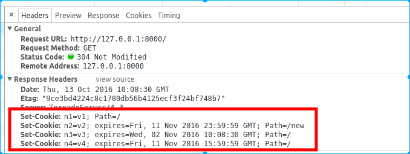

# 数据库


# 安全应用

- Cookie操作
- 安全Cookie
- 跨站请求伪造原理
- XSRF保护
  - 模板
  - 请求体
  - HTTP报文头
- 用户验证
  - authenticated装饰器
  - get_current_user()方法
  - login_url设置


### Cookie

对于RequestHandler，除了在第二章中讲到的之外，还提供了操作cookie的方法。

##### set_cookie()

set_cookie(name, value, domain=None, expires=None, path='/', expires_days=None)

参数说明：

| 参数名       | 说明                                                         |
| :----------- | :----------------------------------------------------------- |
| name         | cookie名                                                     |
| value        | cookie值                                                     |
| domain       | 提交cookie时匹配的域名                                       |
| path         | 提交cookie时匹配的路径                                       |
| expires      | cookie的有效期，可以是时间戳整数、时间元组或者datetime类型，为**UTC时间** |
| expires_days | cookie的有效期，天数，优先级低于expires                      |

```python
import datetime

class IndexHandler(RequestHandler):
    def get(self):
        self.set_cookie("n1", "v1")
        self.set_cookie("n2", "v2", path="/new", expires=time.strptime("2016-11-11 23:59:59","%Y-%m-%d %H:%M:%S"))
        self.set_cookie("n3", "v3", expires_days=20)
        # 利用time.mktime将本地时间转换为UTC标准时间
        self.set_cookie("n4", "v4", expires=time.mktime(time.strptime("2016-11-11 23:59:59","%Y-%m-%d %H:%M:%S")))
        self.write("OK")
```


**原理**

设置cookie实际就是通过设置header的**Set-Cookie**来实现的。



```python
class IndexHandler(RequestHandler):
    def get(self):
        self.set_header("Set-Cookie", "n5=v5; expires=Fri, 11 Nov 2016 15:59:59 GMT; Path=/") 
        self.write("OK")
```


##### get_cookie()

get_cookie(name, default=None)

- 获取名为name的cookie，可以设置默认值。


##### clear_cookie(), clear_all_cookies()

clear_cookie(name, path='/', domain=None)

- 删除名为name，并同时匹配domain和path的cookie。

clear_all_cookies(path='/', domain=None)

- 删除同时匹配domain和path的所有cookie。

**注意：执行清除cookie操作后，并不是立即删除了浏览器中的cookie，而是给cookie值置空，并改变其有效期使其失效。真正的删除cookie是由浏览器去清理的。**


### 安全Cookie

Cookie是存储在客户端浏览器中的，很容易被篡改。Tornado提供了一种对Cookie进行简易加密签名的方法来防止Cookie被恶意篡改。

使用安全Cookie需要为应用配置一个用来给Cookie进行混淆的秘钥cookie_secret，将其传递给Application的构造函数。我们可以使用如下方法来生成一个随机字符串作为cookie_secret的值。

```python
>>> import base64, uuid
>>> base64.b64encode(uuid.uuid4().bytes + uuid.uuid4().bytes)
'2hcicVu+TqShDpfsjMWQLZ0Mkq5NPEWSk9fi0zsSt3A='
```

> Base64是一种基于64个可打印字符来表示二进制数据的表示方法。由于2的6次方等于64，所以每6个比特为一个单元，对应某个可打印字符。三个字节有24个比特，对应于4个Base64单元，即3个字节需要用4个可打印字符来表示。
>
> uuid, 通用唯一识别码（Universally Unique Identifier），是由一组32个16进制数字所构成（两个16进制数是一个字节，总共16字节），因此UUID理论上的总数为16^32=2^128，约等于3.4 x 10^38。也就是说若每纳秒产生1兆个UUID，要花100亿年才会将所有UUID用完。
>
> uuid模块的uuid4()函数可以随机产生一个uuid码，bytes属性将此uuid码作为16字节字符串。

将生成的cookie_secret传入Application构造函数：

```python
app = tornado.web.Application(
    [(r"/", IndexHandler),],
    cookie_secret = "2hcicVu+TqShDpfsjMWQLZ0Mkq5NPEWSk9fi0zsSt3A="
)
```

##### set_secure_cookie()

set_secure_cookie(name, value, expires_days=30)

- 设置一个带签名和时间戳的cookie，防止cookie被伪造。

##### get_secure_cookie()

get_secure_cookie(name, value=None, max_age_days=31)

- 如果cookie存在且验证通过，返回cookie的值，否则返回None。max_age_day不同于expires_days，expires_days是设置浏览器中cookie的有效期，而max_age_day是过滤安全cookie的时间戳。

```python
class IndexHandler(RequestHandler):
    def get(self):
        cookie = self.get_secure_cookie("count")
        count = int(cookie) + 1 if cookie else 1
        self.set_secure_cookie("count", str(count))
        self.write(
            '<html><head><title>Cookie计数器</title></head>'
            '<body><h1>您已访问本页%d次。</h1>' % count + 
            '</body></html>'
        )
```

我们看签名后的cookie值：

```python
"2|1:0|10:1476412069|5:count|4:NQ==|cb5fc1d4434971de6abf87270ac33381c686e4ec8c6f7e62130a0f8cbe5b7609"
```

字段说明：

1. 安全cookie的版本，默认使用版本2，不带长度说明前缀
2. 默认为0
3. 时间戳
4. cookie名
5. base64编码的cookie值
6. 签名值，不带长度说明前缀

注意：Tornado的安全cookie只是一定程度的安全，仅仅是增加了恶意修改的难度。Tornado的安全cookies仍然容易被窃听，而cookie值是签名不是加密，攻击者能够读取已存储的cookie值，并且可以传输他们的数据到任意服务器，或者通过发送没有修改的数据给应用伪造请求。因此，避免在浏览器cookie中存储敏感的用户数据是非常重要的。


### XSRF 保护

跨站请求伪造


### 用户验证

**`@tornado.web.authenticated`** 装饰器

用户验证是指在收到用户请求后进行处理前先判断用户的认证状态（如登陆状态），若通过验证则正常处理，否则强制用户跳转至认证页面（如登陆页面）。 

为了使用 Tornado 的认证功能，我们需要对登录用户标记具体的处理函数。我们可以使用`@tornado.web.authenticated` 装饰器完成它。当我们使用这个装饰器包裹一个处理方法时，Tornado 将确保这个方法的主体只有在合法的用户被发现时才会调用。 

**get_current_user()方法**

装饰器 `@tornado.web.authenticated` 的判断执行依赖于请求处理类中的 `self.current_user` 属性，如果current_user 值为假（None、False、0、""等），任何 GET 或 HEAD 请求都将把访客重定向到应用设置中`login_url` 指定的 URL，而非法用户的 POST 请求将返回一个带有403（Forbidden）状态的 HTTP 响应。

在获取 `self.current_user` 属性的时候，tornado 会调用 `get_current_user()` 方法来返回 current_user 的值。也就是说，**我们验证用户的逻辑应写在get_current_user()方法中，若该方法返回非假值则验证通过，否则验证失败。**

**login_url 设置**

 当用户验证失败时，将用户重定向到login_url上，所以我们还需要在Application中配置login_url。 

```python
class LoginHandler(RequestHandler):
    def get(self):
        """在此返回登陆页面"""
        self.write("登陆页面")

app = tornado.web.Application(
    [
        (r"/", IndexHandler),
        (r"/profile", ProfileHandler),
        (r"/login", LoginHandler),
    ],
    "login_url":"/login"
)
```

**完成登陆操作后的跳转动作**

在login_url后面补充的next参数就是记录的跳转至登录页面前的所在位置，所以我们可以使用next参数来完成登陆后的跳转。

```python
class LoginHandler(RequestHandler):
    def get(self):
        """登陆处理，完成登陆后跳转回前一页面"""
        next = self.get_argument("next", "/")
        self.redirect(next+"?name=logined")
```


# Tornado 异步

- 理解同步与异步执行过程
- 理解异步代码的回调写法与 yield 写法
- Tornado 异步
  - 异步Web客户端 AsyncHTTPClient
  - tornado.web.asynchronous
  - tornado.gen.coroutine
  - 并行协程用法


**异步**

对于耗时的过程，我们将其交给别人（如其另外一个线程）去执行，而我们继续往下处理，当别人执行完耗时操作后再将结果反馈给我们，这就是我们所说的异步。

### 回调写法实现原理

基于 python2 的例子:

```python
# coding:utf-8

import time
import thread

def long_io(callback):
    """将耗时的操作交给另一线程来处理"""
    def fun(cb): # 回调函数作为参数
        """耗时操作"""
        print "开始执行IO操作"
        time.sleep(5)
        print "完成IO操作，并执行回调函数"
        cb("io result")  # 执行回调函数
    thread.start_new_thread(fun, (callback,))  # 开启线程执行耗时操作

def on_finish(ret):
    """回调函数"""
    print "开始执行回调函数on_finish"
    print "ret: %s" % ret
    print "完成执行回调函数on_finish"

def req_a():
    print "开始处理请求req_a" 
    long_io(on_finish)
    print "离开处理请求req_a"

def req_b():
    print "开始处理请求req_b"
    time.sleep(2) # 添加此句来突出显示程序执行的过程
    print "完成处理请求req_b"

def main():
    req_a()
    req_b()
    while 1: # 添加此句防止程序退出，保证线程可以执行完
        pass

if __name__ == '__main__':
    main()
```

执行过程:

```python
开始处理请求req_a
离开处理请求req_a
开始处理请求req_b
开始执行IO操作
完成处理请求req_b
完成IO操作，并执行回调函数
开始执行回调函数on_finish
ret: io result
完成执行回调函数on_finish
```

**异步的特点是程序存在多个步调，即本属于同一个过程的代码可能在不同的步调上同时执行。**


### 协程写法实现原理


# WebSocket


# 部署