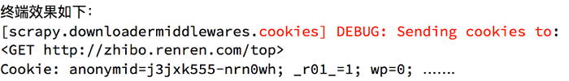

# Scrapy框架

# scrapy基础概念和流程

利用前面通用的爬虫技能和爬虫方法,  已经能够解决90%的爬虫问题.

scrapy并不能解决剩下的10%的问题，而是能够提高爬虫效率.


Scrapy中文文档	https://scrapy-chs.readthedocs.io/zh_CN/1.0/intro/overview.html


## Windows安装scrapy

关于Scrapy安装：Microsoft visual c++ 14.0 is required的解决方法总结

1、下载*twisted*对应版本的whl文件: 

​	进入   [http://www.lfd.uci.edu/~gohlke/pythonlibs/#twisted](http://www.lfd.uci.edu/~gohlke/pythonlibs/#twisted) 

​	ctrl+F 查找twisted

​	cp后是电脑python的版本（查看方法:运行>cmd>输入python即可看到版本）

​	amd后代表位数，32或64位


2、运行命令:  pip install <twisted的whl文件的完整路径>

3、安装完成后，输入pip install Scrapy


## 1. 什么是scrapy

- Scrapy是一个为了爬取网站数据，提取结构性数据而编写的应用**框架**，爬虫开发者只需要实现少量的代码，就能够快速的抓取。
- Scrapy 使用了Twisted `异步`网络框架，可以加快我们的下载速度。


## 2. 异步和非阻塞的区别

- 异步：调用在发出之后，这个调用就直接返回，不管有无结果

- 非阻塞：**关注的是程序在等待调用结果（消息，返回值）时的状态**，指在不能立刻得到结果之前，该调用不会阻塞当前线程。

  


**非阻塞:**  	程序在拿到结果之前的状态,  是继续做其他的事

**阻塞:** 	程序在拿到结果之前的状态,  是等待拿到结果并处理


## 3. scrapy的工作流程

## > 之前的爬虫流程


## > 另一种形式的爬虫流程


## > **scrapy的流程图


**流程描述:**

1. 调度器把Request的实例对象发送给 --> 引擎, 数据类型为Request  -->  下载器中间件, 增加代理等--->  下载器, 发送请求, 获取响应
2. 下载器返回响应给 ----> 下载器中间件 ----> 引擎, 数据类型为Response --->  爬虫中间件  ---> 爬虫, 提取url, 提取数据
3. 爬虫提取url地址，组装成Request对象 ----> 爬虫中间件 ---> 引擎, 数据类型为Request  ---> 调度器
4. 爬虫提取数据, 组装成 Item 对象,  不经过中间件 ---> 引擎, 数据类型为Item --->  管道
5. 管道进行数据的处理和保存

**注意：**

- 图中绿色线条的表示数据的传递
- 注意图中中间件的位置，决定了其作用
- 注意其中引擎的位置，所有的模块之间相互独立，只和引擎进行交互


### **scrapy中每个模块的具体作用


# scrapy的入门使用（一）

## 1. scrapy项目实现流程

1. 创建一个scrapy项目:	`scrapy startproject <项目名字>`
   2. 生成一个爬虫:   `scrapy genspider <爬虫名字> <允许爬取的域名>`
   3. 提取数据:   `完善spider，使用xpath等方法`
   4. 保存数据:   `pipeline中保存数据`


## 2. 创建scrapy项目

创建一个scrapy项目:	`scrapy startproject <项目名字>`

生成的目录和文件结果:


## 3. 创建爬虫

创建一个爬虫 **(一个.py文件)** :	`scrapy genspider <爬虫名字> <允许爬取的域名>`

生成的目录和文件结果:


## 4. 完善spider

完善spider即:   **通过方法进行数据的提取等操作**


**> 注意**

1. `response.xpath()`方法的返回结果是一个类似list的类型，其中包含的是selector对象，操作和列表一样，但是有一些额外的方法

2. `extract()` 返回一个包含有字符串的列表

3. `extract_first()` 返回列表中的第一个字符串，列表为空没有返回None

4. spider中的 `parse方法` 必须重写.  对应源码为:  

   ```python
   def parse(self, response):
           raise NotImplementedError('{}.parse callback is not defined'.format(self.__class__.__name__))
   ```

5. 需要抓取的url地址必须属于allowed_domains,  但是start_urls中的url地址没有这个限制

6. 启动爬虫的时候注意启动的位置，是在项目路径下启动


## 5. 数据传递到pipeline


**> 为什么要使用yield？**

- 让整个函数变成一个生成器，有什么好处呢？
- 遍历这个函数的返回值的时候，挨个把数据读到内存，不会造成内存的瞬间占用过高
- python3中的range和python2中的xrange同理

**注意：**

- **yield能够传递的对象只能是**：`BaseItem`,  `Request`,    `dict`,   `None`,   不能传 list 等
- yield将数据item传给 **引擎**,  引擎可以接收的就是以上 4 种类型数据


**Item_pipeline有以下应用:**

- 清理html数据,  如去除html文件中的tbody标签
- 验证爬取数据的合法性, 检查item是否包含在某些字段中, 如:  手机号, 邮箱的格式; 关键字的验证
- 查重并丢弃, 如歌曲
- 将爬取的结果保存到文件或者数据库中,  或存储为xlsx表格文件


## 6. 完善pipeline


**> pipeline在settings中能够开启多个，为什么需要开启多个？**

- 不同的pipeline可以处理不同爬虫的数据
- 不同的pipeline能够进行不同的数据处理的操作，比如一个进行数据清洗，一个进行数据的保存

**> pipeline使用注意点**

- 使用之前需要在settings中开启
- pipeline在setting中键表示位置(即pipeline在项目中的位置可以自定义)，值表示距离引擎的远近，越近数据会越先经过
- pipeline中 必须定义 `process_item 方法`，否则item没有办法接受和处理
- process_item方法接受item和spider，其中spider表示当前传递item过来的spider
- 有多个pipeline的时候，process_item的方法必须  `return item`,  否则后一个pipeline取到的数据为None值


## 7. 设置LOG_LEVEL日志等级

- 为了让输出到终端的内容能容易看一些，可以在setting中设置log级别.
- 在setting中添加一行（全部大写）：`LOG_LEVEL = "WARNING”`
- 默认终端显示的是 DEBUG 级别的log信息


# scrapy的入门使用（二）

## 1. scrapy实现翻页请求

思路:

1. 找到下一页的url地址
2. 构造url地址的请求，传递给引擎

### 实现翻页请求的方法

在获取到url地址之后，可以通过 `scrapy.Request(url,callback)` 得到一个request对象，通过yield关键字就可以把这个request对象交给引擎

```python
yield response.follow(next_url, callback=self.parse)
```

### 在 `settings` 中设置User-Agent

```python
USER_AGENT = 'Mozilla/5.0 (Macintosh; Intel Mac OS X 10_12_5) AppleWebKit/537.36 (KHTML, like Gecko) Chrome/59.0.3071.115 Safari/537.36'
```


### > 例: 爬取腾讯招聘的页面的招聘信息

url: https://hr.tencent.com/position.php

### ~ hiring_msg.py

> 流程

- 起始url:  start_urls
- 处理列表页首页
  - **根据xpath获取元素时注意:** <tbody>标签只在浏览器Elements下显示,  在网页源码/url对应响应中并没有,  写xpath路径时不能考虑tbody.
- 翻页，请求列表页下一页
- 拼接url的 3 种方法
  - 普通拼接:  前缀 + next_url,  拼接之后请求列表页下一页
  - 通过 `urllib.parse.urljoin()` 进行url地址的拼接,  urljoin(response.url, next_url),  拼接之后请求列表页下一页
  - **推荐**:  使用 `response.follow()` 方法根据repsponse的url地址，对next_url进行url<自动拼接>，并请求列表页下一页

```python
# -*- coding: utf-8 -*-
import scrapy
from urllib.parse import urljoin


class HiringMsgSpider(scrapy.Spider):
    name = 'hiring_msg'
    allowed_domains = ['tencent.com']
    start_urls = ['https://hr.tencent.com/position.php']

    def parse(self, response):
        # tr_list = response.xpath("//table[@class='tablelist']//tr[@class='odd'] | //tr[@class='even']")
        tr_list = response.xpath("//table[@class='tablelist']/tr")[1:-1]  # 对应不同的遍历处理方法

        # 列表页首页
        for tr in tr_list:
            item = dict()
            item['position_name'] = tr.xpath("./td[1]/a/text()").extract_first()
            item['position_url'] = 'https://hr.tencent.com/' + tr.xpath("./td[1]/a/@href").extract_first()
            item['position_category'] = tr.xpath("./td[2]/text()").extract_first()
            item['needs'] = tr.xpath("./td[3]/text()").extract_first()
            item['address'] = tr.xpath("./td[4]/text()").extract_first()
            item['publish_date'] = tr.xpath("./td[5]/text()").extract_first()
            yield item

        # 翻页，请求列表页下一页
        next_url = response.xpath("//a[@id='next']/@href").extract_first()
        if next_url != 'javascript:;':
            # 表示有'下一页', 否则到了最后一页
            # 拼接url No.1 ---- 普通拼接
            # next_url = "https://hr.tencent.com/" + next_url

            # 拼接url No.2 ---- 通过urllib.parse.urljoin()进行url地址的拼接
            # urljoin(response.url, next_url)
            # yield scrapy.Request(next_url, callback=self.parse)  # 返回Request对象给引擎

            # 拼接url No.3 ---- 根据repsponse的url地址，对next_url进行url<自动拼接>，并构造请求
            yield response.follow(next_url, callback=self.parse)
            
```


### ~ pipelines.py

```python
# -*- coding: utf-8 -*-
# Define your item pipelines here
# Don't forget to add your pipeline to the ITEM_PIPELINES setting

from pymongo import MongoClient

# 使用 mongodb 数据库保存结果
client = MongoClient()
collection = client['shendiao']['hiring_msg']


class TencentPipeline(object):
    def process_item(self, item, spider):
        if spider.name == "hiring_msg":
            print(item)
            # 插入数据到mongodb对应库-对应集合中
            collection.insert_one(item)
        return item
```


### ~ settings.py

```python
...
# 找到User-Agent的配置项, 取消注释, 改为以下
USER_AGENT = 'Mozilla/5.0 (Windows NT 10.0; WOW64) AppleWebKit/537.36 (KHTML, like Gecko) Chrome/69.0.3497.92 Safari/537.36'
...

# 取消管道配置的注释
ITEM_PIPELINES = {
   'mySpiser.pipelines.MyspiserPipeline': 300,
}
...
# 增加设置日志等级
LOG_LEVEL = 'WARNING'
```


### scrapy.Request的更多参数

```python
scrapy.Request(url, callback, method="GET", headers, body, cookies, meta, dont_filter=False)
```

注意：

- **callback**
  - 表示当前的url的响应交给哪个函数去处理,  默认为self.parse
- **meta**
  - 实现数据在不同的解析函数中传递
  - meta默认带有部分数据，比如下载延迟，请求深度等
- **dont_filter**
  -  默认会过滤请求的url地址，即请求过的url地址不会继续被请求
  -  对需要重复请求的url地址可以把它设置为Ture，比如贴吧的翻页请求，页面的数据总是在变化;  start_urls中的地址会被反复请求，否则程序不会启动


## 2. 定义Item

### 定义Item的作用

- 字段约束 & 方便统一显示要抓取的字段
  - 定义item即 **提前规划好哪些字段需要抓取**，name = scrapy.Field() 仅仅是提前占坑，
  - 通过item.py能够让别人清楚自己的爬虫是在抓取什么，同时定义好哪些字段是需要抓取的，**没有在item.py中定义的字段不能使用**，防止手误

### 在item.py中定义Item


### 使用Item

Item使用之前需要先导入并且实例化，之后的使用方法和使用字典相同

```python
from yangguang.items import YangguangItem
...
def parse(self, response):
    tr_list = response.xpath("//div[@class='greyframe']/table[2]/tr/td/table/tr")
    for tr in tr_list:
        item = YangguangItem()  # 实例化
        item["num"] = tr.xpath("./td[1]/text()").extract_first()
        ...
```


### > 例: 爬取阳光热线问政平台

目标：所有的投诉帖子的编号、帖子的url、帖子的标题和内容

url:  http://wz.sun0769.com/index.php/question/questionType?type=4&page=0

> 流程

- 列表页的数据
- 确定列表页url地址和程序结束条件
  - 存在下一页时,  注意下一页的 '>' 在网页源码中虽然是 `&gt`, 但写代码匹配时还是写 `>`,  内部程序自动处理
  - 不存在下一页时,  请求结束
- 确定详情页的数据
  - 数据从列表页传递到详情页使用:	`meta参数`,  传入meta={'item': item}
    - 在scrapy.Request()中传入meta,  在response中获取meta
    - 源码中self._meta = dict(meta),  说明在response中获取的meta是字典类型
  - 包含图片时,  content所在标签类名为 class='contentext';  不包含图片时,  content所在标签类名为 class='c1 text14_2'
    - 提取方法:  统一按标签类名为 class='c1 text14_2' 获取content.   
    - resposne.xpath("//div[@class='c1 text14_2']//text()").extract()
    - 问题:  这样提取得到的content列表中会有很多没用的项, 后面需要在管道中清理
- 在管道 pipelines.py 中进行 `数据清洗`,  去除空白字符(\s) 和 特殊字符('\xa0')
- 注意自定义XxxItem类的导入路径
  - pycharm显示的错误信息不一定真的错
  - 原因: 程序启动目录是在每个爬虫项目之下, 当前大目录包括了多个爬虫项目
- 将 item 存入mongodb之前,  需要进行dict()强制类型转换
  - <class 'sunlight.items.SunlightItem'>   -----dict()--->   **< class 'dict'>**   ------>   mongodb
- 代理的使用
  - 定义代理中间件(类): ProxyMid
  - 取消settings.py中下载器中间件的注释


### ~ sun_hotline.py

```python
# -*- coding: utf-8 -*-
import scrapy

from sunlight.items import SunlightItem  # 注意导入路径, 不管pycharm的错误提示


class SunHotlineSpider(scrapy.Spider):
    name = 'sun_hotline'
    # allowed_domains = ['http://wz.sun0769.com']  # XXXXXX
    allowed_domains = ['wz.sun0769.com']  # 对对对对对

    start_urls = ['http://wz.sun0769.com/index.php/question/questionType?type=4&page=0']

    def parse(self, response):  # 提取列表页数据
        tr_list = response.xpath("//div[@class='greyframe']/table[2]//table//tr")
        for tr in tr_list:
            # 获取列表页第一页内容
            
            # item = dict()
            item = SunlightItem() # 实例化item
            
            item['id'] = tr.xpath("./td[1]/text()").extract_first()
            item['title'] = tr.xpath("./td[2]/a[2]/text()").extract_first()
            item['href'] = tr.xpath("./td[2]/a[2]/@href").extract_first()
            item['address'] = tr.xpath("./td[2]/a[3]/text()").extract_first()
            item['status'] = tr.xpath("./td[3]/span/text()").extract_first()
            item['publisher'] = tr.xpath("./td[4]/text()").extract_first()
            item['publish_date'] = tr.xpath("./td[5]/text()").extract_first()

            # yield item

            # 请求当前标题对应的详情页内容
            detail_url = item['href']
            yield scrapy.Request(
                                detail_url,
                                callback=self.parse_detail,
                                meta={'item': item}
                                )

        # 获取完当前列表页, 再请求下一页
        # next_url = response.xpath("//a[contains(text(), '>')][1]").extraxt_first()
        next_url = response.xpath("//a[text()='>']/@href").extract_first()
        # print(next_url)
        if next_url is not None:
            # 如果有下一页, 构造请求
            yield scrapy.Request(next_url, callback=self.parse)


    def parse_detail(self, response):   # 提取每个标题下的详情页数据
        item = response.meta['item']
        src = response.xpath("//div[@class='textpic']/img/@src").extract_first()
        item['image_url'] = ("http://wz.sun0769.com" + src) if src else ''
        item['content'] = response.xpath("//div[@class='c1 text14_2']//text()").extract()
        # 返回给引擎
        yield item
```


### ~ pipelines.py

```python
# -*- coding: utf-8 -*-

# Define your item pipelines here
#
# Don't forget to add your pipeline to the ITEM_PIPELINES setting
# See: https://doc.scrapy.org/en/latest/topics/item-pipeline.html

import re
from pymongo import MongoClient
client = MongoClient()
collection = client['shendiao']['sunlight']


class SunlightPipeline(object):
    def process_item(self, item, spider):
        item['content'] = self.process_content(item['content'])
        # 此时item不是字段，不能直接存入mongodb
        print(type(item))  # <class 'sunlight.items.SunlightItem'>
        collection.insert_one(dict(item))

        # return返回清洗后的数据
        print(item)
        return item

    def process_content(self, content):
        content = [re.sub(r'\s|\xa0', '', s) for s in content]  # 替换字符串中的\xa0,\s
        content = [s for s in content if len(s)>0]  # 删除列表中的空字符串
        # return返回清理后的content
        return content
```


### ~ items.py

```python
# -*- coding: utf-8 -*-

# Define here the models for your scraped items
#
# See documentation in:
# https://doc.scrapy.org/en/latest/topics/items.html

import scrapy


class SunlightItem(scrapy.Item):
    # define the fields for your item here like:
    # name = scrapy.Field()

    id = scrapy.Field()             # 编号
    title = scrapy.Field()          # 标题
    href = scrapy.Field()           # 详情页链接
    address = scrapy.Field()        # 地址
    status = scrapy.Field()         # 处理状态
    publisher = scrapy.Field()      # 发表人
    publish_date = scrapy.Field()   # 发表日期

    content = scrapy.Field()        # 详情页内容
    image_url = scrapy.Field()      # 详情页图片链接
```


### ~middlewares.py 

```python
# Define here the models for your spider middleware
from scrapy import signals


class YangguangSpiderMiddleware(object):
    # Not all methods need to be defined. If a method is not defined,
    # scrapy acts as if the spider middleware does not modify the
    # passed objects.
    ...


class ProxyMid:
    def process_request(self,request,spider):
        request.meta["proxy"] = "http://111.13.135.153:80"
```


### > 练习:  抓取果壳网列表页内容

- 确定某个标签的class类名的是否唯一:  Ctrl+F 查找类名

### ~ guokr.py

```python
# -*- coding: utf-8 -*-
import scrapy
from guokr.items import GuokrItem
from pprint import pprint

class GkSpider(scrapy.Spider):
    name = 'gk'
    allowed_domains = ['guokr.com']
    start_urls = ['https://www.guokr.com/ask/highlight/']

    def parse(self, response):
        # self.settings["HOST"]
        # 先分组，在提取
        li_list = response.xpath("//ul[@class='ask-list-cp']/li")
        for li in li_list:
            item = {}
            item["focus_nums"] = li.xpath(".//p[@class='ask-focus-nums']/span/text()").extract_first()
            item["answer_nums"] = li.xpath(".//p[@class='ask-answer-nums']/span/text()").extract_first()
            item["title"] = li.xpath(".//h2/a/text()").extract_first()
            item["href"] = li.xpath(".//h2/a/@href").extract_first()
            item["summary"] = li.xpath(".//p[@class='ask-list-summary']/text()").extract_first().strip()
            item["tag"] = li.xpath(".//a[@class='tag']/text()").extract()
            # 进入详情页
            yield scrapy.Request(
                item["href"],
                callback=self.parse_detail,
                meta={"item": item})

        # 请求下一页
        # 获取下一页的url地址
        next_url = response.xpath("//a[text()='下一页']/@href").extract_first()
        if next_url is not None:
            yield response.follow(next_url, callback=self.parse)

    def parse_detail(self, response):
        item = response.meta["item"]
        # item["answer_num"] = response.xpath("//span[@class='answers-num gfl']/text()").extract_first().strip()
        # 对回答进行分组，每组进行数据的提取
        div_list = response.xpath("//div[contains(@class,'answer gclear')]")
        answer_lsit = []
        for div in div_list:
            one_answer = {}
            one_answer["name"] = div.xpath(".//a[@class='answer-usr-name']/@title").extract_first()
            one_answer["support_num"] = div.xpath(".//a[@class='answer-digg-up']/span/text()").extract_first()
            one_answer["content"] = div.xpath(".//div[@class='answer-txt answerTxt gbbcode-content']//text()").extract()
            answer_lsit.append(one_answer)
        item["answer_list"] = answer_lsit
        pprint(item)
```

### ~ items.py

```python
import scrapy


class GuokrItem(scrapy.Item):
    # define the fields for your item here like:
    # name = scrapy.Field()

    # 列表页
    focus_nums = scrapy.Field()     # 关注人数
    answer_nums = scrapy.Field()    # 回答人数
    title = scrapy.Field()          # 标题
    href = scrapy.Field()     		# 详情页链接
    summary = scrapy.Field()        # 摘要
    tag = scrapy.Field()            # 标签

    # 详情页
    answer_list = scrapy.Field()    # 回答列表
```


# scrapy进阶

## 1. 认识scrapy的debug信息


## 2. scrapy shell的使用

scrapy shell是scrapy提供的一个终端工具，能够通过它查看scrapy中对象的属性和方法，以及测试xpath

**使用方法:**

- 打开scrapy shell的命令:	`scrapy shell <url> `

  - 如果安装了 ipython,  就会进入Ipython 的交互式终端,  有tab提示和自动补全

- 打开 scrapy shell 的同时,  指定USER_AGENT:   `scrapy   shell   -s   USER_AGENT="......"   "...URL..."`

- 查看帮助信息: `shelp() `

- 要点：

  - response.url：当前响应的url地址
  - response.request.url：当前响应对应的请求的url地址
  - response.headers：响应头
  - response.body：响应体，也就是html代码，默认是byte类型
  - response.requests.headers：当前响应的请求头

  

request对象的属性

  ```python
request.body
request.copy
request.errback
request.meta
request.replace
request.callback
request.dont_filter
request.flags
request.method
request.url
request.cookies
request.encoding
request.headers
request.priority
  ```

response对象的属性

  ```
response.body				响应体, 默认bytes类型
response.text				响应体, 返回str类型
response.encoding
response.meta
response.status
response.xpath				response对象的Selector类的简写形式, response.xpath()
response.selector			返回一个response对象的Selector类,  response.selector.xpath()
response.body_as_unicode
response.flags
response.replace
response.copy
response.follow
response.request
response.request.url		请求url
response.url				响应url
response.css
response.headers			响应头
response.request.headers	请求头
response.urljoin
  ```

spider对象的属性

  ```
spider.close
spider.handles_request
spider.name
spider.start_requests
spider.crawler
spider.log
spider.parse
spider.start_urls
spider.custom_settings
spider.logger
spider.set_crawler
spider.update_settings
spider.from_crawler
spider.make_requests_from_url
spider.settings					返回爬虫的配置信息
  ```

  


- shelp()

```
[s] Available Scrapy objects:
[s]   scrapy     scrapy module (contains scrapy.Request, scrapy.Selector, etc)
[s]   _3         <scrapy.settings.Settings object at 0x000001E1AD11BB70>
[s]   crawler    <scrapy.crawler.Crawler object at 0x000001E1AD11B940>
[s]   item       {}
[s]   request    <GET http://wz.sun0769.com/index.php/question/questionType?type=4>
[s]   response   <200 http://wz.sun0769.com/index.php/question/questionType?type=4>
[s]   settings   <scrapy.settings.Settings object at 0x000001E1AD11BB70>
[s]   spider     <DefaultSpider 'default' at 0x1e1ad3a25f8>
[s] Useful shortcuts:
[s]   fetch(url[, redirect=True]) Fetch URL and update local objects (by default, redirects are followed)
[s]   fetch(req)        Fetch a scrapy.Request and update local objects
[s]   shelp()           Shell help (print this help)
[s]   view(response)    View response in a browser
```


## 3. 认识scrapy中的setting文件

- 为什么项目中需要配置文件

  - 在配置文件中存放一些公共变量，在后续的项目中方便修改
  - 注意其中的变量名一般全部大写

- 配置文件中的变量使用方法

  - NO.1 from ... import导入使用
  - NO.2 在爬虫文件中获取:   `self.settings.get()`
  - NO.3 在管道文件中获取:   `spider.settings.get()`

- settings.py中的重点字段

  ```
  BOT_NAME			项目名
  SPIDER_MODULES		爬虫文件位置
  NEWSPIDER_MODULE	爬虫文件位置

  USER_AGENT			设置ua, 不要在 DEFAULT_REQUEST_HEADERS 中设置
  ROBOTSTXT_OBEY 		是否遵守robots协议，默认是遵守

  CONCURRENT_REQUESTS 设置并发请求的数量，默认是16个
  DOWNLOAD_DELAY 		下载延迟(秒)，默认无延迟, 可以设置为随机数

  COOKIES_ENABLED 	是否开启cookie，即每次请求带上前一次的cookie，默认开启
  DEFAULT_REQUEST_HEADERS 设置默认请求头

  SPIDER_MIDDLEWARES	 	爬虫中间件，设置过程和管道相同
  ITEM_PIPELINES			管道
  DOWNLOADER_MIDDLEWARES 	下载中间件

  LOG_LEVEL = 'WARNING'	设置日志等级
  ```

  


## 4. 管道中的`open_spider`和`close_spider` 的方法

在管道中，除了必须定义process_item之外，还可以定义两个方法：

- `open_spider(spider)` 	能够在爬虫开启的时候执行一次
- `close_spider(spider)` 能够在爬虫关闭的时候执行一次

所以，上述方法经常用于爬虫和数据库的交互:

- 在爬虫开启的时候建立和数据库的连接
- 在爬虫关闭的时候断开和数据库的连接

分别以操作文件和mongodb为例展示方法的使用：

------------------------------------------


-----------------------------------------------------------


---------------------------


## > **练习: 爬取苏宁易购书城

需求：爬取苏宁易购所有下所有图书和图书分类信息，以及子链接页面的价格内容。

url : [https://book.suning.com/](https://book.suning.com/)

- 注意浏览器Elements中的类名不一定与网页源码的一致, 最好从源码中根据类名再查找一次
  - **在Elements中分析网页结构 (标签关系)**
  - **在源代码中确定xpath (真实class/src等属性名)**
- 可以对每次for循环的列表进行[:1]切片,  测试第一条请求结果是否正确


```python
--------先分组, 后提取--------
1 获取列表页
|获取大分类分组
	获取大分类名字
	|获取中间分类的分组
		获取中间分类的名字
		|获取小分类的分组
			获取小分类的名字和url
			请求图书列表页
            |列表页翻页
 			2 获取详情页
```

### ~ *suning_books.py

```python
# -*- coding: utf-8 -*-
import re
import scrapy
from suning.items import SuningItem
from copy import deepcopy


class SuningBooksSpider(scrapy.Spider):
    name = 'suning_books'
    allowed_domains = ['suning.com']
    start_urls = ['https://book.suning.com/']

    def parse(self, response):
        # 获取大分类分组
        div_list = response.xpath("//div[@class='menu-list']/div[@class='menu-item']")
        div_sub_list = response.xpath("//div[@class='menu-list']/div[@class='menu-sub']")
        for div in div_list[:1]:
            item = SuningItem()
            # 获取大分类的名字
            item['b_cat'] = div.xpath(".//h3/a/text()").extract_first()
            # 获取中间分类分组
            p_list = div_sub_list[div_list.index(div)].xpath("./div[@class='submenu-left']/p")
            print(len(p_list))
            if len(p_list) > 0:  # todo 判断是否存在中间分类分组
                for p in p_list:
                    # 获取中间分类名字
                    item['m_cat'] = p.xpath("./a/text()").extract_first()
                    # 获取小分类分组
                    li_list = p.xpath("./following-sibling::ul[1]/li")
                    return self.get_s_cat_and_book_list(li_list, item)

            else:   # todo 没有中间分类分组时, 即只有大分类 & 小分类
                li_list = div_sub_list[div_list.index(div)].xpath("./div[@class='submenu-left']/ul/li")
                return self.get_s_cat_and_book_list(li_list, item)

    def get_s_cat_and_book_list(self, li_list, item):
        for li in li_list:
            # 获取小分类名字
            item['s_cat'] = li.xpath("./a/text()").extract_first()
            item['s_url'] = li.xpath("./a/@href").extract_first()

            # 获取列表页前30个
            yield scrapy.Request(
                item['s_url'],
                callback=self.parse_book_list,
                meta={'item': deepcopy(item)},
            )
            # 获取列表页后30个
            # 前30: https://list.suning.com/emall/showProductList.do
            #       ?ci=262669&pg=03&cp=1&il=0&iy=0&adNumber=0&n=1
            #       &ch=4&prune=0&sesab=ACBAAB&id=IDENTIFYING&cc=025
            # 后30: https://list.suning.com/emall/showProductList.do
            #       ?ci=262669&pg=03&cp=1&il=0&iy=0&adNumber=0&n=1
            #       &ch=4&prune=0&sesab=ACBAAB&id=IDENTIFYING&cc=025&paging=1&sub=0
            next_part_url_temp = "https://list.suning.com/emall/showProductList.do?ci={}&pg=03&cp=0&il=0&iy=0&adNumber=0&n=1&ch=4&prune=0&sesab=ACBAAB&id=IDENTIFYING&paging=1&sub=0"
            ci = item['s_url'].split("-")[1]
            next_part_url = next_part_url_temp.format(ci)
            yield scrapy.Request(
                next_part_url,
                self.parse_book_list,
                meta={'item': deepcopy(item)}
            )

    def parse_book_list(self, response):
        """获取列表页, 列表页分 前/后 两部分获取"""
        item = response.meta['item']
        # 该xpath在获取列表页后一部分时无效: li_list = response.xpath("//div[@id='filter-results']/ul/li")
        li_list = response.xpath("//li[contains(@class,'product      book')]")
        # 获取列表页前/后部分
        for li in li_list:
            item['book_name'] = li.xpath(".//p[@class='sell-point']/a/text()").extract_first().strip()
            item['book_href'] = li.xpath(".//p[@class='sell-point']/a/@href").extract_first()
            item['book_store'] = li.xpath(".//p[contains(@class,'seller oh no-more')]/a/text()").extract_first()

            # 发送详情页请求, 在详情页中获取图书价格
            yield response.follow(
                item['book_href'],
                callback=self.parse_book_detail,
                meta={'item': deepcopy(item)}
            )

        # todo 列表页翻页
        # 前半部分数据的url地址
        next_url_1 = "https://list.suning.com/emall/showProductList.do" \
                     "?ci={}&pg=03&cp={}&il=0&iy=0&adNumber=0&n=1&ch=4&sesab=ABBAAA&id=IDENTIFYING&cc=010"
        # 后半部分数据的url地址
        next_url_2 = "https://list.suning.com/emall/showProductList.do" \
                     "?ci={}&pg=03&cp={}&il=0&iy=0&adNumber=0&n=1&ch=4&sesab=ABBAAA&id=IDENTIFYING&cc=010&paging=1&sub=0"
        ci = item["s_url"].split("-")[1]
        # 当前的页码数
        current_page = re.findall('param.currentPage = "(.*?)";', response.body.decode())[0]
        # 总的页码数
        total_page = re.findall('param.pageNumbers = "(.*?)";', response.body.decode())[0]
        if int(current_page) < int(total_page):
            next_page_num = int(current_page) + 1
            next_url_1 = next_url_1.format(ci, next_page_num)
            # 构造前半部分数据的请求
            yield scrapy.Request(
                next_url_1,
                callback=self.parse_book_list,
                meta={"item": item}
            )
            # 构造后半部分数据的请求
            next_url_2 = next_url_2.format(ci, next_page_num)
            yield scrapy.Request(
                next_url_2,
                callback=self.parse_book_list,
                meta={"item": item}
            )

    def parse_book_detail(self, response):
        """获取详情页图书价格, 或其他数据"""
        # 当前html响应的url格式: https://product.suning.com/0070157234/614203589.html
        # 价格所在响应的url格式:
        # https://icps.suning.com/icps-web/getAllPriceFourPage/000000000614203589_0070157234_025_0250101_1_pc_FourPage.getHisPrice.vhtm
        # https://icps.suning.com/icps-web/getAllPriceFourPage/000000000{p1}_{p2}_025_0250101_1_pc_FourPage.getHisPrice.vhtm
        item = response.meta['item']

        # 响应html中无图书价格
        price_url_temp = "https://icps.suning.com/icps-web/getAllPriceFourPage/000000000{p1}_{p2}_025_0250101_1_pc_FourPage.getHisPrice.vhtm"
        p1 = item['book_href'].split("/")[-1].split(".")[0]  # 在详情页url中提取p1
        p2 = item['book_href'].split("/")[-2]  # 在详情页url中提取p2
        price_url = price_url_temp.format(p1=p1, p2=p2)
        yield scrapy.Request(
            price_url,
            callback=self.parse_book_price,
            meta={'item': item}
        )

    def parse_book_price(self, response):
        item = response.meta['item']
        promotion_price = re.findall(r'"promotionPrice":\s?"(.*?)"', response.body.decode())
        print("promotion_price: ", promotion_price)
        if len(promotion_price) > 0:
            book_price = promotion_price[0]
        else:
            book_price = re.findall(r'"netPrice":\s?"(.*?)"', response.body.decode())[0]
        item['book_price'] = book_price

        print(item)
        yield item
```

### ~ items.py

```python
import scrapy


class SuningItem(scrapy.Item):
    b_cat = scrapy.Field()      # 大分类名字
    m_cat = scrapy.Field()      # 中间分类名字
    s_cat = scrapy.Field()      # 小分类名字
    s_url = scrapy.Field()      # 小分类对应url, 链接的是图书列表页

    book_name = scrapy.Field()  # 列表页展示的图书信息
    book_href = scrapy.Field()  # 列表页图书链接
    book_store = scrapy.Field() # 列表页图书书店名称

    book_price = scrapy.Field() # 详情页图书价格
```

### ~ middlewares.py

```python
......

# 使用代理ip
class ProxyMid:
    def process_request(self,request,spider):
        request.meta["proxy"] = "http://219.157.144.246:8118"
```

### ~ pipelines.py

>  保存为 excel 文件

```python
from openpyxl import Workbook

wb = Workbook()  # 实例化工作薄对象
work_sheet = wb.create_sheet('苏宁图书')  # 创建工作表对象


class SuningPipeline(object):
    def process_item(self, item, spider):
        work_sheet.append([item['b_cat'],    		# 往当前工作表中添加一行数据
                           item.get('m_cat', None),
                           item['s_cat'],
                           item['s_url'],
                           item['book_name'],
                           item['book_href'],
                           item['book_store'],
                           item['book_price'],
                           ])
        wb.save('suning_books.xlsx')
        return item
```


# CrawlSpider类的使用

## 1. crawlspider是什么

回顾之前的代码中，我们有很大一部分时间在寻找下一页的url地址或者是内容的url地址上面，这个过程能更简单一些么？

思路：

- **从response中提取所有的满足规则的url地址**
- **自动地构造requests请求，并发送给引擎**

对应的crawlspider就可以实现上述需求，匹配满足条件的url地址，才发送给引擎，同时能够指定callback函数


## 2. 认识crawlspider爬虫

### 2.1 创建crawlspdier爬虫的命令

```python
scrapy genspider –t crawl tencent tencent.com
```


### 2.2 观察爬虫内的默认内容

spider中默认生成的内容如下，其中重点在 rules 中

- rules是一个元组或者是列表，包含的是Rule对象
- Rule表示规则，其中包含`LinkExtractor`,  `callback`  和 `follow`
- `LinkExtractor`:  **连接提取器**，可以通过正则或者是xpath来进行url地址的匹配
- `callback` :  表示经过连接提取器提取出来的url地址响应的回调函数，可以没有，没有表示响应不会进行回调函数的处理
- `follow`：表示进过连接提取器提取的url地址对应的响应是否还会继续被rules中的规则进行提取，True表示会，Flase表示不会

```python
# -*- coding: utf-8 -*-
import scrapy
from scrapy.linkextractors import LinkExtractor
from scrapy.spiders import CrawlSpider, Rule


class ItSpider(CrawlSpider):
    name = 'tencent'
    allowed_domains = ['tencent.com']
    start_urls = ['https://hr.tencent.com/position.php']

    rules = (
        Rule(LinkExtractor(allow=r'匹配url的正则'), callback='parse_item', follow=True),
        Rule(LinkExtractor(allow=r'匹配url的正则'), callback='xxx', follow=xxx),
    )

    def parse_item(self, response):
        i = {}
        #使用xpath进行数据的提取或者url地址的提取
        return i
```


### 2.3 crawlspider的使用

通过crawlspider爬取腾讯招聘的详情页的招聘信息，url：[http://hr.tencent.com/position.php](http://hr.tencent.com/position.php)

思路分析：

1. **列表页翻页**

   定义一个规则，来进行列表页的翻页，follow需要设置为True

   注意正则中要对 ? 号进行转义

2. **详情页翻页**

   定义一个规则，实现从列表页进入详情页，并且指定回调函数

3. **详情页数据的提取**

   在详情页url地址对应的回调函数中，实现数据提取

### ~ tencent.py----NO.1 

**如果在列表页中只需要提取每一页的对应的url,  而不需要提取列表页中的其他内容**

- 列表页 和 详情页,  分别写一个Role
- 在详情页的Role中指定callback="xxx",  进行详情页数据提取

```python
class TencentSpider(CrawlSpider):
    name = 'tencent'
    allowed_domains = ['tencent.com']
    start_urls = ['https://hr.tencent.com/position.php']

    rules = (
        # 提取列表页的url地址
        Rule(LinkExtractor(allow=r'position.php\?&start=\d+#a'), follow=True),
        # 提取详情页的url地址
        Rule(LinkExtractor(allow=r'position_detail.php\?id=\d+&keywords=&tid=0&lid=0'), callback="parse_item"),

    )
	
    # 省去了以下代码:
    # def parse_list(self,resposne):
    #     item = {}
    #     item["date"] = resposne.xpath("")
    #     yield scrapy.Request(
    #         detail_url,
    #         callback=self.parse_item,
    #         meta = {"item":item}
    #     )

    def parse_item(self, response):
        item = {}
        # 提取标题
        item["title"] = response.xpath("//td[@id='sharetitle']/text()").extract_first()
        # 提取职责
        item["duty"] = response.xpath("//div[text()='工作职责：']/following-sibling::ul[1]/li/text()").extract()
        # 提取工作要求：
        item["require"] = response.xpath("//div[text()='工作要求：']/following-sibling::ul[1]/li/text()").extract()
        print(item)
```


### ~ tencent.py----NO.2

**如果在列表页中不仅需要提取每一页的对应的url,  还需要提取其他数据**

- 只为提取列表页分页的url写一个Role,  同时指定callback="xxx",  进行列表页其他数据提取,  在callback指向的函数中用scrapy.Request() 构造请求,  请求详情页数据

```python
class TencentSpider(CrawlSpider):
    name = 'tencent'
    allowed_domains = ['tencent.com']
    start_urls = ['https://hr.tencent.com/position.php']

    rules = (
        # 提取列表页的url地址, 以及列表页其他数据
        Rule(LinkExtractor(allow=r'position.php\?&start=\d+#a'), follow=True, callback='parse_list'),
    )
	
    # 省去了以下代码:
    def parse_list(self, resposne):
        tr_list = resposne.xpath("//..........")
        for tr in tr_list:
            item = {}
            # 提取列表页当前项的'发布时间'
            item['publish_date'] = tr.xpath(".//......").extract_first()
            # 提取列表页当前项的detail_url
            item['detail_url'] = tr.xpath(".//......").extract_first()
            
            # 请求详情页内容
            yield scrapy.Request(
                item['detail_url'],
                callback=self.parse_item,
                meta = {"item": item}
            )
	
    # 以下代码无修改
    def parse_item(self, response):
        item = {}
        # 提取标题
        item["title"] = response.xpath("//td[@id='sharetitle']/text()").extract_first()
        # 提取职责
        item["duty"] = response.xpath("//div[text()='工作职责：']/following-sibling::ul[1]/li/text()").extract()
        # 提取工作要求：
        item["require"] = response.xpath("//div[text()='工作要求：']/following-sibling::ul[1]/li/text()").extract()
        print(item)
```


### 2.4 crawlspider使用的注意点

--------------------------


### 2.5 crawlspider的补充

------------------------------------


# 下载器中间件和模拟登陆

## 1. scrapy中下载器中间件的使用

1. 使用方法：

   编写一个Downloader Middlewares 和编写一个pipeline一样，定义一个类，然后在settings中开启.

2. Downloader Middlewares 默认的方法：

   - **process_request (self, request, spider)：**

     ```
     当每个request通过下载中间件时，该方法被调用。
       - 如果返回None值：请求继续被[下载器]执行
       - 如果返回Response对象：不再请求，直接把response返回给[引擎]
       - 如果返回Request对象：把request对象通过[引擎]交给[调度器], 调度器负责从request队列中调度request进行后续的请求
     ```

   - **process_response (self, request, response, spider)：**

     ```
     当下载器完成http请求，传递响应给[引擎]的时候调用
       - 如果返回Resposne：交给process_response来处理
       - 如果返回Request对象：通过[引擎]交给[调度器]继续请求
     ```

3. 定义实现 `随机User-Agent` 的下载器中间件

   ```python
    class UserAgentMiddleware(object):
        def process_request(self,request,spider):
            agent = random.choice(agents)   # random.choice()从列表中随即获取User-Agent
            request.headers['User-Agent'] = agent
   ```

4. 定义实现 `随机使用代理proxy` 的下载器中间件

   ```python
    class ProxyMiddleware(object):
        def process_request(self,request,spider):
            proxy = random.choice(---proxies---)
            request.meta['proxy'] = proxy
            # proxy字符串的格式: "http[s]://ip:port"
   ```

   

   User-Agent和代理的使用都是在process_request方法中,  都没有返回值

   

   User-Agent池:

   - 可以设置在settings.py中(改一下名称), 在代码中读取settings, 随机选择User_Agent

   ```python
   USER_AGENTS = [ "Mozilla/5.0 (compatible; MSIE 9.0; Windows NT 6.1; Win64; x64; Trident/5.0; .NET CLR 3.5.30729; .NET CLR 3.0.30729; .NET CLR 2.0.50727; Media Center PC 6.0)", "Mozilla/5.0 (compatible; MSIE 8.0; Windows NT 6.0; Trident/4.0; WOW64; Trident/4.0; SLCC2; .NET CLR 2.0.50727; .NET CLR 3.5.30729; .NET CLR 3.0.30729; .NET CLR 1.0.3705; .NET CLR 1.1.4322)", "Mozilla/4.0 (compatible; MSIE 7.0b; Windows NT 5.2; .NET CLR 1.1.4322; .NET CLR 2.0.50727; InfoPath.2; .NET CLR 3.0.04506.30)", "Mozilla/5.0 (Windows; U; Windows NT 5.1; zh-CN) AppleWebKit/523.15 (KHTML, like Gecko, Safari/419.3) Arora/0.3 (Change: 287 c9dfb30)", "Mozilla/5.0 (X11; U; Linux; en-US) AppleWebKit/527+ (KHTML, like Gecko, Safari/419.3) Arora/0.6", "Mozilla/5.0 (Windows; U; Windows NT 5.1; en-US; rv:1.8.1.2pre) Gecko/20070215 K-Ninja/2.1.1", "Mozilla/5.0 (Windows; U; Windows NT 5.1; zh-CN; rv:1.9) Gecko/20080705 Firefox/3.0 Kapiko/3.0", "Mozilla/5.0 (X11; Linux i686; U;) Gecko/20070322 Kazehakase/0.4.5" ]
   ```


## 2. 使用scrapy进行模拟登陆

### 2.1 回顾之前的模拟登陆的方法

1. requests是如何模拟登陆的？
   1. 直接携带cookies去请求页面
   2. 找接口发送post请求存储cookie
2. selenium是如何模拟登陆的？
   1. 找到对应的input标签，输入文字点击登录

**scrapy有 2 种方法模拟登陆：**

```python
1、直接携带cookie
2、找到发送post请求的url地址，带上信息，发送请求
```


### 2.2 scrapy携带cookie进行模拟登陆

#### > 携带cookie进行模拟登陆应用场景

1. cookie过期时间很长，常见于一些不规范的网站

2. 能在cookie过期之前把所有的数据拿到

3. 配合其他程序使用，比如其使用selenium把登陆之后的cookie获取到保存到本地，scrapy发送请求之前先读取本地cookie

   

#### > 重写爬虫的 `start_requests()`

scrapy中start_url是通过start_requests来进行处理的.

start_requests()源码:

```python
 def start_requests(self):
     cls = self.__class__
     if method_is_overridden(cls, Spider, 'make_requests_from_url'):
         warnings.warn(
             "Spider.make_requests_from_url method is deprecated; it "
             "won't be called in future Scrapy releases. Please "
             "override Spider.start_requests method instead (see %s.%s)." % (
                 cls.__module__, cls.__name__
             ),
         )
         for url in self.start_urls:
             yield self.make_requests_from_url(url)
     else:
         for url in self.start_urls:
             yield Request(url, dont_filter=True)
```

所以对应的，如果start_url地址中的url是需要登录后才能访问的url地址，则需要重写`start_request`方法并在其中手动添加上cookie.

重写start_request方法:

```python
class MySpider(scrapy.Spider):
    name = 'renren'
    allowed_domains = ['renren.com']
    start_urls = ['http://www.renren.com/941954027/profile']

    def start_requests(self):
        cookie_str = "从网页复制来的cookie字符串......."
        cookie_dict = {i.split("=")[0]:i.split("=")[1] for i in cookie_str.split("; ")}

        yield scrapy.Request(
            self.start_urls[0],
            callback=self.xxxx,
            cookies=cookie_dict,
            # headers={"Cookie":cookie_str}
        )

    def xxxx(self, response):
    	......
```


#### > 实现携带cookie登录人人网

**注意**：scrapy中cookie不能够放在headers中，在构造请求的时候有**专门的cookies参数**，能够接受字典形式的cookie

```python
import scrapy
import re

class RenrenSpider(scrapy.Spider):
    name = 'renren'
    allowed_domains = ['renren.com']
    start_urls = ['http://www.renren.com/941954027/profile']

    def start_requests(self):
        cookie_str = "cookie_str"
        cookie_dict = {i.split("=")[0]:i.split("=")[1] for i in cookie_str.split("; ")}
        yield scrapy.Request(
            self.start_urls[0],
            callback=self.parse,
            cookies=cookie_dict,
            # 不能使用headers={"Cookie":cookie_str},  scrapy中使用cookie不能放在请求的headers参数中
        )

    def parse(self, response):
        ret = re.findall("新用户287",response.text)
        print(ret)
        yield scrapy.Request(
            "http://www.renren.com/941954027/profile?v=info_timeline",
            callback=self.parse_detail
        )

    def parse_detail(self,response):
        ret = re.findall("新用户287",response.text)
        print(ret)
```


>  **在settings中开启cookie_debug**

在settings.py中通过设置`COOKIES_DEBUG=TRUE` 能够在终端看到cookie的传递过程

------------------------------




>  **settings中COOKIES_ENABLE = True的作用**

默认COOKIES_ENABLE = True,  表示如果在一次请求中设置了携带cookie,  在后面的请求中也会自动带上cookie


### 2.3 scrapy发送post请求

1. scrapy中发送post请求的方法 通过`scrapy.FormRequest`能够发送post请求，同时需要添加`fromdata`参数作为请求体，以及`callback`

   ```python
   formdata = {
                 "authenticity_token":authenticity_token,
                 "utf8":utf8,
                 "commit":commit,
                 "login":"noobpythoner",
                 "password":"zhoudawei123"
              }

   yield scrapy.FormRequest(
                "https://github.com/session",
                formdata=formdata,
                callback=self.parse_login
            )
   ```

2. 使用scrapy模拟登陆github

   思路分析

   1. 找到post的url地址

      点击登录按钮进行抓包，然后定位url地址为`https://github.com/session`

   2. 找到请求体的规律

      分析post请求的请求体，其中包含的参数均在前一次的响应中

   3. 验证是否登录成功

      通过请求个人主页，观察是否包含用户名

      代码实现如下：

      ```python
      #spider/github.py
      # -*- coding: utf-8 -*-
      import scrapy
      import re

      class GithubSpider(scrapy.Spider):
       name = 'github'
       allowed_domains = ['github.com']
       start_urls = ['https://github.com/login']

       def parse(self, response):
           authenticity_token = response.xpath("//input[@name='authenticity_token']/@value").extract_first()
           utf8 = response.xpath("//input[@name='utf8']/@value").extract_first()
           commit = response.xpath("//input[@name='commit']/@value").extract_first()

           yield scrapy.FormRequest(
               "https://github.com/session",
               formdata={
                   "authenticity_token":authenticity_token,
                   "utf8":utf8,
                   "commit":commit,
                   "login":"noobpythoner",
                   "password":"***"
               },
               callback=self.parse_login
           )

       def parse_login(self,response):
           ret = re.findall("noobpythoner",response.text,re.I)
           print(ret)
      ```


### 2.4 scrapy进行表单提交

1. 方法介绍

   scrapy中具有一个方法：`scrapy.Formrequest.from_response()`  能够自动的从响应中寻找form表单，然后把formdata中的数据提交到action对应的url地址中

   使用实例如下

   ```python
     def parse(self, response):
        yield scrapy.FormRequest.from_response(
            response,#自动的从中寻找action对应的url地址
            formdata={
                "login":"noobpythoner",
                "password":"***"
            },
            callback = self.parse_login
        )
   ```


使用scrapy.Formrequest.from_response() 进行模拟登陆github


```python
# -*- coding: utf-8 -*-
import scrapy
import re

class Github2Spider(scrapy.Spider):
    name = 'github2'
    allowed_domains = ['github.com']
    start_urls = ['https://github.com/login']

    def parse(self, response):
        #准备post的数据
        formdata = {
            "login":"noobpythoner",
            "password":"zhoudawei123"
        }
        #发送请求
        yield scrapy.FormRequest.from_response(
            response,
            formdata=formdata,
            callback = self.parse_login
        )

    def parse_login(self,response):
        ret = re.findall("noobpythoner",response.body.decode(),re.I)
        print(ret)
```


