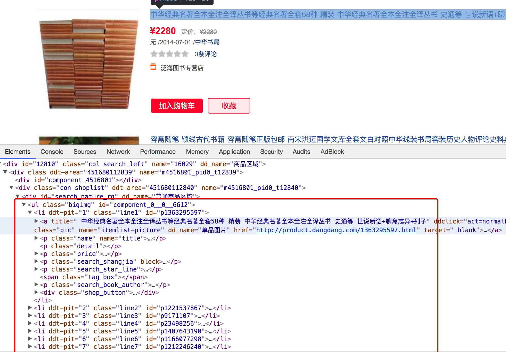
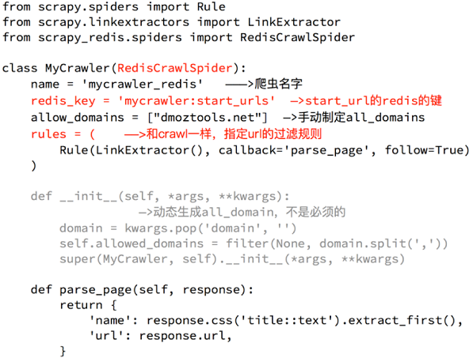
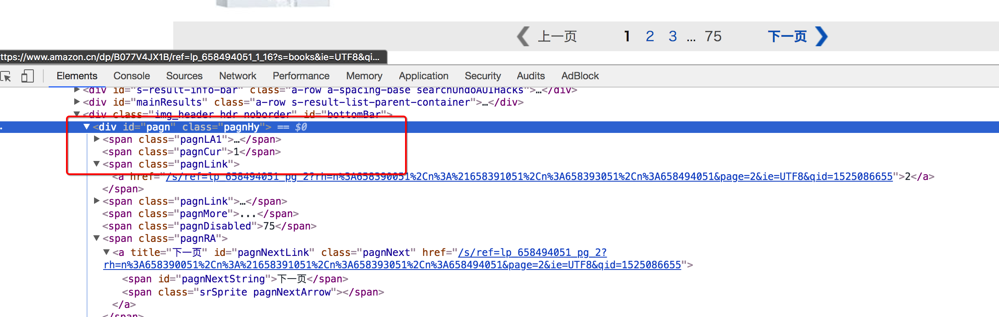
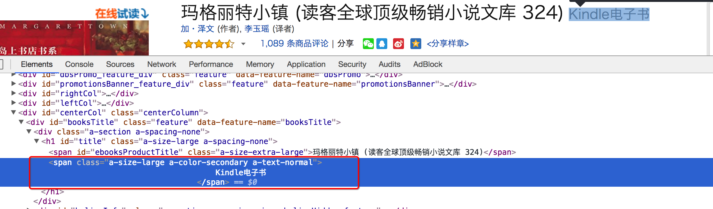
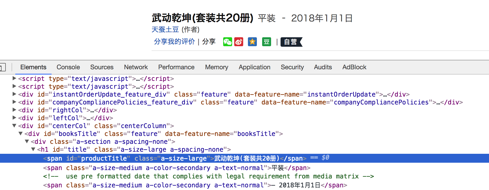
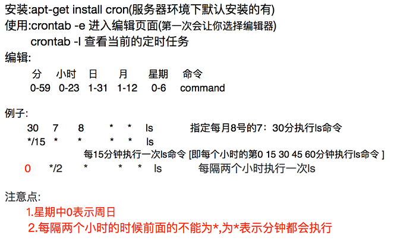

# Scrapy_redis

- scrapy_redis的定义和能够实现的功能
- scrapy_redis实现的原理
- scarpy_redis实现增量式爬虫
- scrapy_redis实现分布式爬虫
- scrapy_redis实现crwalspider爬虫


# 一 scrapy_redis实现增量式爬虫

## 1. scrapy_redis是什么

Scrapy_redis ： Redis-based components for Scrapy.	基于redis 的 Scrapy组件

Github地址：[https://github.com/rmax/scrapy-redis](https://github.com/rmax/scrapy-redis)

在这个地址中存在 3 个demo，后续我们对scrapy_redis的学习会通过这**3 个demo**展开


## 2. scrapy_redis有什么作用

Scrapy_redis在scrapy的基础上实现了更多，更强大的功能，具体体现在：

- **请求对象的持久化**

- **去重的持久化**   (request对象去重, 数据去重,  url去重),  

  原scrapy爬虫只在当前运行时能对url去重,  重新执行又会再请求每个url,  而scrapy_redis可以实现去重的持久化

- **实现分布式**

如何实现 请求对象的持久化 和 去重的持久化 ?

如何实现分布式 ?		多台服务器做同一件事:  从同一个redis取request对象, 各自发起请求

为什么用redis数据库?    redis通量高.  数据读/写快,  数据量不大时也可以把爬取的数据存到mysql/mongodb等


## 3. scrapy_redis的流程

### 3.1 回顾scrapy的流程


在这个基础上，如果需要实现分布式，即多台服务器同时完成一个爬虫，需要怎么做呢？


### 3.2 scrapy_redis的流程

- 在scrapy_redis中，所有的待抓取的对象和去重的指纹都存在所有的服务器 `公用的 redis` 中
- 调度器不再从内存中取request对象, 而是从redis中获取
- 所有的request对象存入redis前，都会在同一个redis中进行判断，判断之前是否已经存入过
- 在默认情况下所有的数据会保存在redis中(对应下图)

**具体流程如下**：


## 4. redis

### 4.1 redis是什么

redis是一个开源的内存型数据库，支持多种数据类型和结构，比如列表、集合、有序集合等

### 4.2 redis服务端和客户端的启动

- `/etc/init.d/redis-server start` 	启动服务端
- `redis-cli -h <hostname> -p <端口号>`    客户端启动


### 4.3 redis中的常见命令

`select 1` 	切换db (0-15)

`keys *` 		查看所有的键

`type key` 	查看键的类型

`flushdb` 	清空db

`flushall` 	清空数据库


**redis三种常见数据类型的操作**


## 5. scrapy_redis dmoz.py爬虫 分析

### 5.1 观察dmoz.py

在domz爬虫文件中，实现方式就是之前的`crawlspider`类型的爬虫.  

- domz.py示例文件中继承自父类crawlspider,  也可以继承最初的scrapy.Spider,  分析网页结构来选择继承合适的父类


- domz爬虫是基于request对象 / 基于数据 的增量式爬虫
  - 基于数据: 可以自定义某个字段不重复, 将其指纹存入redis / 可以对item进行去重
  - domz.py直接按照之前的写法写,  重点是要修改**settings.py**

```python
from scrapy.linkextractors import LinkExtractor
from scrapy.spiders import CrawlSpider, Rule


class DmozSpider(CrawlSpider):
    """Follow categories and extract links."""
    name = 'dmoz'
    allowed_domains = ['dmoztools.net']
    start_urls = ['http://dmoztools.net/']

    # 定义数据提取规则，国外习惯使用css选择器
    rules = [
        Rule(LinkExtractor(
            restrict_css=('.top-cat', '.sub-cat', '.cat-item')
        ), callback='parse_directory', follow=True),
    ]

    def parse_directory(self, response):
        for div in response.css('.title-and-desc'):
            yield {
                'name': div.css('.site-title::text').extract_first(),
                'description': div.css('.site-descr::text').extract_first().strip(),
                'link': div.css('a::attr(href)').extract_first(),
            }
```

但是在settings.py中多了一下几行,  这几行表示`scrapy_redis`中重新实现的了去重的类，以及调度器，并且使用的`RedisPipeline`

> **scrapy_redis 重要配置**

```python
DUPEFILTER_CLASS = "scrapy_redis.dupefilter.RFPDupeFilter"	# 1 指定去重的类
SCHEDULER = "scrapy_redis.scheduler.Scheduler"				# 2 指定调度器的类
SCHEDULER_PERSIST = True									# 3 调度器的内容是否持久化, 一般为True

ITEM_PIPELINES = {
    # 'example.pipelines.ExamplePipeline': 300,
    'scrapy_redis.pipelines.RedisPipeline': 400,			# 4 默认保存到 redis 的管道
}

REDIS_URL = "redis://127.0.0.1:6379/库编号"				  # 5 配置redis链接
```

**scrapy_redis 如何配置实现一个增量式爬虫 ?**

在scrapy的settings中进行配置:   指定去重的类,  指定调度器的类,  配置redis_url,   配置保存到redis的管道


### 5.2 运行dmoz爬虫，观察现象

1. 注意要 **添加redis的连接配置**，程序才能够使用redis

   ```python
   REDIS_URL = "redis://127.0.0.1:6379/库编号"

   # 或者使用下面的方式
   # REDIS_HOST = "127.0.0.1"
   # REDIS_PORT = 6379
   ```

2. 执行domz的爬虫，会发现redis中多了 3个键：

   

   

3. 继续执行程序

- 继续执行程序，会发现程序在前一次的基础之上继续往后执行，所以domz爬虫是**一个基于url地址的增量式的爬虫**
- 控制台提示的**302**重定向:  表示scrapy_redis 将已经请求过的url **重定向到下一个url**
- redis中存有的request对象不会一直增加,  请求过的不再请求


## 6. ***scrapy_redis的原理分析


从settings.py中的 **3个配置** 来进行分析, 分别是：

- RedisPipeline		对应redis中存储 爬取的数据
- RFPDupeFilter              对应redis中存储 指纹,  指纹默认由请求方法method,  url 和请求体(POST请求才有) 三项组成
- Scheduler                      对应redis中存储 待请求的request对象

### 6.1 Scrapy_redis之RedisPipeline

  RedisPipeline中观察process_item，进行数据的保存，存入了redis中

RedisPipeline做了两件事: 

1. 将item序列化
2. 以键值对方式将序列化后的item存入redis

---------------


### 6.2 Scrapy_redis之RFPDupeFilter

RFPDupeFilter 实现了对request对象的加密.

RFPDupeFilter 做了两件事:

1. 生成指纹
2. 返回代表是否重复的True/False

------------------------------


#### **> 总结[1]: scrapy 如何生成指纹 ?**

===> [1]  从scrapy源码中知道,  默认使用sha1加密了`请求方式` + `请求体` + `请求url地址`，得到16进制字符串

```python
fp = hashlib.sha1()
fp.update(to_bytes(request.method))
fp.update(to_bytes(canonicalize_url(request.url)))
fp.update(request.body or b'')  # update方法接收bytes类型, 
								# 在hash之前, Unicode字符串必须经过encode()转为bytes
								# GET请求没有请求体
cache[include_headers] = fp.hexdigest()  # 指纹, len(fp.hexdigest())=40,  16^40=xxxxxx个url地址

# md5加密, 长度可以更长
```


#### **> 总结[2]: scrapy_redis如何去重 ?**

===>  [2]  scrapy_redis 是根据redis集合sadd方法的返回值,   判断数据是否存在于redis的集合中, 判断是否请求过

```python
added = self.server.sadd(self.key, fp)
return added == 0
# added == 0 为True时,   表示存在
# added == 0 为False时,  表示不存在，并且已经插入  (added=插入的数量)
```

添加到redis数据库中:   键是self.key,  值是fp


### 6.3 Scrapy_redis之Scheduler

scrapy_redis调度器的实现了决定什么时候把request对象加入带抓取的队列，同时把请求过的request对象过滤掉

--------------------


```python
request_seen()方法返回True/False 代表了2种情况:
    True---> request对象已序列化存在redis中,  待发起请求/已发起过请求
    False--> request对象不存在redis中, 需要添加到待抓取队列

最终在Scheduler.py里判断是否要把当前request对象加入待抓取的队列:
    if not request.dont_filter and self.df.request_seen(request):
        # [如果dont_filter为False, 表示设置过滤] + [如果见过url] =====> 不会入队
        # [如果dont_filter为False, 表示设置过滤] + [如果没见过url] =====> 会入队
        # [如果dont_filter为True,  表示不过滤]   + [见过/没见过] =====> 反复入队 (start_urls会反复入队)
        return False
    else:  # 添加到待抓取队列
        self.queue.push(request)
    	return True
```


**> 总结: request对象入队的条件有哪几个?**

- request之前没有见过
- request的dont_filter为True，即不过滤
- start_urls中的url地址会入队，因为他们默认是不过滤


## ~  练习: 抓取京东图书的信息

- 需求：抓取京东图书的信息
- 目标：抓取京东图书包含图书的名字、封面图片地址、图书url地址、作者、出版社、出版时间、价格、图书所属大分类、图书所属小的分类、分类的url地址
- 种子url：[https://book.jd.com/booksort.html](https://book.jd.com/booksort.html)

思路分析：

1. 确定数据抓取的入口

   数据都在dl下的dt和dd中，其中dt是大分类的标签，dd是小分类的标签

   对应的思路可以使选择所有的大分类后，选择他下一个兄弟节点即可

   xpath中下一个兄弟节点的语法是`following-sibling::*[1]`

   ---------

   

   

   

2. 确定列表页的url地址和程序终止的条件

   有下一页

   -------------

   

   

   没有下一页

   ----------

   

   

3. 确定数据的位置

   数据大部分都在url地址的响应中，但是价格不在

   ----------------

   

   

   通过`search all file`的方法，找到价格的地址，

   ----------------------

   

   

   对url地址进行删除无用的参数和url解码之后，获取到价格的url为

   `https://p.3.cn/prices/mgets?skuIds=J_11635586613`

   其中skuId为商品的id，能够在网页中获取

   

4. 使用scrapy的思路完成爬虫，在settings中添加上scrapy_redis的相关配置

   ```python
   # scrapy_redis的相关配置
   # ---------------1-----------------
   DUPEFILTER_CLASS = "scrapy_redis.dupefilter.RFPDupeFilter"	# 指定去重的类
   SCHEDULER = "scrapy_redis.scheduler.Scheduler"				# 指定调度器的类
   SCHEDULER_PERSIST = True									# 调度器的内容是否持久化, 一般为True
   # ---------------2-----------------
   REDIS_URL = "redis://127.0.0.1:6379/0"
   # ---------------3-----------------
   ITEM_PIPELINES = {
       'JDbooks.pipelines.JdbooksPipeline': 300,
       'scrapy_redis.pipelines.RedisPipeline': 400,			# 默认保存到 redis 的管道
   }
   ```

   


~ jd.py

```python
# -*- coding: utf-8 -*-
import re
from pprint import pprint
from copy import deepcopy
from JDbooks.items import JdbooksItem

import scrapy
import json


class JdSpider(scrapy.Spider):
    name = 'jd'
    allowed_domains = ['jd.com', 'p.3.cn']
    start_urls = ['https://book.jd.com/booksort.html']

    def parse(self, response):
        # 获取大分类分组
        dt_list = response.xpath("//div[@class='mc']/dl/dt")
        for dt in dt_list:
            item = {}
            # 获取大分类名字
            item['b_cat'] = dt.xpath("./a/text()").extract_first()
            # 获取小分类分组
            em_list = dt.xpath("./following-sibling::*[1]/em")
            for em in em_list:
                # 获取小分类名字, url
                item['s_cat'] = em.xpath("./a/text()").extract_first()
                item['s_href'] = "https:" + em.xpath("./a/@href").extract_first()
                # 获取小分类url对应的列表页第一页
                yield scrapy.Request(
                    item['s_href'],
                    callback=self.parse_book_list,
                    meta={'item': deepcopy(item)}
                )

    def parse_book_list(self, response):
        """获取图书列表页"""
        item = response.meta['item']
        li_list =  response.xpath("//div[@id='plist']/ul/li")
        for li in li_list:
            item['book_name'] = li.xpath(".//div[@class='p-name']/a/em/text()").extract_first().strip()
            # 获取封面图片的url后缀
            # img_href_suffix = li.xpath(".//div[@class='p-img']/a/img/@src").extract_first()
            item['img_href'] = "https:" + li.xpath(".//img/@src | .//img/@data-lazy-img").extract_first()
            item['book_href'] = "https:" + li.xpath(".//div[@class='p-img']/a/@href").extract_first()
            item['sku_id'] = item['book_href'].split("/")[-1].split(".")[0]
            item['author'] = li.xpath(".//span[@class='p-bi-name']/span/a/text()").extract_first()
            item['book_press'] = li.xpath(".//span[@class='p-bi-store']/a/text()").extract_first()
            item['publish_date'] = li.xpath(".//span[@class='p-bi-date']/text()").extract_first().strip()

            # 请求获取价格
            # 价格url:    GET https://p.3.cn/prices/mgets?area=1_72_4137_0&skuIds=J_12090377
            price_url_temp = "https://p.3.cn/prices/mgets?ext=11000000&pin=&type=1&area=1_72_4137_0&skuIds=J_{}" \
                             "&pdbp=0&pdtk=&pdpin=&pduid=15360440491011743495882&source=list_pc_front"
            price_url = price_url_temp.format(item['sku_id'])
            yield scrapy.Request(
                price_url,
                callback=self.parse_price,
                meta={'item': deepcopy(item)}
            )

        # 列表页翻页
        next_url_part = response.xpath("//a[@class='pn-next']/@href").extract_first()
        if next_url_part is not None:
            yield response.follow(
                next_url_part,
                callback=self.parse_book_list,
                meta={'item': item}
            )

    def parse_price(self, response):
        item = response.meta['item']
        # 价格响应字符串: [{"op":"108.00","m":"108.00","id":"J_12090377","p":"108.00"}]
        item['book_price'] = json.loads(response.body.decode())[0]['op']
        pprint(item)
        yield item
```


# 二 scrapy_redis实现分布式爬虫

## 1. RedisSpider类

### 1.1 分析demo中代码

通过观察代码：

- 继承自父类为**RedisSpider**
- 增加了一个redis_key的键，没有直接定义start_urls列表，因为分布式中，如果每台电脑都请求一次start_url就会重复,  start_url存入redis中,  可以在被某台服务器请求过之后,  不再被其他服务器发起请求. 
- 多了`__init__`方法来动态设置allow_domain，该方法一般不用，直接像之前一样指定allow_domains列表

-----------------


**> RedisSpider爬虫的创建和启动**

- **创建爬虫**
  - scrapy genspider 爬虫名 允许爬取的范围
  - 修改父类
  - 添加redis_key
- **启动爬虫**
  - 让爬虫就绪 scrapy crawl 爬虫
  - lpush redis_key url  爬虫会启动

**> RedisSpider的爬虫和scrapy.Spider的区别**

- RedisSpider的爬虫 继承的父类是RedisSpider
- RedisSpider的爬虫 没有start_url,  有redis_key
- RedisSpider的爬虫 用redis_key表示redis中存放start_url地址的键


### ~ 练习: 爬取当当图书

- 需求：抓取当当图书的信息
- 目标：抓取当当图书包括 图书的名字、封面图片地址、图书url地址、作者、出版社、出版时间、价格、图书所属大分类、图书所属小的分类、分类的url地址
- url：[http://book.dangdang.com](http://book.dangdang.com)

思路分析：

1. 程序的入口

   当当图书中，从大分类入手，还有一个中间分类，以及小分类，小分类对一个的地址就是列表页的地址

   注意，url地址的响应和elements略微不同，其中不是每个大分类都在a标签中，中间部分分类不在span标签中

   --------------

   

   

2. 确定列表页的url地址和程序终止条件

   存在下一页

   -------------------

   

   

   不存在下一页

   --------------------

   

   

3. 确定数据的位置

   数据都在url地址对应的响应中，包括列表

   ----------------

   

   

4. 完善spider

   可以使用scrapy的方式创建爬虫，只需要把父类进行修改，添加redis_key

   同时在settings.py中进行配置

   


## 2. RedisCrawlSpider类

### 2.1 分析demo中的代码

和scrapy中的crawlspider的区别在于，继承自的父类不相同，redis_key需要添加

----------




**> RedisCrawlSpider的爬虫的创建和启动**

- 创建爬虫
  - scrapy genspider -t crwal 爬虫名 允许爬取的范围
  - 修改父类
  - 添加redis_key
- 启动爬虫
  - 让爬虫就绪 scrapy crawl 爬虫
  - lpush redis_key url  爬虫会启动


**> RedisCrawlSpider的爬虫和crwalspdier的区别**

- RedisCrawlSpider继承的父类是RedisCrawlSpider

- RedisCrawlSpider没有start_url, 有redis_key

- redis_key表示redis中存放start_url地址的键

  


### ~ 练习: 亚马逊图书爬虫

- 需求：抓取亚马逊图书的信息
- 目标：抓取亚马逊图书又有图书的名字、封面图片地址、图书url地址、作者、出版社、出版时间、价格、图书所属大分类、图书所属小的分类、分类的url地址
- url：[https://www.amazon.cn/%E5%9B%BE%E4%B9%A6/b/ref=sd_allcat_books_l1?ie=UTF8&node=658390051](https://www.amazon.cn/%E5%9B%BE%E4%B9%A6/b/ref=sd_allcat_books_l1?ie=UTF8&node=658390051)


**> 补充知识:  LinkExtractor 链接提取器的参数**

```python
class scrapy.linkextractors.LinkExtractor(
    allow = (),
    deny = (),
    allow_domains = (),
    deny_domains = (),
    deny_extensions = None,
    restrict_xpaths = (),
    tags = ('a','area'),
    attrs = ('href'),
    canonicalize = True,
    unique = True,
    process_value = None
)
--------------------主要参数--------------------
allow：				满足括号中”正则表达式”的值会被提取，如果为空，则全部匹配
deny：				与这个正则表达式(或正则表达式列表)不匹配的url一定不提取
allow_domains：		会被提取的链接的domains
deny_domains：		一定不会被提取链接的domains
restrict_xpaths：	使用xpath表达式，和allow共同作用过滤链接,
					 使用xpath表达式不需要定位到具体的url地址字符串，定位到准确的标签位置即可
```


**思路分析：**

1. 确定rule中的规则

   可以通过连接提取器中的restrict_xpath来实现url地址的，不需要定位到具体的url地址字符串，定位到准确的标签位置即可

   注意：定位到的标签中不能包含不相关的url，否则请求不相关的地址后，数据提取会报错

   通过分析大分类和小分类的url地址，发现他们的规则仙童，即一个Rule可以实现从大分类到小分类的到列表页的过程

   1. 大分类url地址

      -----------------------

      

      

   2. 小分类url地址

      ----------------

      

      

   3. 列表页翻页的url地址位置

      -------------------

      

      

   4. 进入详情页翻页的url地址位置

      详情页在h2标签的上一级，定位到h2后，通过`..`即可实现获取该url

      ---------------

      

   

2. 详情页数据的抓取

   在详情页中，数据有两种，一种是电子书的信息，一种是纸质书的信息，两种页面，数据位置不同

   1. 确定书的分类，是电纸书还是纸质书

      电子书

      --------------------

      

      

      纸质书

      -----------------------

      

      

   2. 不同类型的书籍分别写xpath，比如价格的提取

   

3. 在settings中进行配置


**~ amazon.py**

```python
# -*- coding: utf-8 -*-
import scrapy
from scrapy.linkextractors import LinkExtractor
from scrapy.spiders import CrawlSpider, Rule
from scrapy_redis.spiders import RedisCrawlSpider
import re

class AmazonSpider(RedisCrawlSpider):
    name = 'amazon'
    allowed_domains = ['amazon.cn']
    # start_urls = ['https://www.amazon.cn/%E5%9B%BE%E4%B9%A6/b/ref=sd_allcat_books_l1?ie=UTF8&node=658390051']
    redis_key = "amazon"

    rules = (
        #实现提取大分类的URL地址, 同时提取小分类的url地址
        # Rule(LinkExtractor(restrict_xpaths=("//ul[contains(@class,'a-unordered-list a-nostyle a-vertical s-ref-indent-')]/div/li",)), follow=True),
        # Rule(LinkExtractor(restrict_xpaths=("//ul[@class='a-unordered-list a-nostyle a-vertical s-ref-indent-two']/div/li",)), follow=True),

        # 实现提取图书详情页的url地址
        Rule(LinkExtractor(restrict_xpaths=("//div[@id='mainResults']/ul/li//h2/..",)), callback="parse_item"),

        #实现列表页的翻页
        Rule(LinkExtractor(restrict_xpaths=("//div[@id='pagn']//a",)),follow=True),

    )

    def parse_item(self, response):
        item = {}
        item["book_name"] = response.xpath("//span[contains(@id,'roductTitle')]/text()").extract_first()
        item["book_author"] = response.xpath("//div[@id='bylineInfo']/span[@class='author notFaded']/a/text()").extract()
        item["book_press"] = response.xpath("//b[text()='出版社:']/../text()").extract_first()
        item["book_cate"] = response.xpath("//div[@id='wayfinding-breadcrumbs_feature_div']/ul/li[not(@class)]//a/text()").extract()
        item["book_url"] = response.url
        item["book_desc"] = re.findall(r"\s+<noscript>(.*?)</noscript>\n  <div id=\"outer_postBodyPS\"",response.body.decode(),re.S)[0]
        # item["book_img"] = response.xpath("//div[contains(@id,'img-canvas')]/img/@src").extract_first()
        item["is_ebook"] = "Kindle电子书" in response.xpath("//title/text()").extract_first()
        if item["is_ebook"]:
            item["ebook_price"] = response.xpath("//td[@class='a-color-price a-size-medium a-align-bottom']/text()").extract_first()
        else:
            item["book_price"]= response.xpath("//span[contains(@class,'price3P')]/text()").extract_first()

        yield item
```


settings.py  scrapy_redis配置

```python
# ------------------- scrapy_redis配置 -------------------
DUPEFILTER_CLASS = "scrapy_redis.dupefilter.RFPDupeFilter"	# 1 指定去重的类
SCHEDULER = "scrapy_redis.scheduler.Scheduler"				# 2 指定调度器的类
SCHEDULER_PERSIST = True									# 3 调度器的内容是否持久化, 一般为True

ITEM_PIPELINES = {
    'amazon.pipelines.AmazonPipeline': 300,	
    'scrapy_redis.pipelines.RedisPipeline': 400,			# 4 默认保存到 redis 的管道
}
REDIS_URL = "redis://127.0.0.1:6379"				        # 5 配置redis URL
# --------------------------------------------------------
```


>  scrapy_redis总结


# 三 crontab爬虫定时启动

## 1. crontab的安装和介绍

-------------




## 2. crontab在爬虫中的使用

### 2.1 使用流程

1. 把爬虫启动命令写入`.sh` 文件
2. 给`.sh`脚本添加可执行权限
3. 把`.sh` 添加到crontab脚本正

### 2.2 myspier.sh例子

1. 执行命令写入脚本

   其中`>>`表示重定向，把print等信息导入log中

   `2>&1`表示把标准错误作为标准输出，输入用0表示，标准输出用1表示，标准错误用2标识，通过该命令能够把错误一起输出到log中

   ```
    cd `dirname $0` || exit 1
    python ./main.py >> run.log 2>&1
   ```

2. 添加可执行权限

   `sudo chmod +x myspder.sh`

3. 写入crontab中

   sh脚本文件也可能会报错，对应的可以把其输出和错误重定向到run2.log中

   ```
    0 6 * * * /home/ubuntu/..../myspider.sh >> /home/ubuntu/.../run2.log 2>&1
   ```


### 腾讯云

IP:  140.143.16.133

PORT:  22

ACCOUNT:  ubuntu

PASSWROD:  cz全拼123

ROOT PATH: /home/ubuntu


爬虫项目

金色财经