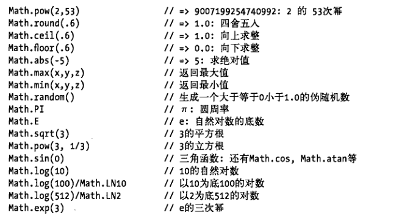

# ==== JS基础语法 ====

JavaScript 是一种专为与网页交互而设计的脚本语言，由下列三个不同的部分组成： 

- ECMAScript，由 ECMA-262 定义，提供核心语言功能；	 
- 文档对象模型（DOM），提供访问和操作网页内容的方法和接口；	 
- 浏览器对象模型（BOM），提供与浏览器交互的方法和接口。 


## !!! 注意

1. **以下面为准:**   
   - **廖雪峰 JavaScript教程:   http://www.shouce.ren/api/view/a/13866** 
   - **手册网:  http://www.shouce.ren/** 
2. window 对象:  在全局作用域中声明的所有变量和函数,  都会成为 window 对象的属性;  通过 window 对象可以访问到 ECMAScript 的所有 Global对象,  如 `new window.Array();`
3. document 对象:  通过 window 对象也可以访问 document 对象, 如 `window.document.getElementById("myDiv")`


## JS嵌入页面的方式

```html
<head>
    ......
    <!-- (2) 内嵌式-->
    <script>
        alert('hello JS!');
    </script>

    <!-- (3) 外链式 -->
  	<!-- 外链式引入js时，只会执行所引入的js语句，在这个script标签之间写的js语句不会执行 -->
    <script src="./js/hello.js"> 此处中间写js语句不会执行 </script>

</head>
<body>
    
    <!-- (1) 行间事件 -->
    <input type="button" value="弹出警告" onclick="alert('hello world!')">

</body>
```


## 变量

js 函数和变量的 预解析

1. 编译阶段
   	将 function 定义的函数提前,  (需要将 js 主函数放在文件前面)
      	将 var 定义的变量声明提前,
      	均赋值为 undefined
2. 执行阶段

变量的定义

```javascript
var 变量名=值;
var 变量名1=v1, 变量名2=v2, 变量名3=v3;
var num1=num2=num3=10;
```

变量的作用域

全局变量

* 在函数外部定义 `全局变量`: var num = 10;
* 不同于Python, 在js中函数内部可以直接修改全局变量, 不需要声明

局部变量

- 在函数内部定义 `局部变量`: var num = 20;
- 在函数内部定义全局变量: num = 10; ,可以被外部代码修改

变量、函数、属性、函数参数的命名规范

​	1 区分大小写
​	2 第一个字符必须是	字母 / 下划线 / 美元符号$
​	3 其他字符可以是	字母、数字、下划线、美元符
​	4 不能与关键字和保留字同名

​	命名风格如:匈牙利命名风格


## 语句

```javascript
// if
if (i > 25) {
  alert("Greater than 25.");
} else if (i < 0) {
  alert("Less than 0.");
} else {
  alert("Between 0 and 25, inclusive.");
}

// do-while
var i = 0;
do {
  i += 2;
} while (i < 10);
alert(i);

// while
var i = 0;
while (i < 10) {
   i += 2;
}

// for
var count = 10;
for (var i=0; i<count; i++){
    alert(i);
}

// for-in 遍历数组
for (var index in list) {
    // 注意: index 是索引
    console.log(index);
}
// for-of 遍历数组
for (var item in list) {
    // 注意: item 是数组的项
    console.log(item);
}

// for-in 遍历对象属性
for (var propName in window) {
    console.log(propName);
}

// for-of 不能遍历对象
for (var item in obj) {
    // 错误
}

// label  可以在代码中添加标签，以便将来使用, label是一种统称, 不是关键字
start: for (var i=0; i < count; i++) {
    alert(i);
}

// break, continue
var num = 0;
for (var i=1; i < 10; i++) {
    if (i % 5 == 0) {
        break;
    }
    num++;
}
alert(num); //4

// break/continue 结合 label
var num = 0;
outermost: for (var i = 0; i < 10; i++) {
	for (var j = 0; j < 10; j++) {
		if (i == 5 && j == 5) {
			break outermost;
		}
		num++;
	}
}
alert(num); //55


// with   将代码的作用域设置到一个特定的对象中
with(location){
    var qs = search.substring(1);
    var hostName = hostname;
    var url = href;
}


// switch - case  多分支语句
// (a)
switch (i) {
    case 25:
        alert("25");
        break;
    case 35:
        alert("35");
        break;
    case 45:
        alert("45");
        break;
    default:
        alert("Other");
}
// (b)
var num = 25;
switch (true) {
    case num < 0 : alert("Less than 0.");
        break;
    case num >= 0 && num <= 10 : alert("Between 0 and 10.");
        break;
    case num > 10 && num <= 20 : alert("Between 10 and 20.");
        break;
    default:
        alert("More than 20.");
}
```


## 函数

### 定义与调用

```javascript
// 函数定义
function myFunc(){
  	alert("hello!");
    return 'myFunc value';
}
// 函数调用
myFunc();
```

### 参数

```
ECMAScript 函数的参数与大多数其他语言中函数的参数有所不同。 ECMAScript 函数不介意传递进来多少个参数，也不在乎传进来参数是什么数据类型。
实际上，在函数体内可以通过 arguments 对象来访问这个参数数组，从而获取传递给函数的每一个参数。 

arguments 对象
 - arguments 对象只是与数组类似（它并不是 Array 的实例），
 - arguments.length 获取传递进来的参数个数
	-----例------
    function sayHi() {
        alert("Hello " + arguments[0] + "," + arguments[1]);
    }

...参数名
 - 类似 python 中的 *args
     -----例------
     <script>
         function info(name, age, ...rest){
             console.log(name); // Martin
             console.log(age);  // 26
             console.log(rest); // [6, 6, 6]
         }
         info('Martin', 26, 6, 6, 6);
     </script>
```

### 内部属性

> 在函数内部，有几种对象 / 属性

```javascript
// 直接使用的特殊对象
    arguments   //主要用途是保存函数参数
    arguments.callee  //是一个指针，指向拥有这个arguments 对象的函数
	arguments.length  // 获取传递进来的参数个数
	this  // this引用的是函数被调用时的环境对象,
	      //当在网页的全局作用域中调用函数时，this 对象引用的就是 window (闭包的注意点)

// 通过函数名调用的属性
	函数名.name     // 返回函数的名字
	函数名.caller   //返回调用方函数的名称, 等同于:  arguments.callee.caller
	                   //如果是在全局作用域中调用当前函数，它的值为null
	函数名.length  // 表示函数希望接收的命名参数的个数
	函数名.toString() 	// 返回函数的源码字符串
	函数名.prototype  // 在创建自定义引用类型以及实现继承时，prototype 属性的作用是极为重要的

```

### 函数方法

```javascript
apply()  call() //都用于在特定的作用域中调用函数

// ------- 使用 函数名.apply()  -----
//apply()方法接收两个参数：一个是在其中运行函数的作用域，另一个是参数数组。其中，第二个参数可以是Array 的实例，也可以是arguments 对象
function sum(num1, num2){
    return num1 + num2;
}
function callSum1(num1, num2){
    return sum.apply(this, arguments); // 传入arguments 对象
}
function callSum2(num1, num2){
    return sum.apply(this, [num1, num2]); // 传入数组
}
alert(callSum1(10,10)); //20
alert(callSum2(10,10)); //20

// ------- 使用 函数名.call()  -----
// 在使用call()方法时，传递给函数的参数必须逐个列举出来
function sum(num1, num2){
    return num1 + num2;
}
function callSum(num1, num2){
    return sum.call(this, num1, num2);
}
alert(callSum(10,10)); //20


// 传递参数并非apply()和call()真正的用武之地,  它们真正强大的地方是能够扩充函数赖以运行的作用域
window.color = "red";
var o = { color: "blue" };
function sayColor(){
    alert(this.color);
}
sayColor(); //red
sayColor.call(this); //red
sayColor.call(window); //red
sayColor.call(o); //blue

// 函数名.bind() 方法
// 略...
```


### 封闭函数

> 自调用函数

```javascript
//-------普通函数-------
function func_name(){ //内部代码; }

//-------匿名函数-------
var demo = function (){ //内部代码; }

//-------封闭函数-------
//封闭函数可以创造一个独立的空间，在封闭函数内定义的变量和函数不会影响外部同名的函数和变量，可以避免命名冲突，在页面上引入多个js文件时，用这种方式添加js文件比较安全
//<1> 小括号
  ;(function(){ //内部代码; })();

//<2> 惊叹号
  ;!function(){ //内部代码; }();

//<3> 波浪线
  ;~function(){ //内部代码; }();

//注: 函数定义前的分号';'防止代码压缩后执行出错
```

### 闭包

 高阶函数除了可以接受函数作为参数外，还可以把函数作为结果值返回。 此时就是一个闭包

>  闭包就是携带状态的函数，并且它的状态可以完全对外隐藏起来。 

```javascript
function lazy_sum(arr) {
    var sum = function () {
        return arr.reduce(function (x, y) {
            return x + y;
        });
    }
    return sum;
} 
var f1 = lazy_sum([1, 2, 3, 4, 5]);  // function sum() 
f1();   // 15 
var f2 = lazy_sum([1, 2, 3, 4, 5]);
f1 === f2; // false
```

闭包的注意点:

```javascript
// 1. 返回函数不要引用任何循环变量，或者后续会发生变化的变量。因为返回的函数如果引用某个变量i, 函数并非立刻执行, 真正执行时采取获取 i 的值
function count() {
    var arr = [];
    for (var i=1; i<=3; i++) {
        arr.push(function () {
            return i * i;  // push传入的function没有立即执行, 最后绑定 i 的值是 3
        });
    }
    return arr;
}

// 2. 如果一定要引用循环变量怎么办？
/* 方法是再创建一个函数，用该函数的参数绑定循环变量当前的值，
   无论该循环变量后续如何更改，已绑定到函数参数的值不变
*/
function count() {
    var arr = [];
    for (var i=1; i<=3; i++) {
        arr.push((function (n) {
            return function () {
                return n * n;
            }
        })(i));  //外层包装一个自调用函数
    }
    return arr;
}
```

脑洞大开

```javascript
'use strict';
 
// 定义数字0:
var zero = function (f) {
    return function (x) {
        return x;
    }
};
 
// 定义数字1:
var one = function (f) {
    return function (x) {
        return f(x);
    }
};
 
// 定义加法:
function add(n, m) {
    return function (f) {
        return function (x) {
            return m(f)(n(f)(x));
        }
    }
} // 计算数字2 = 1 + 1:
var two = add(one, one);
 
// 计算数字3 = 1 + 2:
var three = add(one, two);
 
// 计算数字5 = 2 + 3:
var five = add(two, three);
 
// 你说它是3就是3，你说它是5就是5，你怎么证明？
 
// 呵呵，看这里:
 
// 给3传一个函数,会打印3次:
(three(function () {
    console.log('print 3 times');
}))();
 
// 给5传一个函数,会打印5次:
(five(function () {
    console.log('print 5 times');
}))();
```


### 箭头函数

 ES6标准新增了一种新的函数：Arrow Function（箭头函数）。 

> 箭头函数相当于匿名函数，并且简化了函数定义。 

```javascript
// 箭头函数有两种格式

// a.只包含一个表达式
var myFunc = x => x * x;
// 相当于
var myFunc = function (x) {
    return x * x;
}

// b.包含多条语句，这时候不能省略 { ... } 和 return
var myFunc = x => {
    if (x > 0) {
        return x * x;
    }
    else {
        return - x * x;
    }
}
```

箭头函数的参数写法

```javascript
// 两个参数:
var myFunc = (x, y) => x * x + y * y
// 无参数:
var myFunc = () => 3.14
// 可变参数:
var myFunc = (x, y, ...rest) => {
    var i, sum = x + y;
    for (i=0; i<rest.length; i++) {
        sum += rest[i];
    }
    return sum;
}
```

箭头函数返回值

```javascript
// 如果返回一个对象
var myFunc = x => { foo: x }  // SyntaxError
var myFunc = x => ({ foo: x })  // ok
```

 箭头函数完全修复了闭包中的 `this` 指向，`this`总是指向外层调用者`obj`：

```javascript
// 原来, 不使用箭头函数:
var obj = {
    birth: 1990,
    getAge: function () {
        var b = this.birth; // 1990
        var fn = function () {
            return new Date().getFullYear() - this.birth;   // this指向 window 或 undefined
        };
        return fn();
    }
};

// 现在, 使用箭头函数
// 以前的那种hack写法就不再需要了: var that = this; 
var obj = {
    birth: 1990,
    getAge: function () {
        var b = this.birth; // 1990
        var fn = () => new Date().getFullYear() - this.birth;  // this指向obj对象
        return fn();
    }
};
obj.getAge(); // 25

//由于this在箭头函数中已经按照词法作用域绑定了，所以，用call()或者apply()调用箭头函数时，无法对this进行绑定，即传入的第一个参数被忽略：
var obj = {
    birth: 1990,
    getAge: function (year) {
        var b = this.birth; // 1990
        var fn = (y) => y - this.birth; // this.birth仍是1990
        return fn.call({birth:2000}, year);
    }
};
obj.getAge(2015); // 25 
```


### generator

>   generator（生成器）是ES6标准引入的新的数据类型 , 借鉴了Python的generator的概念和语法 

```javascript
function* foo(x) {  // 定义时用 `function*`
    yield x + 1;
    yield x + 2;    // 可以用yield返回多次
    return x + 3;
}
```

 编写一个产生斐波那契数列的函数 

```javascript
// 普通版
<script>
    'use strict';  // 严格模式下不能使用未声明的变量, 变量必须先声明
    function fibo(max){
        var
            sum,
            a = 0,
            b = 1,
            arr = [0, 1];
        while( arr.length < max ){
            sum = a + b;
            arr.push(sum);
            a = b;
            b = sum;
        }
        return arr;
    }
    console.log(fibo(8));
</script>


// 生成器版
<script>
    'use strict';
    function* fibo(max){
        // 0 1 1 2 3 5 8 ...
        var
            sum,
            a = 0,
            b = 1,
            count = 1;
        while( count <= max ){
            yield a;
            sum = a + b;
            a = b;
            b = sum;
            count++;
        }
    }
    // var ret = fibo(5);
    // console.log(ret);  // fibo {<suspended>}  一个生成器对象
    // 访问生成器元素
    // console.log(ret.next());  // {value: 1, done: false}
    
    //遍历访问
    for (var j of fibo(10)){
        console.log(j);
    }
</script>
```

 generator和普通函数相比，有什么用？ 

```javascript
// 1. 可以记住执行状态
// 2. 可以让异步回调代码看起来像是“同步”代码

//第2点用 ajax 的例子说明
//没有generator之前的黑暗时代，用AJAX时写代码的回调越多，代码越难看。
ajax('http://url-1', data1, function (err, result) {
    if (err) {
        return handle(err);
    }
    ajax('http://url-2', data2, function (err, result) {
        if (err) {
            return handle(err);
        }
        ajax('http://url-3', data3, function (err, result) {
            if (err) {
                return handle(err);
            }
            return success(result);
        });
    });
}); 
// 有了generator的美好时代，看上去是同步的代码，实际执行是异步的。
try {
    r1 = yield ajax('http://url-1', data1);
    r2 = yield ajax('http://url-2', data2);
    r3 = yield ajax('http://url-3', data3);
    success(r3);
}
catch (err) {
    handle(err);
} 
```


## 面向对象

### 创建对象

创建自定义对象的一些方式

1. var person = new Object();
2. var person = { };
3. function Person(){ };   var person = new Person();
4. ...

```javascript
// 1.创建一个 Object 的实例，然后再为它添加属性和方法
var person = new Object();
person.name = "Nicholas";
person.job = "Software Engineer";
person.sayName = function(){
    alert(this.name);
};

// 2.对象字面量
<script>
    var person = {
        name: 'Martin',
        'job': 'Software Engineer',
        sayName: function(){
            alert(this.name);
        }
    }
    person.sayName();

// 3.构造方法
// 定义一个普通函数，用关键字 new 来调用这个函数，返回一个对象
function Student(name) {
    this.name = name;
    this.hello = function () {
        alert('Hello, ' + this.name + '!');
    }
} 
var xiaoming = new Student('小明');
// 注意:  如果不写new，这就是一个普通函数，返回undefined。但是，如果写了new，它就变成了一个构造函数，它绑定的 this 指向新创建的对象，并默认返回 this，也就是说，不需要在最后写 return this;。


</script>

```

### prototype

JavaScript对每个创建的对象都会设置一个原型，指向它的原型对象。

当我们用`obj.xxx`访问一个对象的属性时，JavaScript 引擎先在当前对象上查找该属性，如果没有找到，就到其原型对象上找，如果还没有找到，就一直上溯到`Object.prototype`对象，最后，如果还没有找到，就只能返回`undefined`。

```javascript
// 创建一个Array对象
var arr = [1, 2, 3]; 

// 其原型链是：  arr ----> Array.prototype ----> Object.prototype ----> null 
// Array.prototype 定义了 indexOf()、shift() 等方法，因此你可以在所有的Array对象上直接调用这些方法。


// 创建一个函数
function foo() { return 0;} 
// 其原型链是：  foo ----> Function.prototype ----> Object.prototype ----> null 
// 由于Function.prototype定义了apply()等方法，因此，所有函数都可以调用apply()方法。
```

在对象的原型定义类似python的类方法

```javascript
function Student(name) {
    this.name = name;
}
Student.prototype.hello = function () {
    alert('Hello, ' + this.name + '!');
};
```

忘记写 new 怎么办

如果一个函数被定义为用于创建对象的构造函数，但是调用时忘记了写`new`怎么办？

在strict模式下，`this.name = name`将报错，因为`this`绑定为`undefined`，在非strict模式下，`this.name = name`不报错，因为`this`绑定为`window`，于是无意间创建了全局变量`name`，并且返回`undefined`，这个结果更糟糕。

所以，调用构造函数千万不要忘记写`new`。为了区分普通函数和构造函数，按照约定，构造函数首字母应当大写，而普通函数首字母应当小写，这样，一些语法检查工具如[jslint](http://www.jslint.com/)将可以帮你检测到漏写的`new`。

一个常用的编程模式:

```javascript
function Student(props) {
    this.name = props.name || '匿名'; // 默认值为'匿名'
    this.grade = props.grade || 1; // 默认值为1
}
Student.prototype.hello = function () {
    alert('Hello, ' + this.name + '!');
};
function createStudent(props) {
    return new Student(props || {})
} 
```


### 原型继承

JavaScript 的原型继承实现方式是：

1. 定义新的构造函数，并在内部用`call()`调用希望“继承”的构造函数，并绑定`this`；
2. 借助中间函数`F`实现原型链继承，最好通过封装的`inherits`函数完成；
3. 继续在新的构造函数的原型上定义新方法。

```javascript
// 封装 inherits, 用于实现原型继承链
function inherits(Child, Parent) {
    var F = function () {};
    F.prototype = Parent.prototype;
    Child.prototype = new F();
    Child.prototype.constructor = Child;
} 


// 测试原型继承
function Student(props) {
    this.name = props.name || 'Unnamed';
}
Student.prototype.hello = function () {
    alert('Hello, ' + this.name + '!');
}
function PrimaryStudent(props) {
    Student.call(this, props);
    this.grade = props.grade || 1;
}
inherits(PrimaryStudent, Student);  // 实现原型继承链:
PrimaryStudent.prototype.getGrade = function () {  // 绑定其他方法到PrimaryStudent原型:
    return this.grade;
}; 
```

### class 继承

 新的关键字`class`从ES6开始正式被引入到JavaScript中。`class`的目的就是让定义类更简单。 

用新的`class`关键字来编写`Student`，可以这样写：

```javascript
<script>
    class Student {
        constructor(name) {
            this.name = name;
        }
        hello() {   // 注意没有 function 关键字  (此处hello是类似python的类方法)
            alert('Hello, ' + this.name + '!');
        }
    }

    var stu = new Student('Martin');
    stu.hello();
</script>
```

class 继承

```javascript
class PrimaryStudent extends Student {
    constructor(name, grade) {
        super(name); // 记得用super调用父类的构造方法!
        this.grade = grade;
    }
    myGrade() {
        alert('I am at grade ' + this.grade);
    }
}
```


## 数据类型

```
5 种基本数据类型
	Undefined
	Null
	Boolean
	Number
	String
1 种复杂数据类型
	Object   // 如：数组，字典
```

null 和 undefined

1. `null`表示一个“空”的值，它和`0`以及空字符串`''`不同，`0`是一个数值，`''`表示长度为0的字符串，而`null`表示“空”。

2. 在其他语言中，也有类似 JS 的`null`的表示，例如Java也用`null`，Swift用`nil`，Python用`None`表示。但是，在JS 中，还有一个和`null`类似的`undefined`，它表示“未定义”。

3. JS 的设计者希望用`null`表示一个空的值，而`undefined`表示值未定义。事实证明，区分两者的意义不大。大多数情况下，我们都应该用 `null`。`undefined`仅仅在判断函数参数是否传递的情况下有用。
4. alert(null == undefined); //true

String

1. 多行字符串, 原来用\n, ES6标准新增用 **反引号** 表示,  如:

   ```javascript
   var multiLine = `这是
   一个
   多行字符串
   `;
   ```

2. 模板字符串, 要连接多个字符串，用 + 号比较麻烦, ES6新增一种模板字符串: `你好, ${name}!`

属于number类型的 NaN

```
a  在js中, 任何数值除以0不会报错,  会返回 NaN
b  中文减数字: "你好吗"-10, 返回 NaN

isNaN()函数:
确定参数是否“不是数值”.
经常用它做判断用户输入的是不是一个数字。 比如用户输入手机号， 只能输入数字。
```


### typeof 操作符

返回一个值的数据类型

typeof 是运算符, 不是函数, 一般不加(), 但是当对象是一个表达式时,  需要用括号.

| 类型             | 示例                | 结果        |
| :--------------- | :------------------ | :---------- |
| String           | typeof ‘42’         | ‘string’    |
| Number           | typeof 42           | ‘number’    |
| Boolean          | typeof true         | ‘boolean’   |
| Undefined        | typeof undefined    | ‘undefined’ |
| Object           | typeof {a: 1}       | ‘object’    |
| Null             | typeof null         | ‘object’    |
| function函数对象 | typeof function(){} | ‘function’  |
| Symbol           | typeof Symbol()     | ‘symbol’    |

```javascript
// 判断特殊空值
var a = null;
console.log(!a && typeof a === 'object'); // true

var a;
// 未定义与未声明
console.log(a); // undefined
console.log(b); // ReferenceError: b is not defined

// 安全机制
console.log(typeof a); // undefined
console.log(typeof b); // undefined

// 两次typeof
console.log(typeof typeof a);  // string
```

### 数据类型转换

两种判等:  == 与 ===

1. ==比较，它会自动转换数据类型再比较，很多时候，会得到非常诡异的结果；

2. ===比较，它不会自动转换数据类型，如果数据类型不一致，返回false，如果一致，再比较。

```javascript
var a = false + 1; // 有+号，false隐式转化为0
console.log(a); // 1


var b = false == 1;  // false转化为0
console.log(b); // false


console.log(-true); // -1
console.log(+undefined); // NaN
console.log(+undefined - 1); // NaN
console.log(+undefined - 1 + ''); // 'NaN'


if (1 + 5 * '3' == 16) { // === 也通过了,  * 号会将字符串3转化为数字3
    console.log('通过了');
} else {
    console.log('没通过');
}
// 输出：通过了


window.a || (window.a = '1');
// 由于括号优先级较高，先赋值，再`或`运算
console.log(window.a); // 1
```

#### Number()

Number() 函数转换规则

```javascript
Number(true); // 1
Number(null); // 0
Number(undefined); // NaN

// Number转换字符串的规则
Number('123.11');  // 123.11
Number('000100');  // 100
Number("0xf");  // 15
Number("");     // 0
// 如果字符串中包含除上述格式之外的字符，则将其转换为 NaN, 如 Number("1234blue") 输出 NaN

// 一元加操作符的操作与 Number()函数相同

// 在处理Number的时候更常用的是 parseInt(), parseFloat(), 而不是Number()或一元加
parseInt("1234blue");  // 1234
```

#### parseInt()

```javascript
parseInt("1234blue"); // 1234
parseInt(""); // NaN
parseInt("0xA"); // 10（十六进制数）
parseInt(22.5); // 22

parseInt("0xAF", 16); //175
parseInt("AF", 16); //175
parseInt("AF"); //NaN

parseInt("10", 2); //2 （按二进制解析）
parseInt("10", 8); //8 （按八进制解析）
parseInt("10", 10); //10 （按十进制解析）
parseInt("10", 16); //16 （按十六进制解析）

// 建议无论在什么情况下都明确指定基数, 即第二个参数
```

#### parseFloat()

```javascript
parseFloat("1234blue"); //1234 （整数）
parseFloat("0xA"); //0
parseFloat("22.5"); //22.5
parseFloat("22.34.5"); //22.34
parseFloat("0908.5"); //908.5
parseFloat("3.125e7"); //31250000
```

#### 变量名.toString()

```javascript
// 数值、布尔值、对象和字符串值都有 toString()方法. null 和 undefined 值没有这个方法
numVar.toString()
boolVar.toString()
strVar.toString()
objVar.toString()
// 多数情况下调用 toString()方法不必传递参数。但是，在调用数值的 toString()方法时，可以传递一个参数：输出数值的基数 (进制数)。
```


## 操作符

```
一元操作符
	myVar++  ++myVar  myVar--  --myVar  +myVar  -myVar
	
位操作符
	按位非:  ~num1
	按位与:  25 & 3  //1
	按位或:  25 | 3  //27
	按位异或: 25 ^ 3 //26
	左移:   2 << 5  //64
	有符号右移:  64 >> 5  //2
	无符号右移:  64 >>> 5  //2
	
布尔操作符
	逻辑非: !
	逻辑与: &&
	逻辑或: ||
	
乘性操作符
	*  /  %
加性操作符
	+  -
关系操作符
	>  <  >=  <=
相等操作符
	相等和不相等:  ==  !=
		相等和不相等操作符都会先转换操作数（通常称为强制转型），然后再比较它们的相等性。 
		null == undefined  //true
		"55" == 55   //true，因为转换后相等
		"55" != 55   //false，因为转换后相等
		NaN == NaN   //false
		false == 0   //true
		true == 1    //true
		true == 2    //false
		undefined == 0 //false
		null == 0    //false
	全等和不全等:  ===  !==
        "55" === 55  //false，因为不同的数据类型不相等
        "55" !== 55  //true，因为不同的数据类型不相等

条件操作符
	variable = boolean_expression ? true_value : false_value;
	
赋值操作符
	*=  /=  %=  +=  -=  <<=  >>=  >>>=

逗号操作符
	使用逗号操作符可以在一条语句中执行多个操作: var num1=1, num2=2, num3=3;
	在用于赋值时，逗号操作符总会返回表达式中的最后一项:  var num=(5,1,4,8,0);  //num 为 0
```


## 引用类型

### Object

创建Object实例的 2 种方式

```javascript
//-------1-------
var person = new Object();
person.name = "Nicholas";
person.age = 29;

//-------2-------
//---2.1---
var person = {
    name : "Nicholas",
    age : 29
};
//---2.2---
var person = {
    "name" : "Nicholas",
    "age" : 29,
    5 : true
};
//---2.3---
var person = {};  //与new Object()相同
person.name = "Nicholas";
person.age = 29;
```

添加对象属性的 2 种方式

```javascript
person.name = 'Martin';
person['name'] = 'Martin';
```

访问对象属性的 2 种方式

```javascript
person.name
person['name']
```


### Array

Array 构造方式

```javascript
new Array()
new Array(3) // 创建一个包含3 项的数组
new Array("Greg") // 创建一个包含1 项，即字符串"Greg"的数组
new Array("red", "blue", "green")
Array(3)
Array("Greg")

[]
[1,2]
[1,2,] //不要这样！这样会创建一个包含2 或3 项的数组
```

数组对象的属性

```
myArr.length
```

数组对象的方法

```
检测数组
	Array.isArray(myArr)

转换数组为其他类型
	myArr.toString()  // 返回由数组中每个值的字符串形式拼接而成的一个以逗号分隔的字符串
	                  // alert()要接收字符串参数，所以它会在后台对数组调用toString()方法
	myArr.toLocaleString()
	myArr.join(str)   // 使用指定的分隔符来根据数组元素构建一个新字符串
栈方法
	myArr.push(1, 2)  //从末尾添加一个/多个元素
	myArr.pop()       //弹出最后一项
队列方法
	myArr.shift();    //弹出第一项
	myArr.unshift(1, 2) //从开头添加一个/多个元素
重排序方法
	myArr.reverse()   //反转数组
	myArr.sort(myFunc)  // 见后面单独的说明
操作方法
	myArr.concat(...args)  // 先创建当前数组一个副本，然后将接收到的参数添加到这个副本的末尾，返回新数组
        var colors = ["red"];
        alert(colors.concat("yellow", ["black"])); //red,yellow,black
	myArr.slice(num1, [num2])  // 基于当前数组中的一或多个项创建一个新数组, 类似python的切片
	myArr.splice()  // 见后面单独的说明
位置方法
	myArr.indexOf()  // 返回要查找的项在数组中的位置，或者在没找到的情况下返回 -1. 
					// 在比较第一个参数与数组中的每一项时，会使用全等操作符
	myArr.lastIndexOf()  // 与 .indexOf() 类似, 只不过是从数组的末尾开始向前查找.
迭代方法
	myArr.every()     // 对数组中的每一项运行给定函数，如果该函数对每一项都返回true，则返回true。 
    myArr.filter()    // 对数组中的每一项运行给定函数，返回该函数会返回true 的项组成的数组。 
    myArr.forEach()   // 对数组中的每一项运行给定函数。这个方法没有返回值。 
    myArr.map()       // 对数组中的每一项运行给定函数，返回每次函数调用的结果组成的数组。 
    myArr.some()      // 对数组中的每一项运行给定函数，如果该函数对任一项返回true，则返回true。 
    // 迭代方法第一个参数是一个函数, 这个接收 3 个参数:  
    	item, 当前项
    	index, 当前项的索引
    	array, 数组整个值
   	// 迭代方法第二个参数是运行该函数的作用域对象(可选的) —— 影响this的值

归并方法:  迭代数组的所有项，然后构建一个最终返回的值
	myArr.reduce()        // 从数组的第一项开始，逐个遍历到最后, 构建一个最终返回的值
	myArr.reduceRight()   // 从数组的最后一项开始，向前遍历到第一项, 构建一个最终返回的值
	// 归并方法第一个参数是在每一项上调用的函数, 此函数接收4个参数：前一个值、当前值、项的索引和数组对象
	// 归并方法第二个参数是作为归并基础的初始值（可选的）
```


#### .sort() 说明

```javascript
// 默认情况下, sort()方法会调用每个数组项的 .toString() 方法，然后比较得到的字符串，以确定如何排序。即使数组中的每一项都是数值，sort()方法比较的也是字符串
var values = [0, 1, 5, 10, 15];
values.sort();
alert(values); //0,1,10,15,5

// sort()方法可以接收一个比较函数作为参数，以便我们指定哪个值位于哪个值的前面。 
// 比较函数接收两个参数，如果第一个参数应该位于第二个之前则返回一个负数，如果两个参数相等则返回0，如果第一个参数应该位于第二个之后则返回一个正数。以下就是一个简单的比较函数： 
function compare(value1, value2) {
	if (value1 < value2) {
		return - 1;
	} else if (value1 > value2) {
		return 1;
	} else {
		return 0;
	}
}
var values = [0, 1, 5, 10, 15];
values.sort(compare);
alert(values); //0,1,5,10,15

// 如果只想反转数组原来的顺序，使用 .reverse()方法要更快一些

// 对于数值类型或者其valueOf()方法会返回数值类型的对象类型，可以使用一个更简单的比较函数。这个函数只要用第二个值减第一个值即可。 
function compare(value1, value2){
   return value2 - value1;
}
```

#### .splice() 说明

splice()的主要用途是向数组的中部插入项，但使用这种方法的方式则有如下3 种。 

- **删除**：可以删除任意数量的项，只需指定 2 个参数：要删除的第一项的位置和要删除的项数。例如，splice(0,2)会删除数组中的前两项。
- **插入**：可以向指定位置插入任意数量的项，只需提供 3 个参数：起始位置、0（要删除的项数）和要插入的项。如果要插入多个项，可以再传入第四、第五，以至任意多个项。例如，splice(2,0,"red","green")会从当前数组的位置2 开始插入字符串"red"和"green"。	 
- **替换**：可以向指定位置插入任意数量的项，且同时删除任意数量的项，只需指定 3 个参数：起始位置、要删除的项数和要插入的任意数量的项。插入的项数不必与删除的项数相等。例如，splice (2,1,"red","green") 会删除当前数组位置 2 的项，然后再从位置 2 开始插入字符串 "red"和"green"。 

splice()方法始终都会返回一个数组，该数组中包含从原始数组中删除的项（如果没有删除任何项，则返回一个空数组）。下面的代码展示了上述 3 种使用splice()方法的方式。 

```javascript
var colors = ["red", "green", "blue"];

var removed = colors.splice(0,1);  // 在原数组上删除第一项, 返回被删除的项组成的数组
console.log(colors);  // ["green", "blue"]
console.log(removed);   // ["red"]

removed = colors.splice(1, 0, "yellow", "orange"); // 从位置1 开始插入两项
console.log(colors);  // ['green','yellow','orange','blue']
console.log(removed); // []

removed = colors.splice(1, 1, "red", "purple"); // 插入两项，删除一项
console.log(colors); // ['green','red','purple','orange','blue']
console.log(removed); // ['yellow']，返回的数组中只包含一项
```


### Date

Date类型使用自UTC（Coordinated Universal Time，国际协调时间）1970 年1 月1 日午夜（零时）开始经过的毫秒数来保存日期。

```javascript
// 创建一个日期对象
var now = new Date();
```

在调用 Date 构造函数而不传递参数的情况下，新创建的对象自动获得当前日期和时间。如果想根据特定的日期和时间创建日期对象，必须传入表示该日期的毫秒数（即从 UTC 时间起至该日期止经过的毫秒数）。为了简化这一计算过程，ECMAScript 提供了两个方法：Date.parse() 和 Date.UTC()。

```javascript
//-----------  Date.parse()  --------------
// 接收一个表示日期的字符串参数，然后尝试根据这个字符串返回相应日期的毫秒数
// 如果直接将表示日期的字符串传递给 Date 构造函数，也会在后台调用 Date.parse()。

// Date.parse() 支持的日期格式:
/*
 - 月/日/年，如:  "6/13/2004"
 - 英文月名 日,年，如:  "January 12,2004"
 - 英文星期几 英文月名 日 年 时:分:秒 时区，如:  "Tue May 25 2004 00:00:00 GMT-0700"
 - ISO 8601 扩展格式YYYY-MM-DDTHH:mm:ss.sssZ（例如2004-05-25T00:00:00）。只有兼容 ECMAScript 5 的实现支持这种格式。 
 
如果传入Date.parse()方法的字符串不能表示日期，那么它会返回 NaN
*/

// 例如，要为2004 年5 月25 日创建一个日期对象，可以使用下面的代码： 
new Date(Date.parse("Aprial 2, 2020"));  // Thu Apr 02 2020 00:00:00 GMT+0800 (中国标准时间)
new Date("Aprial 2, 2020");  // 结果同上


//-----------  Date.UTC()  --------------
// 同样也返回表示日期的毫秒数，但它与Date.parse()在构建时使用不同的信息。
// Date.UTC()的参数分别是年份、月份（一月是0，二月是1，以此类推）、月中的哪一天（1 到31）、小时数（0 到23）、分钟、秒以及毫秒数。 只有前两个参数（年和月）是必需的。如果没有提供月中的天数，则假设天数为1；如果省略其他参数，则统统假设为0。

new Date(Date.UTC(2000, 0));  // GMT 时间 2000 年 1 月 1 日午夜零时
new Date(Date.UTC(2005, 4, 5, 17, 55, 55));  // GMT 时间 2005 年 5 月 5 日下午 5:55:55

// Date构造函数接收的参数仍然可以与 Date.UTC() 相同
new Date(2000, 0);
new Date(2005, 4, 5, 17, 55, 55);
```

其他方法

```javascript
Data.now()  // 返回表示调用这个方法时的日期和时间的毫秒数
    var start = Date.now();  //开始时间
    doSomething();
    var stop = Date.now(),  //停止时间
    var result = stop – start;
    // 在不支持 Data.now() 的浏览器中，使用 + 操作符把 Data 对象转换成字符串，也可以达到同样的目的。 
    var start = +new Date();  //开始时间
    doSomething();
    var stop = +new Date(),  //停止时间
    var result = stop - start;


// 继承的方法
.toLocaleString()
.toString()
.valueOf()  // 返回日期的毫秒表示。因此，可以方便使用比较操作符（小于或大于）来比较日期值:  new Date(2007, 0, 1) < new Date(2007, 1, 1) --> true

// 日期格式化方法
.toDateString()        // 以特定于实现的格式显示星期几、月、日和年； 
.toTimeString()        // 以特定于实现的格式显示时、分、秒和时区； 
.toLocaleDateString()  // 以特定于地区的格式显示星期几、月、日和年； 
.toLocaleTimeString()  // 以特定于实现的格式显示时、分、秒； 
.toUTCString()         // 以特定于实现的格式完整的UTC 日期。 

// 日期/时间组件方法
getTime();  // 以number形式表示的时间戳 
getFullYear()  //取得4位数的年份（如2007而非仅07）
getMonth()  //返回日期中的月份，其中0表示一月，11表示十二月
getDate()  //返回日期月份中的天数（1到31）
getDay()  //返回日期中星期的星期几（其中0表示星期日，6表示星期六）
getHours()  //返回日期中的小时数（0到23）
getMinutes()  //返回日期中的分钟数（0到59）
getSeconds()  //返回日期中的秒数（0到59）
getMilliseconds()  //返回日期中的毫秒数
//更多略...
```


### RegExp

ECMAScript 通过 RegExp 类型来支持正则表达式。使用下面类似 Perl 的语法，就可以创建一个正则表达式。 

```javascript
var pattern1 = / pattern / flags ;   // /[bc]at/i;
var pattern2 = new RegExp(pattern, flags);  // new RegExp("[bc]at", "i")

// pattern 可以是任何简单或复杂的正则表达式，可以包含字符类、限定符、分组、向前查找以及反向引用
// flags 用以标明正则表达式的行为, 每个正则表达式都可带有一或多个flags, 3 种标志:
/*
    g  表示全局（global）模式，即模式将被应用于所有字符串，而非在发现第一个匹配项时立即停止； 
    i  表示不区分大小写（case-insensitive）模式，即在确定匹配项时忽略模式与字符串的大小写； 
    m  表示多行（multiline）模式，即在到达一行文本末尾时还会继续查找下一行中是否存在与模式匹配的项。 
*/

//正则表达式中的元字符包括:  ( [ { \ ^ $ | ) ? * + .]}
```

RegExp实例属性 / 方法

```javascript
// 属性
/*
global：布尔值，表示是否设置了g 标志。 
ignoreCase：布尔值，表示是否设置了i 标志。 
lastIndex：整数，表示开始搜索下一个匹配项的字符位置，从0 算起。 
multiline：布尔值，表示是否设置了m 标志。 
source：正则表达式的字符串表示，按照字面量形式而非传入构造函数中的字符串模式返回。 
*/

// 方法
// ----- pattern.exec() ----
var text = "mom and dad and baby";
var pattern = /mom( and dad( and baby)?)?/gi;
var matches = pattern.exec(text);
alert(matches.index); // 0
alert(matches.input); // "mom and dad and baby"
alert(matches[0]); // "mom and dad and baby"
alert(matches[1]); // " and dad and baby"
alert(matches[2]); // " and baby"
// ----- pattern.test() ----
var text = "000-00-0000";
var pattern = /\d{3}-\d{2}-\d{4}/;
if (pattern.test(text)){
    alert("The pattern was matched.");
}
```

RegExp构造函数的属性

```
// 通过 RegExp. 或 RegExp[] 获取以下属性

长属性名      短属性名  说 明
input        $_       最近一次要匹配的字符串。Opera未实现此属性
lastMatch    $&       最近一次的匹配项。Opera未实现此属性
lastParen    $+       最近一次匹配的捕获组。Opera未实现此属性
leftContext  $`       input字符串中lastMatch之前的文本
multiline    $*       布尔值，表示是否所有表达式都使用多行模式。
```


### Function

函数实际上是对象。每个函数都是Function 类型的实例，而且都与其他引用类型一样具有属性和方法。

Function 构造函数可以接收任意数量的参数，但最后一个参数始终都被看成是函数体，而前面的参数则枚举出了新函数的参数。

```javascript
// 不推荐
var sum = new Function("num1", "num2", "return num1 + num2");
```


### 基本包装类型

为了便于操作基本类型值，ECMAScript 还提供了3 个特殊的引用类型：Boolean、Number 和String。

#### String类型

```javascript
var stringObject = new String("hello world");
var stringValue = "hello world";
```

String类型的方法

>  String 类型提供了很多方法，用于辅助完成对ECMAScript 中字符串的解析和操作。 

```
字符方法 :  根据索引访问字符串中特定字符 / 字符的编码
	myStr.charAt(i)
	myStr.charCodeAt(i)
	myStr[i]
字符串操作方法 
	myStr.concat()     // 用于将一或多个字符串拼接起来，返回拼接得到的新字符串
	myStr.slice()      // 类似python字符串的切片操作, 支持负索引
	myStr.substr()     // 第二个参数(可选) 指定的是返回的字符个数, 如果为负数, 会被转换为0
	myStr.substring()  // 类似 slice(), 但 substring 会把所有负值参数都转换为0
字符串位置方法
	myStr.indexOf()
	myStr.lastIndexOf()
移除空白字符
	myStr.trim()  // 创建一个字符串的副本，删除前置及后缀的所有空格，然后返回结果
大小写转换方法
	var myStr = "hello world";
	// toLocaleLowerCase()和toLocaleUpperCase()方法是针对特定地区的实现,
	// 在不知道自己的代码将在哪种语言环境中运行的情况下，还是使用针对地区的方法更稳妥一些。 
	myStr.toLocaleUpperCase()   //"HELLO WORLD"
	myStr.toUpperCase()         //"HELLO WORLD"
	myStr.toLocaleLowerCase()   //"hello world"
	myStr.toLowerCase()         //"hello world"
模式匹配方法
	myStr.match()
        var matches = myStr.match(pattern);  // 与调用RegExp 的 exec()方法相同, 参考 RegExp 类型
    myStr.search()
        var pos = myStr.search(pattern);
    myStr.replace()
    	var text = "cat, bat, sat, fat";
    	var result = text.replace("at", "ond");
    	alert(result); //"cond, bat, sat, fat"
    	result = text.replace(/at/g, "ond");
    	alert(result); //"cond, bond, sond, fond"
	myStr.split()
        var colorText = "red,blue,green,yellow";
        var colors1 = colorText.split(",");  //["red", "blue", "green", "yellow"]
        var colors2 = colorText.split(",", 2);  //["red", "blue"]
        var colors3 = colorText.split(/[^\,]+/);  //["", ",", ",", ",", ""]


myStr.localeCompare()方法
    比较两个字符串，并返回下列值中的一个：
    • 如果字符串在字母表中应该排在字符串参数之前，则返回一个负数（大多数情况下是-1，具体的值要视实现而定）； 
    • 如果字符串等于字符串参数，则返回0； 
    • 如果字符串在字母表中应该排在字符串参数之后，则返回一个正数（大多数情况下是1，具体的值同样要视实现而定）。
String.fromCharCode()方法 
	接收一或多个字符编码，然后将它们转换成一个字符串,
	从本质上来看，这个方法与 实例方法charCodeAt()执行的是相反的操作
	alert(String.fromCharCode(104, 101, 108, 108, 111));  //"hello"

反转字符串:  s.split("").reverse().join("");
```


##  JSON

> JSON是JavaScript Object Notation的缩写，它是一种 超轻量级的数据交换格式 
>
>  JavaScript 内置了JSON 的解析 

JSON 中的数据类型

```
在JSON中，一共就这么几种数据类型：
    number： JS 的 number
    boolean：JS 的 true / false
    string： JS 的 string
    null：   JS 的 null；
    array：  JS 的 []
    object： JS 的 { ... }
以及上面的任意组合。

- JSON 定死了字符集必须是 UTF-8，用来表示多语言就没有问题。
- 为了统一解析，JSON的字符串规定必须用双引号 ""
- 不同于python中字典的key, json的键可以相同
```

### JSON.stringify()

> 序列化

```javascript
<script>
    var martin = {
        name: 'Martin',
        'gender': true,
        skills: ['Python', 'JavaScript', 'Php']
    };
    var jsonStr = JSON.stringify(martin);


/* 
JSON.stringify() 的参数:
	第一个参数:  对象
	第二个参数:  a.对象的属性名列表 / b.函数引用(接收两个参数: key, value)
	第三个参数:  格式化输出, 例如传入 '  '
如果想要精确控制如何序列化，可以给对象定义一个 toJSON() 的方法，直接返回 JSON 应该序列化的数据.
*/

//例1:
var jsonStr = JSON.stringify(martin, ['name', 'skills'], '  '); 
//例2:
function convert(key, value) {
    if (typeof value === 'string') {
        return value.toUpperCase();
    }
    return value;
}
var jsonStr = JSON.stringify(martin, convert, '  '); 

//例3:
var martin = {
    name: 'Martin',
    'gender': true,
    skills: ['Python', 'JavaScript', 'Php'],
    toJSON: function () {
        return { // 只输出name和skills，并且改变了key：
            'Name': this.name,
            'Skills': this.skills
        };
    }
};
var jsonStr = JSON.stringify(martin, null, '  ');
</script>
```

### JSON.parse()

> 反序列化

拿到一个JSON格式的字符串，我们直接用`JSON.parse()`把它变成一个JavaScript对象：

```javascript
JSON.parse('[1,2,3,true]');   // [1, 2, 3, true]
JSON.parse('{"name":"小明","age":14}');   // Object {name: '小明', age: 14}
JSON.parse('true');     // true
JSON.parse('123.45');   // 123.45 
```

`JSON.parse()`还可以接收一个函数，用来转换解析出的属性：

```javascript
JSON.parse('{"name":"小明","age":14}', function (key, value) {
    // 把number * 2:
    if (key === 'name') {
        return value + '同学';
    }
    return value;
}); // Object {name: '小明同学', age: 14} 
```


## Math




## JS 代码调试

```
alert()				弹出警示框
prompt()			弹出输入框 相当于Python的input()
document.write()	文档打印输出, 多次打印的内容 同时显示在网页中

console.log()	输出到控制台, 执行结果
console.error()	输出到控制台, 错误信息
console.warn()	输出到控制台, 提示信息

浏览器的 Source调试框
```

###### 

###### 

# ====  JS获取标签 & 操作标签 ====

## 1 设置加载完 html 再执行js语句

```javascript
window.onload = function(){
  
	// 所有js语句集;
  
}
```


## 2 获取元素

### - 获取标签对象--document对象的方法

```javascript
var obj = document.getElementById("id_name");
console.log(obj.id);
console.log(obj.class);
...

var obj = document.getElementByClass("class_name");

```


### - 获取和写入当前标签下包裹的 标签+文本( innerHTML )

```javascript
1 先获取标签对象 obj_01
2 获取元素中的内容  html_in_current_tag = obj_01.innerHTML;
3 修改元素中的内容  obj_01.innerHTML = 'str';
```


### - 获取当前标签下包裹的 文本( innerText )

```javascript
1 先获取标签对象 obj_01
2 获取元素中的内容  text_in_current_tag = obj_01.innerText;
3 可以操作元素中的文本  obj_01.innerText = 'str';
```


## 3 操作元素属性

### - 读取标签属性

```javascript
var 变量 = 元素.属性名

var attr_type = obj.type;
var attr_value = obj.value;
var attr_name = obj.name;
var attr_class_name = obj.className;
var attr_href = obj.href;
var attr_style = obj.style;
```


### - 改写标签属性

```javascript
元素.属性名 = 新属性值

obj.value = '100px';
obj.style.color = 'red';
obj.style.fontSize = '16px';
obj.className = "new_cls_name";
```


### - 事件属性 及 匿名函数

常用事件
​	鼠标点击事件属性		onclick
​	鼠标移入事件属性		mouseover
​	鼠标移出事件属性		mouseout

两种方式使用事件:

```javascript
a. html标签绑定事件:
<div id="my-div" onclick="foo()">我是一个div, 点我一下看看!</div>
<script>
    // 不能加 window.onload, 否则 `foo is not defined`.
    var obj = document.getElementById('my-div');
        obj.onclick = function (){
        obj.innerHTML = '我变了, 变得更强了';
    };
</script>

b. js注册事件:
-- 标签对象名.事件名 = 函数名
-- 标签对象名.事件名 = function(){ ... }
<script>
    window.onload = function(){  // window.onload: 让js代码在html加载完成后执行
        var obj = document.getElementById('my-div');
        obj.onclick = function (){
            obj.innerHTML = '我变了, 变得更强了';
        };

    }
</script>
```


## 4 定时器

### - 定时器作用

​	1、定时调用函数
​	2、制作动画

### - 定时器使用

​	setTimeout  		只执行一次的定时器 
​	clearTimeout 	关闭只执行一次的定时器
​	setInterval  		反复执行的定时器
​	clearInterval 	关闭反复执行的定时器

```javascript
var time1 = setTimeout(myalert,2000);
var time2 = setInterval(myalert,2000);
/*
clearTimeout(time1);
clearInterval(time2);
*/
function myalert(){
    alert('ok!');
}

var time1 = setTimeout(function(){alert('After 2 seconds, doing...')}, 2000);
var time2 = setInterval(function(){alert('Each 2 seconds, doing...')}, 2000);
```


###### 

###### 

# ==== BOM 对象 ====

详见在线手册:   http://www.shouce.ren/ 


## 什么是 BOM, DOM?

DOM 是一套操作HTML标签的API（接口/方法/属性）
BOM 是一套操作浏览器的API（接口/方法/属性）

常见的 BOM 对象
 window：代表整个浏览器窗口（window是BOM中的一个对象，并且是顶级的对象）
 Navigator ：代表浏览器当前的信息，通过Navigator我们可以获取用户当前使用的是什么浏览器
 Location： 代表浏览器当前的地址信息，通过Location我们可以获取或者设置当前的地址信息
 History：代表浏览器的历史信息，通过History我们可以实现上一步/刷新/下一步操作（出于
 对用户的隐私考虑，我们只能拿到当前的浏览记录，不能拿到所有的历史记录）
 Screen：代表用户的屏幕信息


## window 对象

 `window`对象不但充当全局作用域，而且表示浏览器窗口。 

> 查看 window 对象有哪些属性:   打印 `window` 或运行 for  in 遍历:
>
> ```
> for (var propName in window) {document.write(propName+'<br/>');}
> ```

BOM 的核心对象是window，它表示浏览器的一个实例。在浏览器中，window 对象有双重角色，它既是通过JavaScript 访问浏览器窗口的一个接口，又是 ECMAScript 规定的 Global 对象。这意味着在网页中定义的任何一个对象、变量和函数，都以window 作为其Global 对象，因此有权访问parseInt()等方法。 

相关主题:

```
全局作用域
窗口关系及框架 
	<frameset></frameset>
	<frame></frame>
窗口位置
窗口大小 
导航和打开窗口 
间歇调用和超时调用 
系统对话框    alert()、confirm()、prompt()
```

## location 对象

> 查看 location 对象有哪些属性:   打印 `location`

location 是最有用的BOM对象之一，它提供了与当前窗口中加载的文档有关的信息，还提供了一些导航功能。事实上，location 对象是很特别的一个对象，因为它既是window 对象的属性，也是document 对象的属性；换句话说，window.location 和 document.location 引用的是同一个对象。 

location 对象的用处不只表现在它保存着当前文档的信息，还表现在它将URL 解析为独立的片段，让开发人员可以通过不同的属性访问这些片段。下表列出了location 对象的所有属性（注：省略了每个属性前面的location 前缀）。 

| **属性名** | **例 子**            | **说 明**                                                    |
| ---------- | -------------------- | ------------------------------------------------------------ |
| hash       | "#contents"          | 返回URL中的hash（#号后跟零或多个字符），如果URL中不包含散列，则返回空字符串 |
| host       | "www.wrox.com:80"    | 返回服务器名称和端口号（如果有）                             |
| hostname   | "www.wrox.com"       | 返回不带端口号的服务器名称                                   |
| href       | "http:/www.wrox.com" | 返回当前加载页面的完整URL。而location对象的toString()方法也返回这个值 |
| pathname   | "/WileyCDA/"         | 返回URL中的目录和（或）文件名                                |
| port       | "8080"               | 返回URL中指定的端口号。如果URL中不包含端口号，则这个属性返回空字符串 |
| protocol   | "http:"              | 返回页面使用的协议。通常是http:或https:                      |
| search     | "?q=javascript"      | 返回URL的查询字符串。这个字符串以问号开头                    |


相关主题:

```
查询字符串参数 
	location.search
位置操作 
	location.assign("http://www.wrox.com");
	window.location = "http://www.wrox.com";
	location.href = "http://www.wrox.com"; (最常用)
重新加载当前显示的页面   location.reload(); 
	location.reload(); //重新加载（有可能从缓存中加载）
	location.reload(true); //重新加载（从服务器重新加载）
```

```
// 假设初始URL为http://www.wrox.com/WileyCDA/

//将URL 修改为"http://www.wrox.com/WileyCDA/#section1"
location.hash = "#section1";

//将URL 修改为"http://www.wrox.com/WileyCDA/?q=javascript"
location.search = "?q=javascript";

//将URL 修改为"http://www.yahoo.com/WileyCDA/"
location.hostname = "www.yahoo.com";

//将URL 修改为"http://www.yahoo.com/mydir/"
location.pathname = "mydir";

//将URL 修改为"http://www.yahoo.com:8080/WileyCDA/"
location.port = 8080;
```


## navigator 对象

> 在浏览器控制台输入 navigator 查看其属性和方法.

最早由Netscape Navigator 2.0 引入的navigator 对象，现在已经成为识别客户端浏览器的事实标准。虽然其他浏览器也通过其他方式提供了相同或相似的信息（例如，IE 中的window.clientInformation和Opera 中的window.opera），但navigator 对象却是所有支持JavaScript 的浏览器所共有的。与其他BOM 对象的情况一样，每个浏览器中的navigator 对象也都有一套自己的属性。

查看属性及其支持的浏览器:  参考手册

> 属性举例:
>
> ```
> cookieEnabled	表示cookie是否启用 
> platform		浏览器所在的系统平台
> plugins			浏览器中安装的插件信息的数组 
> userAgent		浏览器的用户代理字符串 
> ```


相关主题:

```
检测插件 
注册处理程序 
```


## screen 对象

JavaScript 中有几个对象在编程中用处不大，而 screen 对象就是其中之一。screen 对象基本上只用来表明客户端的能力，其中包括浏览器窗口外部的显示器的信息，如像素宽度和高度等。每个浏览器中的screen 对象都包含着各不相同的属性，

> 在浏览器控制台输入 screen 查看其属性和方法.

有时候可能会用到 screen 对象的信息来调整浏览器窗口大小，使其占据屏幕的可用空间，例如： 

```
window.resizeTo(screen.availWidth, screen.availHeight);
```

前面曾经提到过，许多浏览器都会禁用调整浏览器窗口大小的能力，因此上面这行代码不一定在所有环境下都有效。 

涉及移动设备的屏幕大小时，情况有点不一样。运行iOS 的设备始终会像是把设备竖着拿在手里一样，因此返回的值是768×1024。而 Android 设备则会相应调用 screen.width 和 screen.height 的值。 


## history 对象

history 对象保存着用户上网的历史记录，从窗口被打开的那一刻算起。因为 history 是window对象的属性，因此每个浏览器窗口、每个标签页乃至每个框架，都有自己的 history 对象与特定的 window 对象关联。出于安全方面的考虑，开发人员无法得知用户浏览过的URL。不过，借由用户访问过的页面列表，同样可以在不知道实际URL 的情况下实现后退和前进。 

使用 go() 方法可以在用户的历史记录中任意跳转，可以向后也可以向前。这个方法接受一个参数，表示向后或向前跳转的页面数的一个整数值。负数表示向后跳转（类似于单击浏览器的“后退”按钮），正数表示向前跳转（类似于单击浏览器的“前进”按钮）。来看下面的例子。 

```
//后退一页
history.go(-1);
//前进一页
history.go(1);
//前进两页
history.go(2);
```

也可以给 go() 方法传递一个字符串参数，此时浏览器会跳转到历史记录中包含该字符串的第一个位置——可能后退，也可能前进，具体要看哪个位置最近。如果历史记录中不包含该字符串，那么这个方法什么也不做，例如： 

```
//跳转到最近的wrox.com 页面
history.go("wrox.com");
```

另外，还可以使用两个简写方法 back() 和 forward() 来代替 go()。顾名思义，这两个方法可以模仿浏览器的“后退”和“前进”按钮。 

```
//后退一页
history.back();
//前进一页
history.forward();
```

除了上述几个方法外，history 对象还有一个length 属性，保存着历史记录的数量。这个数量包括所有历史记录history.length 等于0。通过像下面这样测试该属性的值，可以确定用户是否一开始就打开了你的页面。 

```
if (history.length == 0){    
	//这应该是用户打开窗口后的第一个页面
}
```

虽然history 并不常用，但在创建自定义的“后退”和“前进”按钮，以及检测当前页面是不是用户历史记录中的第一个页面时，还是必须使用它。 

当页面的URL 改变时，就会生成一条历史记录。在IE8 及更高版本、Opera、Firefox、Safari 3 及更高版本以及Chrome 中，这里所说的改变包括URL 中hash 的变化（因此，设置location.hash 会在这些浏览器中生成一条新的历史记录）。 


# ==== DOM 对象 ====

- 源:  W3School:  [HTML DOM 对象](https://www.w3school.com.cn/jsref/dom_obj_document.asp )

## document 对象

每个载入浏览器的 HTML 文档都会成为 Document 对象。Document 对象使我们可以从脚本中对 HTML 页面中的所有元素进行访问。

> **提示：**Document 对象是 Window 对象的一部分，可通过 window.document 属性对其进行访问。
>
> 打印 document 对象的所有属性和方法名称:  
>
> ```
> for (var attr in document) {document.write(attr + '<br/>')};
> ```

**Document 对象集合**

| 集合                                                         | 描述                                     |
| :----------------------------------------------------------- | :--------------------------------------- |
| [all[\]](https://www.w3school.com.cn/jsref/coll_doc_all.asp) | 提供对文档中所有 HTML 元素的访问。       |
| [anchors[\]](https://www.w3school.com.cn/jsref/coll_doc_anchors.asp) | 返回对文档中所有 Anchor 对象的引用。     |
| applets                                                      | 返回对文档中所有 Applet 对象的引用。     |
| [forms[\]](https://www.w3school.com.cn/jsref/coll_doc_forms.asp) | 返回对文档中所有 Form 对象引用。         |
| [images[\]](https://www.w3school.com.cn/jsref/coll_doc_images.asp) | 返回对文档中所有 Image 对象引用。        |
| [links[\]](https://www.w3school.com.cn/jsref/coll_doc_links.asp) | 返回对文档中所有 Area 和 Link 对象引用。 |


**Document 对象属性**

| 属性                                                         | 描述                                                         |
| :----------------------------------------------------------- | :----------------------------------------------------------- |
| body                                                         | 提供对 <body> 元素的直接访问。对于定义了框架集的文档，该属性引用最外层的 <frameset>。 |
| [cookie](https://www.w3school.com.cn/jsref/prop_doc_cookie.asp) | 设置或返回与当前文档有关的所有 cookie。                      |
| [domain](https://www.w3school.com.cn/jsref/prop_doc_domain.asp) | 返回当前文档的域名。                                         |
| [lastModified](https://www.w3school.com.cn/jsref/prop_doc_lastmodified.asp) | 返回文档被最后修改的日期和时间。                             |
| [referrer](https://www.w3school.com.cn/jsref/prop_doc_referrer.asp) | 返回载入当前文档的文档的 URL。                               |
| [title](https://www.w3school.com.cn/jsref/prop_doc_title.asp) | 返回当前文档的标题。                                         |
| [URL](https://www.w3school.com.cn/jsref/prop_doc_url.asp)    | 返回当前文档的 URL。                                         |


**Document 对象方法**

| 方法                                                         | 描述                                                         |
| :----------------------------------------------------------- | :----------------------------------------------------------- |
| [close()](https://www.w3school.com.cn/jsref/met_doc_close.asp) | 关闭用 document.open() 方法打开的输出流，并显示选定的数据。  |
| [getElementById()](https://www.w3school.com.cn/jsref/met_doc_getelementbyid.asp) | 返回对拥有指定 id 的第一个对象的引用。                       |
| [getElementsByName()](https://www.w3school.com.cn/jsref/met_doc_getelementsbyname.asp) | 返回带有指定名称的对象集合。                                 |
| [getElementsByTagName()](https://www.w3school.com.cn/jsref/met_doc_getelementsbytagname.asp) | 返回带有指定标签名的对象集合。                               |
| [open()](https://www.w3school.com.cn/jsref/met_doc_open.asp) | 打开一个流，以收集来自任何 document.write() 或 document.writeln() 方法的输出。 |
| [write()](https://www.w3school.com.cn/jsref/met_doc_write.asp) | 向文档写 HTML 表达式 或 JavaScript 代码。                    |
| [writeln()](https://www.w3school.com.cn/jsref/met_doc_writeln.asp) | 等同于 write() 方法，不同的是在每个表达式之后写一个换行符。  |
| createElement()                                              | 传入标签名,  创建一个标签元素                                |


## event 对象

> html 普通标签 中的 event (如: onclick) 是 html DOM Event;
>
> javascript 代码中的 event 是 javascript Event

Event 对象代表事件的状态，比如事件在其中发生的元素、键盘按键的状态、鼠标的位置、鼠标按钮的状态。

事件通常与函数结合使用，函数不会在事件发生前被执行！

**事件句柄　(Event Handlers)**

HTML 4.0 的新特性之一是能够使 HTML 事件触发浏览器中的行为，比如当用户点击某个 HTML 元素时启动一段 JavaScript。下面是一个属性列表，可将之插入 HTML 标签以定义事件的行为。

| 属性                                                         | 此事件发生在何时...                  |
| :----------------------------------------------------------- | :----------------------------------- |
| [onabort](https://www.w3school.com.cn/jsref/event_onabort.asp) | 图像的加载被中断。                   |
| [onblur](https://www.w3school.com.cn/jsref/event_onblur.asp) | 元素失去焦点。                       |
| [onchange](https://www.w3school.com.cn/jsref/event_onchange.asp) | 域的内容被改变。                     |
| [onclick](https://www.w3school.com.cn/jsref/event_onclick.asp) | 当用户点击某个对象时调用的事件句柄。 |
| [ondblclick](https://www.w3school.com.cn/jsref/event_ondblclick.asp) | 当用户双击某个对象时调用的事件句柄。 |
| [onerror](https://www.w3school.com.cn/jsref/event_onerror.asp) | 在加载文档或图像时发生错误。         |
| [onfocus](https://www.w3school.com.cn/jsref/event_onfocus.asp) | 元素获得焦点。                       |
| [onkeydown](https://www.w3school.com.cn/jsref/event_onkeydown.asp) | 某个键盘按键被按下。                 |
| [onkeypress](https://www.w3school.com.cn/jsref/event_onkeypress.asp) | 某个键盘按键被按下并松开。           |
| [onkeyup](https://www.w3school.com.cn/jsref/event_onkeyup.asp) | 某个键盘按键被松开。                 |
| [onload](https://www.w3school.com.cn/jsref/event_onload.asp) | 一张页面或一幅图像完成加载。         |
| [onmousedown](https://www.w3school.com.cn/jsref/event_onmousedown.asp) | 鼠标按钮被按下。                     |
| [onmousemove](https://www.w3school.com.cn/jsref/event_onmousemove.asp) | 鼠标被移动。                         |
| [onmouseout](https://www.w3school.com.cn/jsref/event_onmouseout.asp) | 鼠标从某元素移开。                   |
| [onmouseover](https://www.w3school.com.cn/jsref/event_onmouseover.asp) | 鼠标移到某元素之上。                 |
| [onmouseup](https://www.w3school.com.cn/jsref/event_onmouseup.asp) | 鼠标按键被松开。                     |
| [onreset](https://www.w3school.com.cn/jsref/event_onreset.asp) | 重置按钮被点击。                     |
| [onresize](https://www.w3school.com.cn/jsref/event_onresize.asp) | 窗口或框架被重新调整大小。           |
| [onselect](https://www.w3school.com.cn/jsref/event_onselect.asp) | 文本被选中。                         |
| [onsubmit](https://www.w3school.com.cn/jsref/event_onsubmit.asp) | 确认按钮被点击。                     |
| [onunload](https://www.w3school.com.cn/jsref/event_onunload.asp) | 用户退出页面。                       |


**鼠标 / 键盘属性**

| 属性                                                         | 描述                                         |
| :----------------------------------------------------------- | :------------------------------------------- |
| [altKey](https://www.w3school.com.cn/jsref/event_altkey.asp) | 返回当事件被触发时，"ALT" 是否被按下。       |
| [button](https://www.w3school.com.cn/jsref/event_button.asp) | 返回当事件被触发时，哪个鼠标按钮被点击。     |
| [clientX](https://www.w3school.com.cn/jsref/event_clientx.asp) | 返回当事件被触发时，鼠标指针的水平坐标。     |
| [clientY](https://www.w3school.com.cn/jsref/event_clienty.asp) | 返回当事件被触发时，鼠标指针的垂直坐标。     |
| [ctrlKey](https://www.w3school.com.cn/jsref/event_ctrlkey.asp) | 返回当事件被触发时，"CTRL" 键是否被按下。    |
| [metaKey](https://www.w3school.com.cn/jsref/event_metakey.asp) | 返回当事件被触发时，"meta" 键是否被按下。    |
| [relatedTarget](https://www.w3school.com.cn/jsref/event_relatedtarget.asp) | 返回与事件的目标节点相关的节点。             |
| [screenX](https://www.w3school.com.cn/jsref/event_screenx.asp) | 返回当某个事件被触发时，鼠标指针的水平坐标。 |
| [screenY](https://www.w3school.com.cn/jsref/event_screeny.asp) | 返回当某个事件被触发时，鼠标指针的垂直坐标。 |
| [shiftKey](https://www.w3school.com.cn/jsref/event_shiftkey.asp) | 返回当事件被触发时，"SHIFT" 键是否被按下。   |


**IE 属性**

除了上面的鼠标/事件属性，IE 浏览器还支持下面的属性：

| 属性            | 描述                                                         |
| :-------------- | :----------------------------------------------------------- |
| cancelBubble    | 如果事件句柄想阻止事件传播到包容对象，必须把该属性设为 true。 |
| fromElement     | 对于 mouseover 和 mouseout 事件，fromElement 引用移出鼠标的元素。 |
| keyCode         | 对于 keypress 事件，该属性声明了被敲击的键生成的 Unicode 字符码。对于 keydown 和 keyup 事件，它指定了被敲击的键的虚拟键盘码。虚拟键盘码可能和使用的键盘的布局相关。 |
| offsetX,offsetY | 发生事件的地点在事件源元素的坐标系统中的 x 坐标和 y 坐标。   |
| returnValue     | 如果设置了该属性，它的值比事件句柄的返回值优先级高。把这个属性设置为 fasle，可以取消发生事件的源元素的默认动作。 |
| srcElement      | 对于生成事件的 Window 对象、Document 对象或 Element 对象的引用。 |
| toElement       | 对于 mouseover 和 mouseout 事件，该属性引用移入鼠标的元素。  |
| x,y             | 事件发生的位置的 x 坐标和 y 坐标，它们相对于用CSS动态定位的最内层包容元素。 |


**标准 Event 属性**

下面列出了 2 级 DOM 事件标准定义的属性。

| 属性                                                         | 描述                                           |
| :----------------------------------------------------------- | :--------------------------------------------- |
| [bubbles](https://www.w3school.com.cn/jsref/event_bubbles.asp) | 返回布尔值，指示事件是否是起泡事件类型。       |
| [cancelable](https://www.w3school.com.cn/jsref/event_cancelable.asp) | 返回布尔值，指示事件是否可拥可取消的默认动作。 |
| [currentTarget](https://www.w3school.com.cn/jsref/event_currenttarget.asp) | 返回其事件监听器触发该事件的元素。             |
| [eventPhase](https://www.w3school.com.cn/jsref/event_eventphase.asp) | 返回事件传播的当前阶段。                       |
| [target](https://www.w3school.com.cn/jsref/event_target.asp) | 返回触发此事件的元素（事件的目标节点）。       |
| [timeStamp](https://www.w3school.com.cn/jsref/event_timestamp.asp) | 返回事件生成的日期和时间。                     |
| [type](https://www.w3school.com.cn/jsref/event_type.asp)     | 返回当前 Event 对象表示的事件的名称。          |


**标准 Event 方法**

下面列出了 2 级 DOM 事件标准定义的方法。IE 的事件模型不支持这些方法：

| 方法                                                         | 描述                                     |
| :----------------------------------------------------------- | :--------------------------------------- |
| [initEvent()](https://www.w3school.com.cn/jsref/event_initevent.asp) | 初始化新创建的 Event 对象的属性。        |
| [preventDefault()](https://www.w3school.com.cn/jsref/event_preventdefault.asp) | 通知浏览器不要执行与事件关联的默认动作。 |
| [stopPropagation()](https://www.w3school.com.cn/jsref/event_stoppropagation.asp) | 不再派发事件。                           |


## element 对象

详见 W3School:  https://www.w3school.com.cn/jsref/dom_obj_document.asp

## attr 对象

详见 W3School:  https://www.w3school.com.cn/jsref/dom_obj_document.asp


# ==== HTML 对象 ====

详见 W3School:  https://www.w3school.com.cn/jsref/dom_obj_document.asp

## Form 对象

> HTML DOM Form 对象

- Form 对象代表一个 HTML 表单。

- 在 HTML 文档中 `<form>` 每出现一次，Form 对象就会被创建。

Form 对象集合

| 集合                                                         | 描述                       |
| :----------------------------------------------------------- | :------------------------- |
| [elements[\]](https://www.w3school.com.cn/jsref/coll_form_elements.asp) | 包含表单中所有元素的数组。 |

Form 对象属性

| 属性                                                         | 描述                                          |
| :----------------------------------------------------------- | :-------------------------------------------- |
| [acceptCharset](https://www.w3school.com.cn/jsref/prop_form_acceptcharset.asp) | 服务器可接受的字符集。                        |
| [action](https://www.w3school.com.cn/jsref/prop_form_action.asp) | 设置或返回表单的 action 属性。                |
| [enctype](https://www.w3school.com.cn/jsref/prop_form_enctype.asp) | 设置或返回表单用来编码内容的 MIME 类型。      |
| [id](https://www.w3school.com.cn/jsref/prop_form_id.asp)     | 设置或返回表单的 id。                         |
| [length](https://www.w3school.com.cn/jsref/prop_form_length.asp) | 返回表单中的元素数目。                        |
| [method](https://www.w3school.com.cn/jsref/prop_form_method.asp) | 设置或返回将数据发送到服务器的 HTTP 方法。    |
| [name](https://www.w3school.com.cn/jsref/prop_form_name.asp) | 设置或返回表单的名称。                        |
| [target](https://www.w3school.com.cn/jsref/prop_form_target.asp) | 设置或返回表单提交结果的 Frame 或 Window 名。 |

标准属性

| 属性                                                         | 描述                          |
| :----------------------------------------------------------- | :---------------------------- |
| [className](https://www.w3school.com.cn/jsref/prop_classname.asp) | 设置或返回元素的 class 属性。 |
| [dir](https://www.w3school.com.cn/jsref/prop_dir.asp)        | 设置或返回文本的方向。        |
| [lang](https://www.w3school.com.cn/jsref/prop_lang.asp)      | 设置或返回元素的语言代码。    |
| [title](https://www.w3school.com.cn/jsref/prop_title.asp)    | 设置或返回元素的 title 属性。 |

Form 对象方法

| 方法                                                         | 描述                                     |
| :----------------------------------------------------------- | :--------------------------------------- |
| [reset()](https://www.w3school.com.cn/jsref/met_form_reset.asp) | 把表单的所有输入元素重置为它们的默认值。 |
| [submit()](https://www.w3school.com.cn/jsref/met_form_submit.asp) | 提交表单。                               |

Form 对象事件句柄

| 事件句柄                                                     | 描述                     |
| :----------------------------------------------------------- | :----------------------- |
| [onreset](https://www.w3school.com.cn/jsref/prop_form_onreset.asp) | 在重置表单元素之前调用。 |
| [onsubmit](https://www.w3school.com.cn/jsref/prop_form_onsubmit.asp) | 在提交表单之前调用。     |


## Checkbox 对象

> HTML DOM Checkbox 对象

Checkbox 对象代表一个 HTML 表单中的 一个选择框。

在 HTML 文档中 `<input type="checkbox">` 每出现一次，Checkbox 对象就会被创建。

您可以通过遍历表单的 elements[ ] 数组来访问某个选择框，或者通过使用 document.getElementById() 。

Checkbox 对象的属性

| 属性                                                         | 描述                                         |
| :----------------------------------------------------------- | :------------------------------------------- |
| [accessKey](https://www.w3school.com.cn/jsref/prop_checkbox_accesskey.asp) | 设置或返回访问 checkbox 的快捷键。           |
| [alt](https://www.w3school.com.cn/jsref/prop_checkbox_alt.asp) | 设置或返回不支持 checkbox 时显示的替代文本。 |
| [checked](https://www.w3school.com.cn/jsref/prop_checkbox_checked.asp) | 设置或返回 checkbox 是否应被选中。           |
| [defaultChecked](https://www.w3school.com.cn/jsref/prop_checkbox_defaultchecked.asp) | 返回 checked 属性的默认值。                  |
| [disabled](https://www.w3school.com.cn/jsref/prop_checkbox_disabled.asp) | 设置或返回 checkbox 是否应被禁用。           |
| [form](https://www.w3school.com.cn/jsref/prop_checkbox_form.asp) | 返回对包含 checkbox 的表单的引用。           |
| [id](https://www.w3school.com.cn/jsref/prop_checkbox_id.asp) | 设置或返回 checkbox 的 id。                  |
| [name](https://www.w3school.com.cn/jsref/prop_checkbox_name.asp) | 设置或返回 checkbox 的名称。                 |
| [tabIndex](https://www.w3school.com.cn/jsref/prop_checkbox_tabindex.asp) | 设置或返回 checkbox 的 tab 键控制次序。      |
| [type](https://www.w3school.com.cn/jsref/prop_checkbox_type.asp) | 返回 checkbox 的表单元素类型。               |
| value                                                        | 设置或返回 checkbox 的 value 属性的值        |

标准属性

| 属性                                                         | 描述                          |
| :----------------------------------------------------------- | :---------------------------- |
| [className](https://www.w3school.com.cn/jsref/prop_classname.asp) | 设置或返回元素的 class 属性。 |
| [dir](https://www.w3school.com.cn/jsref/prop_dir.asp)        | 设置或返回文本的方向。        |
| [lang](https://www.w3school.com.cn/jsref/prop_lang.asp)      | 设置或返回元素的语言代码。    |
| [title](https://www.w3school.com.cn/jsref/prop_title.asp)    | 设置或返回元素的 title 属性。 |

Checkbox 对象的方法

| 方法                                                         | 描述                               |
| :----------------------------------------------------------- | :--------------------------------- |
| [blur()](https://www.w3school.com.cn/jsref/met_checkbox_blur.asp) | 从 checkbox 上移开焦点。           |
| [click()](https://www.w3school.com.cn/jsref/met_checkbox_click.asp) | 模拟在 checkbox 中的一次鼠标点击。 |
| [focus()](https://www.w3school.com.cn/jsref/met_checkbox_focus.asp) | 为 checkbox 赋予焦点。             |


## +  更多见 W3School

 https://www.w3school.com.cn/jsref/dom_obj_fileupload.asp 


# ==== Ajax 与 Comet ====

## XMLHttpRequest 对象

### 辅助函数

#### 封装 xhr 兼容代码

1. 普通版

```javascript
<html lang="en">
<body>
    <div id='myDiv'></div>
</body>
</html>

<script>
    // 定义封装 xhr 的兼容函数
    function createXHR() {
    	if (window.XMLHttpRequest) {
    		return new XMLHttpRequest();
    	} else if (window.ActiveXObject) {
    		if (typeof arguments.callee.activeXString != "string") {
    			var 
                    versions = ["MSXML2.XMLHttp.6.0", "MSXML2.XMLHttp.3.0", "MSXML2.XMLHttp"],
                    i,
                    len;
    			for (i = 0, len = versions.length; i < len; i++) {
    				try {
    					new ActiveXObject(versions[i]);
    					arguments.callee.activeXString = versions[i];
    					break;
    				} catch(ex) {
    					//跳过
    				}
    			}
    		}
    		return new ActiveXObject(arguments.callee.activeXString);
    	} else {
    		throw new Error("No XHR object available.");
    	}
    }

	// ====== 测试 =======
    // 创建一个 xhr 请求对象
    var xhr = createXHR();
    console.log(xhr);

	// 打开一个链接
    xhr.open("get", "/index/", false);
	// 设置请求头信息
	xhr.setRequestHeader("MyHeader", "MyValue");
	// 发送一个 get 请求
    xhr.send(null);

	// 分析响应状态码, 代表请求成功: [200, 300), 304
    if ((xhr.status >= 200 && xhr.status < 300) || xhr.status == 304) {
        // 获取响应内容
    	myDiv.innerText = xhr.responseText;
        // xhr.getResponseHeader("MyHeader"); //获取响应头某一项
        // xhr.getAllResponseHeaders();  //获取响应头所有项
    } else {
    	alert("Request was unsuccessful: " + xhr.status);
    }
</script>
```


2. 惰性载入版,  不用每次调用时都测试浏览器是否支持

```javascript
<script>
    function createXHR() {
        if (window.XMLHttpRequest) {
            createXHR = function() {
                return new XMLHttpRequest();
            };
        } else if (window.ActiveXObject) {
            createXHR = function() {
                if (typeof arguments.callee.activeXString != "string") {
                    var versions = ["MSXML2.XMLHttp.6.0", "MSXML2.XMLHttp.3.0", "MSXML2.XMLHttp"],
                    i,
                    len;
                    for (i = 0, len = versions.length; i < len; i++) {
                        try {
                            new ActiveXObject(versions[i]);
                            arguments.callee.activeXString = versions[i];
                            break;
                        } catch(ex) {
                            //skip
                        }
                    }
                }
                return new ActiveXObject(arguments.callee.activeXString);
            };
        } else {
            createXHR = function() {
                throw new Error("No XHR object available.");
            };
        }
        return createXHR();
    }
</script>
```


#### 添加查询字符串参数

```javascript
function addURLParam(url, name, value) {
    url += (url.indexOf("?") == -1 ? "?": "&");
    url += encodeURIComponent(name) + "=" + encodeURIComponent(value);
    return url;
}
```


## XHR 的用法 

```javascript
new XMLHttpquest()
// XHR对象的构造函数
// IE7+、Firefox、Opera、Chrome 和Safari 都支持原生的 XHR 对象，在这些浏览器中创建 XHR 对象使用XMLHttpRequest 构造函数;  创建原生 XHR 对象是使用 ActiveXObject 构造函数

xhr.open()
// 在使用 XHR 对象时，第一个方法是 open()，它接受 3 个参数：请求类型（"get"、"post"等）、请求URL、表示是否异步发送请求的布尔值

xhr.timeout = 1000; //设置超时时间 (1 秒钟) （仅适用于IE8+）
xhr.ontimeout = function() {  //超时事件
	alert("Request did not return in a second.");
};

// xhr.overrideMimeType("text/xml");  //重写响应的 MIME 类型

xhr.send()
// send()方法接收一个参数，即要作为请求主体发送的数据。如果不需要通过请求主体发送数据，则必须传入null，因为这个参数对有些浏览器来说是必需的。调用send()之后，请求就会被分派到服务器。

xhr.status
xhr.responseText
/*
在收到响应后，响应的数据会自动填充XHR 对象的属性:
    • xhr.responseText：作为响应主体被返回的文本。 
    • xhr.responseXML：如果响应的内容类型是"text/xml"或"application/xml"，这个属性中将保存包含着响应数据的XML DOM 文档。 
    • xhr.status：响应的HTTP 状态。 
    • xhr.statusText：HTTP 状态的说明。 
*/


xhr.readyState
// 发送异步请求后使用
/*
多数情况下要发送异步请求，才能让 JS 继续执行而不必等待响应。此时，可以检测XHR 对象的 readyState 属性，该属性表示请求/响应过程的当前活动阶段。
xhr.readyState 的取值:
    • 0：未初始化。尚未调用open()方法。 
    • 1：启动。已经调用open()方法，但尚未调用send()方法。 
    • 2：发送。已经调用send()方法，但尚未接收到响应。 
    • 3：接收。已经接收到部分响应数据。 
    • 4：完成。已经接收到全部响应数据，而且已经可以在客户端使用了。 

xhr.readystatechange
只要 readyState 属性的值由一个值变成另一个值，都会触发一次 readystatechange 事件
*/
```

异步请求的一个例子

```javascript
var xhr = createXHR();
xhr.onreadystatechange = function() {
	if (xhr.readyState == 4) {
		if ((xhr.status >= 200 && xhr.status < 300) || xhr.status == 304) {
			alert(xhr.responseText);
		} else {
			alert("Request was unsuccessful: " + xhr.status);
		}
	}
};
xhr.open("get", "example.txt", true);
xhr.send(null);

// 在接收到响应之前还可以调用abort()方法来取消异步请求: xhr.abort();
```

表单提交 - post

```javascript
function submitData() {
	var xhr = createXHR();
	xhr.onreadystatechange = function() {
		if (xhr.readyState == 4) {
			if ((xhr.status >= 200 && xhr.status < 300) || xhr.status == 304) {
				alert(xhr.responseText);
			} else {
				alert("Request was unsuccessful: " + xhr.status);
			}
		}
	};
	xhr.open("post", "postexample.php", true);
	xhr.setRequestHeader("Content-Type", "application/x-www-form-urlencoded");
	var form = document.getElementById("user-info");
	xhr.send(serialize(form));
    
    // post提交json (对应django可以用 request.body 获取bytes请求体)
    var obj = {
        name: 'Martin',
        'age': 26,
        gender: true,
        hobbies: ['python', 'javascript', 'movies']
    }
    xhr.setRequestHeader("Content-Type", "application/json");
    xhr.send(JSON.stringify(obj));
}
```


## FormData

现代Web 应用中频繁使用的一项功能就是表单数据的序列化，XMLHttpRequest 2 级为此定义了FormData 类型。FormData 为序列化表单以及创建与表单格式相同的数据（用于通过XHR 传输）提供了便利。

```javascript
var data = new FormData();
// data.append("name", "Martin");
// 也可以用表单元素的数据预先向其中填入键值对儿：
var data = new FormData(document.forms[0]);  //传入文档的第一个 form 对象
```

### 发送请求时携带 FormData

```javascript
var xhr = createXHR();
xhr.onreadystatechange = function() {
	if (xhr.readyState == 4) {
		if ((xhr.status >= 200 && xhr.status < 300) || xhr.status == 304) {
			alert(xhr.responseText);
		} else {
			alert("Request was unsuccessful: " + xhr.status);
		}
	}
};
xhr.open("post", "postexample.php", true);
var form = document.getElementById("user-info");
xhr.send(new FormData(form));
```


## 进度事件

有以下6 个进度事件。

- loadstart：在接收到响应数据的第一个字节时触发。	 
- progress：在接收响应期间持续不断地触发。	 
- error：在请求发生错误时触发。	 
- abort：在因为调用abort()方法而终止连接时触发。	 
- load：在接收到完整的响应数据时触发。	 
- loadend：在通信完成或者触发error、abort 或load 事件后触发。 

> 详见手册


## 跨源资源共享 - CORS

- CORS（Cross-Origin Resource Sharing，跨源资源共享）
- CSRF（Cross-Site Request Forgery，跨站点请求伪造）
- XSS（Cross-Site Scripting，跨站点脚本）

默认情况下，XHR 对象只能访问与包含它的页面位于同一个域中的资源。这种安全策略可以预防某些恶意行为。但是，实现合理的跨域请求对开发某些浏览器应用程序也是至关重要的。

### 发送跨域请求

IE 对 CORS 的实现:  

```javascript
var xdr = new XDomainRequest();
xdr.onload = function() {
	alert(xdr.responseText);
};
xdr.onerror = function() {
	alert("An error occurred.");
};
xdr.timeout = 1000;
xdr.ontimeout = function() {
	alert("Request took too long.");
};
xdr.open("get", "http://www.somewhere-else.com/page/");
xdr.send(null);
```

其他浏览器对 CORS 的实现:  

> Firefox 3.5+、Safari 4+、Chrome、iOS 版Safari 和Android 平台中的WebKit 都通过XMLHttpRequest对象实现了对CORS 的原生支持。在尝试打开不同来源的资源时，无需额外编写代码就可以触发这个行为。要请求位于另一个域中的资源，使用标准的XHR 对象并在open()方法中传入绝对URL 即可.
>
> 跨域XHR 对象也有一些限制，但为了安全这些限制是必需的:
>
> - 不能使用setRequestHeader()设置自定义头部。	 
> - 不能发送和接收cookie。	 
> - 调用getAllResponseHeaders()方法总会返回空字符串。

```javascript
var xhr = createXHR();
xhr.onreadystatechange = function() {
	if (xhr.readyState == 4) {
		if ((xhr.status >= 200 && xhr.status < 300) || xhr.status == 304) {
			alert(xhr.responseText);
		} else {
			alert("Request was unsuccessful: " + xhr.status);
		}
	}
};
xhr.open("get", "http://www.somewhere-else.com/page/", true);
xhr.send(null);
```

兼容跨浏览器的 CORS

> 检测XHR 是否支持CORS 的最简单方式，就是检查是否存在withCredentials 属性。再结合检测XDomainRequest 对象是否存在，就可以兼顾所有浏览器了。

```javascript
function createCORSRequest(method, url) {
	var xhr = new XMLHttpRequest();
	if ("withCredentials" in xhr) {
		xhr.open(method, url, true);
	} else if (typeof XDomainRequest != "undefined") {
		vxhr = new XDomainRequest();
		xhr.open(method, url);
	} else {
		xhr = null;
	}
	return xhr;
}
var request = createCORSRequest("get", "http://www.somewhere-else.com/page/");
if (request) {
	request.onload = function() {
		//对request.responseText 进行处理
	};
	request.send();
}
```


### 其他跨域技术

1. 使用 `` 标签:  一个网页可以从任何网页中加载图像，不用担心跨域不跨域。
2. JSONP (JSON with padding),  填充式JSON 或参数式JSON
3. comet:  是一种更高级的Ajax 技术（经常也有人称为“服务器推送”）。Ajax 是一种从页面向服务器请求数据的技术，而Comet 则是一种服务器向页面推送数据的技术。Comet 能够让信息近乎实时地被推送到页面上，非常适合处理体育比赛的分数和股票报价。
4. Web Sockets


## Web Sockets 

- Web Sockets 的目标是在一个单独的持久连接上提供全双工、双向通信。

- 未加密的连接不再是http://，而是ws://；加密的连接也不是https://，而是wss://

- 目前支持Web Sockets 的浏览器有Firefox 6+、Safari 5+、Chrome 和iOS 4+版Safari。

```javascript
// 创建 Web Socket 连接
var socket = new WebSocket("ws://www.example.com/server.php");  //1.必须传绝对URL; 2.同源策略对Web Sockets 不适用

/* 与XHR 类似，WebSocket 也有一个表示当前状态的readyState 属性, 不过，这个属性的值与XHR 并不相同:
    • WebSocket.OPENING (0)：正在建立连接。 
    • WebSocket.OPEN (1)：已经建立连接。 
    • WebSocket.CLOSING (2)：正在关闭连接。 
    • WebSocket.CLOSE (3)：已经关闭连接。 
*/

// 发送数据
socket.send("Hello world!");  // 发送纯文本数据
var message = {
	time: new Date(),
	text: "Hello world!",
	clientId: "asdfp8734rew"
};
socket.send(JSON.stringify(message));  // 发送复杂数据

// 接收数据
socket.onmessage = function(event) {
	var data = event.data;  //处理数据...
};

// 关闭连接
socket.close();


// 其他事件
/*
    • open：在成功建立连接时触发。 
    • error：在发生错误时触发，连接不能持续。 
    • close：在连接关闭时触发。 
*/
//WebSocket 对象不支持DOM 2 级事件侦听器，因此必须使用DOM 0 级语法分别定义每个事件处理程序。
var socket = new WebSocket("ws://www.example.com/server.php");
socket.onopen = function() {
	alert("Connection established.");
};
socket.onerror = function() {
	alert("Connection error.");
};
socket.onclose = function(event) {
	console.log("Was clean? " + event.wasClean + " Code=" + event.code + " Reason=" + event.reason);
};

```


# ==== 其他  ====

## document.execCommand()

- 参考:  https://developer.mozilla.org/zh-CN/docs/Web/API/Document/execCommand 


## promise

廖雪峰:  http://www.shouce.ren/api/view/a/13895 


## canvas


## 对象/数组解构

 https://www.cnblogs.com/cheng-du-lang-wo1/p/7259343.html 


## + 更多主题见手册